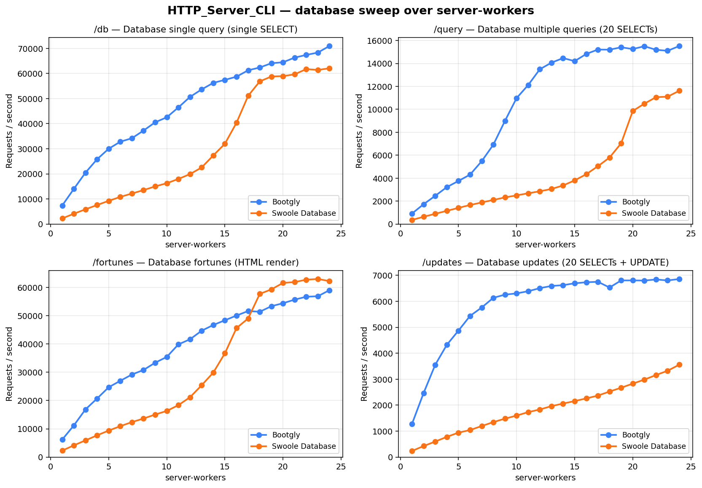
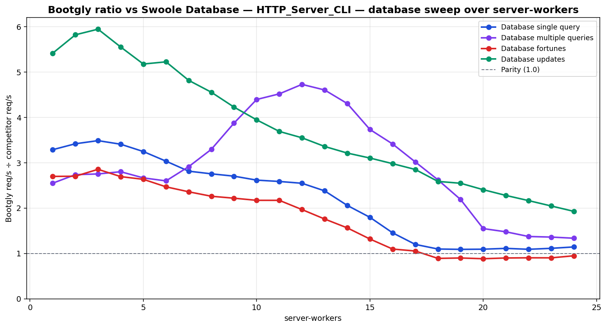

# HTTP_Server_CLI — database sweep over server-workers

`HTTP_Server_CLI` benchmark — sweep of 24 `.bench.marks` files
varying `server-workers` from `1` to `24`, scenario set
`database`. Generated by `chart.py` on `2026-06-02 22:57:03`.

## Environment

- **OS** — Linux 6.18.26.1-microsoft-standard-WSL2
- **CPU** — 24 logical processors
- **PHP** — 8.4.21
- **Swoole** — 6.2.0
- **Runner** — `tcp_client`
- **Scenario set** — `database`
- **Connections** — `514`
- **Duration** — `10`
- **Client workers** — `12`
- **Pipeline** — `1`

## Command

Reproduction sweep — replace `<IDS>` with the original `--scenarios=` argument:

```bash
for sw in 1 2 3 4 5 6 7 8 9 10 11 12 13 14 15 16 17 18 19 20 21 22 23 24; do
   env BOOTGLY_HTTP_SERVER_CLI_ROUTER=database \
       BOOTGLY_HTTP_SERVER_CLI_SCENARIOS=database \
   php bootgly test benchmark HTTP_Server_CLI \
      --competitors=bootgly,swoole-database \
      --runner=tcp_client \
      --connections=514 \
      --duration=10 \
      --client-workers=12 \
      --server-workers="$sw" \
      --scenarios=<IDS>  # scenarios in this sweep: Database single query, Database multiple queries, Database fortunes, Database updates
done
```

## Throughput



## Bootgly / competitor ratio



Ratio > 1.0 means **Bootgly** is faster than the competitor at that server-workers.

## Comparison tables

### Database single query

| `server-workers` | Bootgly | Swoole Database | Δ (Bootgly vs Swoole Database) |
|---:|---:|---:|---:|
| 1 | 7.377 | 2.244 | +228.7% |
| 2 | 14.008 | 4.098 | +241.8% |
| 3 | 20.470 | 5.870 | +248.7% |
| 4 | 25.827 | 7.578 | +240.8% |
| 5 | 30.013 | 9.244 | +224.7% |
| 6 | 32.816 | 10.815 | +203.4% |
| 7 | 34.204 | 12.155 | +181.4% |
| 8 | 37.270 | 13.526 | +175.5% |
| 9 | 40.549 | 14.996 | +170.4% |
| 10 | 42.557 | 16.265 | +161.6% |
| 11 | 46.498 | 17.974 | +158.7% |
| 12 | 50.684 | 19.899 | +154.7% |
| 13 | 53.663 | 22.550 | +138.0% |
| 14 | 56.272 | 27.336 | +105.9% |
| 15 | 57.467 | 32.002 | +79.6% |
| 16 | 58.733 | 40.378 | +45.5% |
| 17 | 61.283 | 51.098 | +19.9% |
| 18 | 62.391 | 56.853 | +9.7% |
| 19 | 64.094 | 58.809 | +9.0% |
| 20 | 64.477 | 58.966 | +9.3% |
| 21 | 66.333 | 59.670 | +11.2% |
| 22 | 67.402 | 61.763 | +9.1% |
| 23 | 68.348 | 61.423 | +11.3% |
| 24 | 70.970 | 62.079 | +14.3% |

### Database multiple queries

| `server-workers` | Bootgly | Swoole Database | Δ (Bootgly vs Swoole Database) |
|---:|---:|---:|---:|
| 1 | 915 | 359 | +154.9% |
| 2 | 1.727 | 631 | +173.7% |
| 3 | 2.461 | 894 | +175.3% |
| 4 | 3.219 | 1.149 | +180.2% |
| 5 | 3.756 | 1.409 | +166.6% |
| 6 | 4.310 | 1.658 | +160.0% |
| 7 | 5.479 | 1.881 | +191.3% |
| 8 | 6.917 | 2.099 | +229.5% |
| 9 | 8.989 | 2.321 | +287.3% |
| 10 | 10.977 | 2.498 | +339.4% |
| 11 | 12.119 | 2.682 | +351.9% |
| 12 | 13.493 | 2.854 | +372.8% |
| 13 | 14.066 | 3.055 | +360.4% |
| 14 | 14.468 | 3.361 | +330.5% |
| 15 | 14.203 | 3.805 | +273.3% |
| 16 | 14.828 | 4.344 | +241.3% |
| 17 | 15.212 | 5.041 | +201.8% |
| 18 | 15.201 | 5.795 | +162.3% |
| 19 | 15.407 | 7.039 | +118.9% |
| 20 | 15.257 | 9.858 | +54.8% |
| 21 | 15.499 | 10.495 | +47.7% |
| 22 | 15.191 | 11.060 | +37.4% |
| 23 | 15.105 | 11.101 | +36.1% |
| 24 | 15.516 | 11.618 | +33.6% |

### Database fortunes

| `server-workers` | Bootgly | Swoole Database | Δ (Bootgly vs Swoole Database) |
|---:|---:|---:|---:|
| 1 | 6.182 | 2.291 | +169.8% |
| 2 | 11.191 | 4.141 | +170.2% |
| 3 | 16.851 | 5.903 | +185.5% |
| 4 | 20.706 | 7.686 | +169.4% |
| 5 | 24.703 | 9.378 | +163.4% |
| 6 | 26.978 | 10.928 | +146.9% |
| 7 | 29.197 | 12.375 | +135.9% |
| 8 | 30.814 | 13.629 | +126.1% |
| 9 | 33.376 | 15.048 | +121.8% |
| 10 | 35.426 | 16.317 | +117.1% |
| 11 | 39.864 | 18.365 | +117.1% |
| 12 | 41.653 | 21.171 | +96.7% |
| 13 | 44.688 | 25.405 | +75.9% |
| 14 | 46.707 | 29.875 | +56.3% |
| 15 | 48.383 | 36.716 | +31.8% |
| 16 | 50.050 | 45.632 | +9.7% |
| 17 | 51.647 | 49.028 | +5.3% |
| 18 | 51.398 | 57.708 | -10.9% |
| 19 | 53.358 | 59.304 | -10.0% |
| 20 | 54.410 | 61.602 | -11.7% |
| 21 | 55.679 | 61.882 | -10.0% |
| 22 | 56.705 | 62.740 | -9.6% |
| 23 | 56.882 | 62.982 | -9.7% |
| 24 | 59.026 | 62.242 | -5.2% |

### Database updates

| `server-workers` | Bootgly | Swoole Database | Δ (Bootgly vs Swoole Database) |
|---:|---:|---:|---:|
| 1 | 1.278 | 236 | +441.5% |
| 2 | 2.468 | 424 | +482.1% |
| 3 | 3.555 | 598 | +494.5% |
| 4 | 4.325 | 779 | +455.2% |
| 5 | 4.871 | 941 | +417.6% |
| 6 | 5.439 | 1.041 | +422.5% |
| 7 | 5.761 | 1.196 | +381.7% |
| 8 | 6.135 | 1.347 | +355.5% |
| 9 | 6.256 | 1.480 | +322.7% |
| 10 | 6.305 | 1.598 | +294.6% |
| 11 | 6.388 | 1.731 | +269.0% |
| 12 | 6.507 | 1.833 | +255.0% |
| 13 | 6.590 | 1.962 | +235.9% |
| 14 | 6.622 | 2.061 | +221.3% |
| 15 | 6.694 | 2.157 | +210.3% |
| 16 | 6.734 | 2.260 | +198.0% |
| 17 | 6.752 | 2.368 | +185.1% |
| 18 | 6.532 | 2.524 | +158.8% |
| 19 | 6.804 | 2.671 | +154.7% |
| 20 | 6.805 | 2.829 | +140.5% |
| 21 | 6.800 | 2.984 | +127.9% |
| 22 | 6.841 | 3.160 | +116.5% |
| 23 | 6.804 | 3.325 | +104.6% |
| 24 | 6.859 | 3.558 | +92.8% |

## Peaks

| Scenario | Bootgly peak (req/s @ server-workers) | Swoole Database peak (req/s @ server-workers) | Δ at Bootgly peak |
|---|---|---|---|
| Database single query | 70.970 @ 24 | 62.079 @ 24 | +14.3% |
| Database multiple queries | 15.516 @ 24 | 11.618 @ 24 | +33.6% |
| Database fortunes | 59.026 @ 24 | 62.982 @ 23 | -5.2% |
| Database updates | 6.859 @ 24 | 3.558 @ 24 | +92.8% |

## Notes

- The sweep crosses the CPU oversubscription threshold — `server-workers + client-workers > 24` logical processors. Above that point the kernel scheduler and external services (e.g. PostgreSQL) become the bottleneck, not the framework.
- Files consumed: `2026-06-02_130005_bench.marks`, `2026-06-02_130158_bench.marks`, `2026-06-02_130343_bench.marks` … (+21 more)
