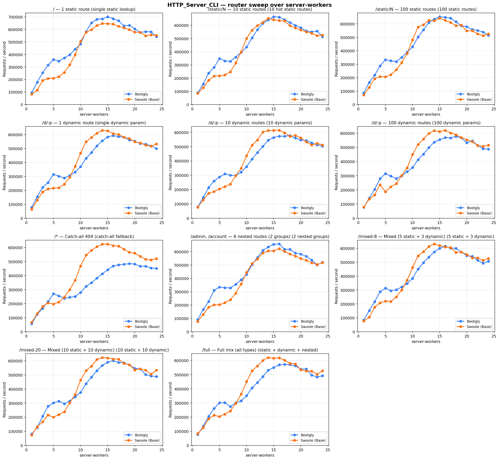
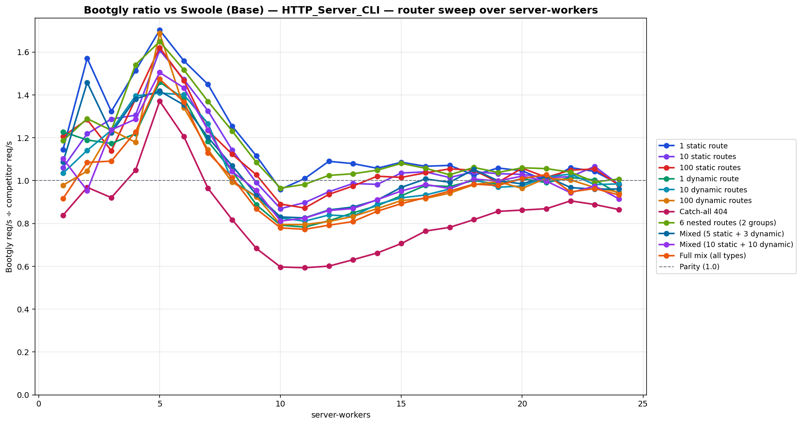

# HTTP_Server_CLI — router sweep over server-workers

`HTTP_Server_CLI` benchmark — sweep of 24 `.bench.marks` files
varying `server-workers` from `1` to `24`, scenario set
`router`. Generated by `chart.py` on `2026-06-02 22:57:02`.

## Environment

- **OS** — Linux 6.18.26.1-microsoft-standard-WSL2
- **CPU** — 24 logical processors
- **PHP** — 8.4.21
- **Swoole** — 6.2.0
- **Runner** — `tcp_client`
- **Scenario set** — `router`
- **Connections** — `514`
- **Duration** — `10`
- **Client workers** — `12`
- **Pipeline** — `1`

## Command

Reproduction sweep — replace `<IDS>` with the original `--scenarios=` argument:

```bash
for sw in 1 2 3 4 5 6 7 8 9 10 11 12 13 14 15 16 17 18 19 20 21 22 23 24; do
   php bootgly test benchmark HTTP_Server_CLI \
      --competitors=bootgly,swoole-(base) \
      --runner=tcp_client \
      --connections=514 \
      --duration=10 \
      --client-workers=12 \
      --server-workers="$sw" \
      --scenarios=<IDS>  # scenarios in this sweep: 1 static route, 10 static routes, 100 static routes, 1 dynamic route, 10 dynamic routes, 100 dynamic routes, Catch-all 404, 6 nested routes (2 groups), Mixed (5 static + 3 dynamic), Mixed (10 static + 10 dynamic), Full mix (all types)
done
```

## Throughput



## Bootgly / competitor ratio



Ratio > 1.0 means **Bootgly** is faster than the competitor at that server-workers.

## Comparison tables

### 1 static route

| `server-workers` | Bootgly | Swoole (Base) | Δ (Bootgly vs Swoole (Base)) |
|---:|---:|---:|---:|
| 1 | 95.479 | 83.367 | +14.5% |
| 2 | 178.827 | 113.828 | +57.1% |
| 3 | 253.709 | 191.792 | +32.3% |
| 4 | 314.745 | 208.049 | +51.3% |
| 5 | 358.620 | 210.666 | +70.2% |
| 6 | 347.064 | 222.591 | +55.9% |
| 7 | 371.658 | 256.499 | +44.9% |
| 8 | 398.058 | 317.396 | +25.4% |
| 9 | 442.520 | 396.772 | +11.5% |
| 10 | 483.870 | 504.367 | -4.1% |
| 11 | 582.493 | 576.939 | +1.0% |
| 12 | 651.697 | 597.818 | +9.0% |
| 13 | 681.012 | 630.973 | +7.9% |
| 14 | 683.883 | 646.649 | +5.8% |
| 15 | 700.737 | 645.409 | +8.6% |
| 16 | 685.051 | 642.084 | +6.7% |
| 17 | 669.028 | 624.571 | +7.1% |
| 18 | 627.620 | 611.855 | +2.6% |
| 19 | 632.708 | 597.465 | +5.9% |
| 20 | 604.420 | 577.990 | +4.6% |
| 21 | 575.015 | 576.268 | -0.2% |
| 22 | 582.159 | 548.825 | +6.1% |
| 23 | 579.356 | 555.571 | +4.3% |
| 24 | 541.913 | 550.982 | -1.6% |

### 10 static routes

| `server-workers` | Bootgly | Swoole (Base) | Δ (Bootgly vs Swoole (Base)) |
|---:|---:|---:|---:|
| 1 | 88.968 | 83.882 | +6.1% |
| 2 | 156.031 | 128.021 | +21.9% |
| 3 | 237.873 | 184.752 | +28.8% |
| 4 | 281.925 | 215.983 | +30.5% |
| 5 | 348.534 | 216.649 | +60.9% |
| 6 | 330.398 | 224.383 | +47.2% |
| 7 | 327.938 | 247.431 | +32.5% |
| 8 | 359.468 | 314.628 | +14.3% |
| 9 | 395.201 | 398.949 | -0.9% |
| 10 | 435.782 | 501.366 | -13.1% |
| 11 | 505.325 | 563.102 | -10.3% |
| 12 | 567.037 | 598.138 | -5.2% |
| 13 | 615.044 | 623.466 | -1.4% |
| 14 | 641.113 | 652.539 | -1.8% |
| 15 | 665.239 | 642.375 | +3.6% |
| 16 | 661.757 | 635.841 | +4.1% |
| 17 | 642.930 | 633.831 | +1.4% |
| 18 | 621.686 | 596.964 | +4.1% |
| 19 | 598.878 | 580.096 | +3.2% |
| 20 | 581.518 | 565.077 | +2.9% |
| 21 | 557.376 | 549.831 | +1.4% |
| 22 | 550.420 | 540.494 | +1.8% |
| 23 | 556.363 | 521.789 | +6.6% |
| 24 | 514.603 | 524.628 | -1.9% |

### 100 static routes

| `server-workers` | Bootgly | Swoole (Base) | Δ (Bootgly vs Swoole (Base)) |
|---:|---:|---:|---:|
| 1 | 85.464 | 70.836 | +20.7% |
| 2 | 164.707 | 128.193 | +28.5% |
| 3 | 219.230 | 192.447 | +13.9% |
| 4 | 287.543 | 208.221 | +38.1% |
| 5 | 333.684 | 205.840 | +62.1% |
| 6 | 325.383 | 221.746 | +46.7% |
| 7 | 319.355 | 258.796 | +23.4% |
| 8 | 351.669 | 313.144 | +12.3% |
| 9 | 390.286 | 380.081 | +2.7% |
| 10 | 429.269 | 482.074 | -11.0% |
| 11 | 502.153 | 575.868 | -12.8% |
| 12 | 556.394 | 594.566 | -6.4% |
| 13 | 610.561 | 626.397 | -2.5% |
| 14 | 636.246 | 623.443 | +2.1% |
| 15 | 653.008 | 643.305 | +1.5% |
| 16 | 649.704 | 626.891 | +3.6% |
| 17 | 643.416 | 610.009 | +5.5% |
| 18 | 615.835 | 587.305 | +4.9% |
| 19 | 586.433 | 590.768 | -0.7% |
| 20 | 579.505 | 547.870 | +5.8% |
| 21 | 557.934 | 549.533 | +1.5% |
| 22 | 551.520 | 525.863 | +4.9% |
| 23 | 539.794 | 512.021 | +5.4% |
| 24 | 515.478 | 526.655 | -2.1% |

### 1 dynamic route

| `server-workers` | Bootgly | Swoole (Base) | Δ (Bootgly vs Swoole (Base)) |
|---:|---:|---:|---:|
| 1 | 77.984 | 63.504 | +22.8% |
| 2 | 154.229 | 129.635 | +19.0% |
| 3 | 221.554 | 188.794 | +17.4% |
| 4 | 255.408 | 209.474 | +21.9% |
| 5 | 314.579 | 215.519 | +46.0% |
| 6 | 300.962 | 217.576 | +38.3% |
| 7 | 287.856 | 243.349 | +18.3% |
| 8 | 306.643 | 293.669 | +4.4% |
| 9 | 330.361 | 372.357 | -11.3% |
| 10 | 369.641 | 466.674 | -20.8% |
| 11 | 429.060 | 547.840 | -21.7% |
| 12 | 471.175 | 580.000 | -18.8% |
| 13 | 518.394 | 610.209 | -15.0% |
| 14 | 555.900 | 629.770 | -11.7% |
| 15 | 583.156 | 627.527 | -7.1% |
| 16 | 593.101 | 606.720 | -2.2% |
| 17 | 585.225 | 601.750 | -2.7% |
| 18 | 581.731 | 581.368 | +0.1% |
| 19 | 560.998 | 570.737 | -1.7% |
| 20 | 553.217 | 548.275 | +0.9% |
| 21 | 535.375 | 540.288 | -0.9% |
| 22 | 531.719 | 524.223 | +1.4% |
| 23 | 518.022 | 516.359 | +0.3% |
| 24 | 499.808 | 532.353 | -6.1% |

### 10 dynamic routes

| `server-workers` | Bootgly | Swoole (Base) | Δ (Bootgly vs Swoole (Base)) |
|---:|---:|---:|---:|
| 1 | 78.887 | 76.256 | +3.5% |
| 2 | 145.360 | 127.359 | +14.1% |
| 3 | 214.269 | 173.529 | +23.5% |
| 4 | 260.038 | 186.343 | +39.5% |
| 5 | 287.272 | 203.893 | +40.9% |
| 6 | 309.216 | 220.726 | +40.1% |
| 7 | 300.619 | 237.437 | +26.6% |
| 8 | 297.515 | 297.971 | -0.2% |
| 9 | 322.450 | 348.261 | -7.4% |
| 10 | 360.245 | 436.379 | -17.4% |
| 11 | 413.485 | 509.953 | -18.9% |
| 12 | 458.961 | 546.776 | -16.1% |
| 13 | 501.749 | 601.868 | -16.6% |
| 14 | 544.843 | 612.546 | -11.1% |
| 15 | 563.614 | 612.967 | -8.1% |
| 16 | 572.771 | 613.915 | -6.7% |
| 17 | 573.269 | 596.713 | -3.9% |
| 18 | 576.508 | 571.736 | +0.8% |
| 19 | 560.555 | 578.330 | -3.1% |
| 20 | 547.043 | 561.238 | -2.5% |
| 21 | 542.250 | 533.143 | +1.7% |
| 22 | 526.672 | 511.087 | +3.0% |
| 23 | 512.856 | 522.553 | -1.9% |
| 24 | 503.929 | 511.762 | -1.5% |

### 100 dynamic routes

| `server-workers` | Bootgly | Swoole (Base) | Δ (Bootgly vs Swoole (Base)) |
|---:|---:|---:|---:|
| 1 | 76.303 | 77.972 | -2.1% |
| 2 | 141.235 | 135.237 | +4.4% |
| 3 | 203.109 | 164.337 | +23.6% |
| 4 | 278.554 | 236.273 | +17.9% |
| 5 | 314.982 | 186.595 | +68.8% |
| 6 | 297.170 | 221.564 | +34.1% |
| 7 | 279.812 | 244.517 | +14.4% |
| 8 | 299.533 | 301.669 | -0.7% |
| 9 | 328.861 | 355.568 | -7.5% |
| 10 | 357.845 | 450.099 | -20.5% |
| 11 | 413.496 | 520.133 | -20.5% |
| 12 | 452.659 | 559.415 | -19.1% |
| 13 | 498.478 | 598.591 | -16.7% |
| 14 | 537.040 | 617.781 | -13.1% |
| 15 | 554.326 | 611.281 | -9.3% |
| 16 | 568.591 | 620.191 | -8.3% |
| 17 | 566.768 | 601.901 | -5.8% |
| 18 | 577.978 | 589.034 | -1.9% |
| 19 | 566.914 | 569.581 | -0.5% |
| 20 | 532.680 | 552.806 | -3.6% |
| 21 | 546.435 | 540.202 | +1.2% |
| 22 | 514.004 | 512.318 | +0.3% |
| 23 | 490.762 | 507.026 | -3.2% |
| 24 | 487.192 | 515.126 | -5.4% |

### Catch-all 404

| `server-workers` | Bootgly | Swoole (Base) | Δ (Bootgly vs Swoole (Base)) |
|---:|---:|---:|---:|
| 1 | 57.272 | 68.337 | -16.2% |
| 2 | 125.220 | 129.276 | -3.1% |
| 3 | 165.529 | 179.801 | -7.9% |
| 4 | 216.268 | 206.362 | +4.8% |
| 5 | 270.479 | 197.271 | +37.1% |
| 6 | 255.602 | 211.969 | +20.6% |
| 7 | 238.606 | 247.579 | -3.6% |
| 8 | 245.317 | 300.107 | -18.3% |
| 9 | 250.806 | 366.978 | -31.7% |
| 10 | 279.740 | 468.769 | -40.3% |
| 11 | 323.804 | 545.768 | -40.7% |
| 12 | 348.835 | 580.623 | -39.9% |
| 13 | 382.163 | 605.866 | -36.9% |
| 14 | 413.339 | 624.253 | -33.8% |
| 15 | 441.357 | 624.902 | -29.4% |
| 16 | 468.924 | 613.417 | -23.6% |
| 17 | 477.020 | 610.085 | -21.8% |
| 18 | 481.067 | 588.217 | -18.2% |
| 19 | 484.841 | 566.208 | -14.4% |
| 20 | 483.007 | 560.049 | -13.8% |
| 21 | 466.759 | 537.243 | -13.1% |
| 22 | 467.580 | 516.353 | -9.4% |
| 23 | 454.720 | 511.809 | -11.2% |
| 24 | 450.829 | 521.225 | -13.5% |

### 6 nested routes (2 groups)

| `server-workers` | Bootgly | Swoole (Base) | Δ (Bootgly vs Swoole (Base)) |
|---:|---:|---:|---:|
| 1 | 91.158 | 76.802 | +18.7% |
| 2 | 167.476 | 129.884 | +28.9% |
| 3 | 226.039 | 183.079 | +23.5% |
| 4 | 310.407 | 201.477 | +54.1% |
| 5 | 333.917 | 202.469 | +64.9% |
| 6 | 329.928 | 217.476 | +51.7% |
| 7 | 327.947 | 239.425 | +37.0% |
| 8 | 355.099 | 288.302 | +23.2% |
| 9 | 388.440 | 357.987 | +8.5% |
| 10 | 428.653 | 444.154 | -3.5% |
| 11 | 501.868 | 510.799 | -1.7% |
| 12 | 556.749 | 543.532 | +2.4% |
| 13 | 609.193 | 590.312 | +3.2% |
| 14 | 634.752 | 605.309 | +4.9% |
| 15 | 654.200 | 605.446 | +8.1% |
| 16 | 657.152 | 621.432 | +5.7% |
| 17 | 617.186 | 600.821 | +2.7% |
| 18 | 617.014 | 581.289 | +6.1% |
| 19 | 588.569 | 566.953 | +3.8% |
| 20 | 580.967 | 548.162 | +6.0% |
| 21 | 564.809 | 534.878 | +5.6% |
| 22 | 536.803 | 516.486 | +3.9% |
| 23 | 500.550 | 503.653 | -0.6% |
| 24 | 520.543 | 516.667 | +0.8% |

### Mixed (5 static + 3 dynamic)

| `server-workers` | Bootgly | Swoole (Base) | Δ (Bootgly vs Swoole (Base)) |
|---:|---:|---:|---:|
| 1 | 84.119 | 77.395 | +8.7% |
| 2 | 152.518 | 104.594 | +45.8% |
| 3 | 215.818 | 176.515 | +22.3% |
| 4 | 287.149 | 207.847 | +38.2% |
| 5 | 313.407 | 220.993 | +41.8% |
| 6 | 294.923 | 217.937 | +35.3% |
| 7 | 302.033 | 251.283 | +20.2% |
| 8 | 321.538 | 300.806 | +6.9% |
| 9 | 347.110 | 371.395 | -6.5% |
| 10 | 384.327 | 462.895 | -17.0% |
| 11 | 451.004 | 546.044 | -17.4% |
| 12 | 497.011 | 575.825 | -13.7% |
| 13 | 537.276 | 612.858 | -12.3% |
| 14 | 573.876 | 631.192 | -9.1% |
| 15 | 599.963 | 619.506 | -3.2% |
| 16 | 614.958 | 610.229 | +0.8% |
| 17 | 600.723 | 605.325 | -0.8% |
| 18 | 599.879 | 570.297 | +5.2% |
| 19 | 572.691 | 573.079 | -0.1% |
| 20 | 547.434 | 555.903 | -1.5% |
| 21 | 541.911 | 531.519 | +2.0% |
| 22 | 513.817 | 531.025 | -3.2% |
| 23 | 492.404 | 512.907 | -4.0% |
| 24 | 506.674 | 527.418 | -3.9% |

### Mixed (10 static + 10 dynamic)

| `server-workers` | Bootgly | Swoole (Base) | Δ (Bootgly vs Swoole (Base)) |
|---:|---:|---:|---:|
| 1 | 80.999 | 73.434 | +10.3% |
| 2 | 125.997 | 132.132 | -4.6% |
| 3 | 206.925 | 167.260 | +23.7% |
| 4 | 277.633 | 215.748 | +28.7% |
| 5 | 301.361 | 200.285 | +50.5% |
| 6 | 313.670 | 218.853 | +43.3% |
| 7 | 295.024 | 238.678 | +23.6% |
| 8 | 314.513 | 301.681 | +4.3% |
| 9 | 344.642 | 361.108 | -4.6% |
| 10 | 375.908 | 463.330 | -18.9% |
| 11 | 437.390 | 530.408 | -17.5% |
| 12 | 483.907 | 562.301 | -13.9% |
| 13 | 529.835 | 609.314 | -13.0% |
| 14 | 567.581 | 623.096 | -8.9% |
| 15 | 589.778 | 619.757 | -4.8% |
| 16 | 601.713 | 612.584 | -1.8% |
| 17 | 588.970 | 611.720 | -3.7% |
| 18 | 585.572 | 581.381 | +0.7% |
| 19 | 571.160 | 572.139 | -0.2% |
| 20 | 546.943 | 535.614 | +2.1% |
| 21 | 541.518 | 542.790 | -0.2% |
| 22 | 502.974 | 533.088 | -5.6% |
| 23 | 492.183 | 504.990 | -2.5% |
| 24 | 488.868 | 534.111 | -8.5% |

### Full mix (all types)

| `server-workers` | Bootgly | Swoole (Base) | Δ (Bootgly vs Swoole (Base)) |
|---:|---:|---:|---:|
| 1 | 76.346 | 83.367 | -8.4% |
| 2 | 136.262 | 125.624 | +8.5% |
| 3 | 204.812 | 187.713 | +9.1% |
| 4 | 261.279 | 212.813 | +22.8% |
| 5 | 300.737 | 203.988 | +47.4% |
| 6 | 302.031 | 220.887 | +36.7% |
| 7 | 274.150 | 242.568 | +13.0% |
| 8 | 300.519 | 296.427 | +1.4% |
| 9 | 314.169 | 362.028 | -13.2% |
| 10 | 351.510 | 450.940 | -22.0% |
| 11 | 406.724 | 526.427 | -22.7% |
| 12 | 443.877 | 560.604 | -20.8% |
| 13 | 485.927 | 600.663 | -19.1% |
| 14 | 531.863 | 620.634 | -14.3% |
| 15 | 550.237 | 616.403 | -10.7% |
| 16 | 569.252 | 618.371 | -7.9% |
| 17 | 572.416 | 601.833 | -4.9% |
| 18 | 570.341 | 579.804 | -1.6% |
| 19 | 561.986 | 575.005 | -2.3% |
| 20 | 538.830 | 533.855 | +0.9% |
| 21 | 540.312 | 525.486 | +2.8% |
| 22 | 496.173 | 523.956 | -5.3% |
| 23 | 483.786 | 502.247 | -3.7% |
| 24 | 491.491 | 526.853 | -6.7% |

## Peaks

| Scenario | Bootgly peak (req/s @ server-workers) | Swoole (Base) peak (req/s @ server-workers) | Δ at Bootgly peak |
|---|---|---|---|
| 1 static route | 700.737 @ 15 | 646.649 @ 14 | +8.6% |
| 10 static routes | 665.239 @ 15 | 652.539 @ 14 | +3.6% |
| 100 static routes | 653.008 @ 15 | 643.305 @ 15 | +1.5% |
| 1 dynamic route | 593.101 @ 16 | 629.770 @ 14 | -2.2% |
| 10 dynamic routes | 576.508 @ 18 | 613.915 @ 16 | +0.8% |
| 100 dynamic routes | 577.978 @ 18 | 620.191 @ 16 | -1.9% |
| Catch-all 404 | 484.841 @ 19 | 624.902 @ 15 | -14.4% |
| 6 nested routes (2 groups) | 657.152 @ 16 | 621.432 @ 16 | +5.7% |
| Mixed (5 static + 3 dynamic) | 614.958 @ 16 | 631.192 @ 14 | +0.8% |
| Mixed (10 static + 10 dynamic) | 601.713 @ 16 | 623.096 @ 14 | -1.8% |
| Full mix (all types) | 572.416 @ 17 | 620.634 @ 14 | -4.9% |

## Notes

- The sweep crosses the CPU oversubscription threshold — `server-workers + client-workers > 24` logical processors. Above that point the kernel scheduler and external services (e.g. PostgreSQL) become the bottleneck, not the framework.
- Files consumed: `2026-06-02_221038_bench.marks`, `2026-06-02_221509_bench.marks`, `2026-06-02_221940_bench.marks` … (+21 more)
