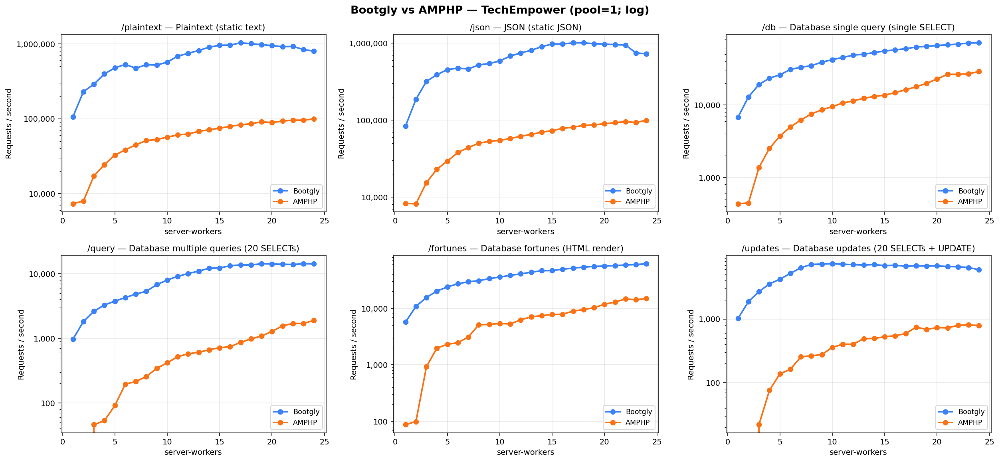
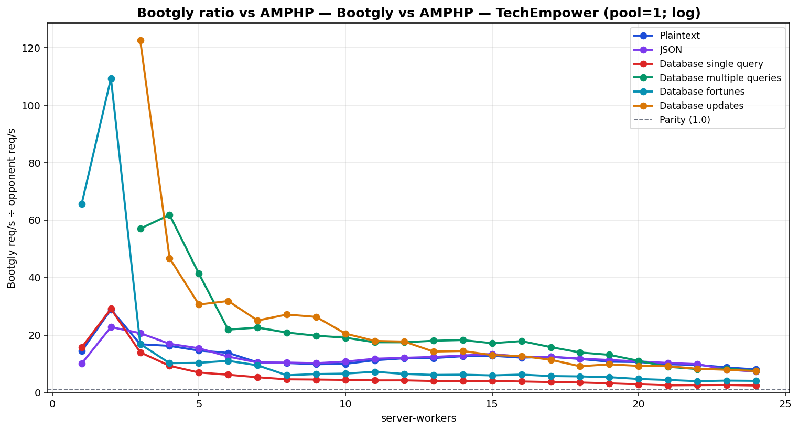

# Bootgly vs AMPHP — TechEmpower (pool=1; log)

`HTTP_Server_CLI` benchmark — sweep of 24 `.bench.marks` files
varying `server-workers` from `1` to `24`, load set
`techempower`. Generated by `chart.py` on `2026-06-25 16:15:42`.

## Environment

- **OS** — Linux 6.18.33.2-microsoft-standard-WSL2
- **CPU** — 24 logical processors
- **PHP** — 8.4.22
- **Runner** — `tcp_client`
- **Load set** — `techempower`
- **Connections** — `514`
- **Duration** — `10`
- **Client workers** — `12`
- **Pipeline** — `1`

## Command

Reproduction sweep — replace `<IDS>` with the original `--loads=` argument:

```bash
for sw in 1 2 3 4 5 6 7 8 9 10 11 12 13 14 15 16 17 18 19 20 21 22 23 24; do
   php bootgly test benchmark HTTP_Server_CLI \
      --opponents=bootgly,amphp \
      --runner=tcp_client \
      --connections=514 \
      --duration=10 \
      --client-workers=12 \
      --server-workers="$sw" \
      --loads=techempower:<IDS>  # loads in this sweep: Plaintext, JSON, Database single query, Database multiple queries, Database fortunes, Database updates
done
```

## Throughput



## Bootgly / opponent ratio



Ratio > 1.0 means **Bootgly** is faster than the opponent at that server-workers.

## Comparison tables

### Plaintext

| `server-workers` | Bootgly | AMPHP | Δ (Bootgly vs AMPHP) |
|---:|---:|---:|---:|
| 1 | 105.852 | 7.317 | +1346.7% |
| 2 | 230.071 | 7.963 | +2789.3% |
| 3 | 288.786 | 17.180 | +1580.9% |
| 4 | 396.443 | 24.396 | +1525.0% |
| 5 | 477.232 | 32.639 | +1362.2% |
| 6 | 530.421 | 38.391 | +1281.6% |
| 7 | 471.971 | 44.817 | +953.1% |
| 8 | 526.192 | 51.099 | +929.8% |
| 9 | 520.507 | 52.690 | +887.9% |
| 10 | 569.423 | 56.835 | +901.9% |
| 11 | 683.609 | 60.638 | +1027.4% |
| 12 | 746.721 | 62.598 | +1092.9% |
| 13 | 814.803 | 67.789 | +1102.0% |
| 14 | 901.248 | 71.227 | +1165.3% |
| 15 | 955.853 | 74.685 | +1179.8% |
| 16 | 961.718 | 79.064 | +1116.4% |
| 17 | 1.029.522 | 82.777 | +1143.7% |
| 18 | 1.004.181 | 85.787 | +1070.6% |
| 19 | 975.144 | 90.720 | +974.9% |
| 20 | 946.026 | 88.961 | +963.4% |
| 21 | 916.745 | 92.966 | +886.1% |
| 22 | 922.927 | 95.665 | +864.7% |
| 23 | 838.895 | 95.657 | +777.0% |
| 24 | 798.620 | 99.093 | +705.9% |

### JSON

| `server-workers` | Bootgly | AMPHP | Δ (Bootgly vs AMPHP) |
|---:|---:|---:|---:|
| 1 | 83.214 | 8.254 | +908.2% |
| 2 | 186.281 | 8.169 | +2180.3% |
| 3 | 318.262 | 15.401 | +1966.5% |
| 4 | 389.390 | 22.962 | +1595.8% |
| 5 | 452.725 | 29.352 | +1442.4% |
| 6 | 473.487 | 37.818 | +1152.0% |
| 7 | 461.688 | 43.994 | +949.4% |
| 8 | 522.122 | 49.955 | +945.2% |
| 9 | 543.054 | 53.074 | +923.2% |
| 10 | 587.426 | 54.452 | +978.8% |
| 11 | 679.864 | 57.652 | +1079.3% |
| 12 | 745.799 | 61.632 | +1110.1% |
| 13 | 808.067 | 65.117 | +1140.9% |
| 14 | 899.030 | 69.718 | +1189.5% |
| 15 | 976.421 | 72.832 | +1240.6% |
| 16 | 974.624 | 77.959 | +1150.2% |
| 17 | 1.008.593 | 80.845 | +1147.6% |
| 18 | 1.008.774 | 85.221 | +1083.7% |
| 19 | 983.990 | 86.782 | +1033.9% |
| 20 | 971.503 | 89.567 | +984.7% |
| 21 | 955.847 | 92.614 | +932.1% |
| 22 | 943.322 | 95.257 | +890.3% |
| 23 | 747.432 | 93.193 | +702.0% |
| 24 | 725.605 | 99.244 | +631.1% |

### Database single query

| `server-workers` | Bootgly | AMPHP | Δ (Bootgly vs AMPHP) |
|---:|---:|---:|---:|
| 1 | 6.790 | 433 | +1468.1% |
| 2 | 12.970 | 445 | +2814.6% |
| 3 | 19.172 | 1.371 | +1298.4% |
| 4 | 23.492 | 2.519 | +832.6% |
| 5 | 26.100 | 3.731 | +599.5% |
| 6 | 31.003 | 4.976 | +523.1% |
| 7 | 33.261 | 6.216 | +435.1% |
| 8 | 34.895 | 7.532 | +363.3% |
| 9 | 39.128 | 8.583 | +355.9% |
| 10 | 42.232 | 9.506 | +344.3% |
| 11 | 45.449 | 10.657 | +326.5% |
| 12 | 48.835 | 11.409 | +328.0% |
| 13 | 50.316 | 12.381 | +306.4% |
| 14 | 53.037 | 13.140 | +303.6% |
| 15 | 55.722 | 13.681 | +307.3% |
| 16 | 57.839 | 14.867 | +289.0% |
| 17 | 59.873 | 16.195 | +269.7% |
| 18 | 63.228 | 17.872 | +253.8% |
| 19 | 64.642 | 19.906 | +224.7% |
| 20 | 66.409 | 22.939 | +189.5% |
| 21 | 67.787 | 26.495 | +155.8% |
| 22 | 69.406 | 26.564 | +161.3% |
| 23 | 71.692 | 26.951 | +166.0% |
| 24 | 72.186 | 29.008 | +148.8% |

### Database multiple queries

| `server-workers` | Bootgly | AMPHP | Δ (Bootgly vs AMPHP) |
|---:|---:|---:|---:|
| 1 | 968 | 0 | — |
| 2 | 1.814 | 0 | — |
| 3 | 2.623 | 46 | +5602.2% |
| 4 | 3.276 | 53 | +6081.1% |
| 5 | 3.760 | 91 | +4031.9% |
| 6 | 4.272 | 195 | +2090.8% |
| 7 | 4.840 | 214 | +2161.7% |
| 8 | 5.348 | 256 | +1989.1% |
| 9 | 6.770 | 342 | +1879.5% |
| 10 | 7.986 | 418 | +1810.5% |
| 11 | 9.084 | 519 | +1650.3% |
| 12 | 10.073 | 576 | +1648.8% |
| 13 | 10.969 | 608 | +1704.1% |
| 14 | 12.141 | 664 | +1728.5% |
| 15 | 12.277 | 715 | +1617.1% |
| 16 | 13.277 | 741 | +1691.8% |
| 17 | 13.681 | 865 | +1481.6% |
| 18 | 13.667 | 979 | +1296.0% |
| 19 | 14.251 | 1.085 | +1213.5% |
| 20 | 14.145 | 1.280 | +1005.1% |
| 21 | 14.001 | 1.559 | +798.1% |
| 22 | 13.912 | 1.699 | +718.8% |
| 23 | 14.228 | 1.697 | +738.4% |
| 24 | 14.216 | 1.890 | +652.2% |

### Database fortunes

| `server-workers` | Bootgly | AMPHP | Δ (Bootgly vs AMPHP) |
|---:|---:|---:|---:|
| 1 | 5.704 | 87 | +6456.3% |
| 2 | 10.818 | 99 | +10827.3% |
| 3 | 15.558 | 923 | +1585.6% |
| 4 | 20.201 | 1.973 | +923.9% |
| 5 | 23.905 | 2.307 | +936.2% |
| 6 | 27.201 | 2.459 | +1006.2% |
| 7 | 29.517 | 3.109 | +849.4% |
| 8 | 30.845 | 5.113 | +503.3% |
| 9 | 33.503 | 5.175 | +547.4% |
| 10 | 35.786 | 5.402 | +562.5% |
| 11 | 38.284 | 5.271 | +626.3% |
| 12 | 40.738 | 6.260 | +550.8% |
| 13 | 43.510 | 7.053 | +516.9% |
| 14 | 46.358 | 7.416 | +525.1% |
| 15 | 46.497 | 7.755 | +499.6% |
| 16 | 49.385 | 7.864 | +528.0% |
| 17 | 51.386 | 8.915 | +476.4% |
| 18 | 53.568 | 9.494 | +464.2% |
| 19 | 55.268 | 10.266 | +438.4% |
| 20 | 56.018 | 11.793 | +375.0% |
| 21 | 56.913 | 12.895 | +341.4% |
| 22 | 58.557 | 14.644 | +299.9% |
| 23 | 59.528 | 14.181 | +319.8% |
| 24 | 61.469 | 14.954 | +311.1% |

### Database updates

| `server-workers` | Bootgly | AMPHP | Δ (Bootgly vs AMPHP) |
|---:|---:|---:|---:|
| 1 | 1.018 | 0 | — |
| 2 | 1.880 | 0 | — |
| 3 | 2.694 | 22 | +12145.5% |
| 4 | 3.552 | 76 | +4573.7% |
| 5 | 4.225 | 138 | +2961.6% |
| 6 | 5.191 | 163 | +3084.7% |
| 7 | 6.393 | 255 | +2407.1% |
| 8 | 7.193 | 265 | +2614.3% |
| 9 | 7.290 | 277 | +2531.8% |
| 10 | 7.363 | 359 | +1951.0% |
| 11 | 7.242 | 403 | +1697.0% |
| 12 | 7.140 | 402 | +1676.1% |
| 13 | 7.038 | 493 | +1327.6% |
| 14 | 7.158 | 495 | +1346.1% |
| 15 | 6.884 | 528 | +1203.8% |
| 16 | 6.969 | 547 | +1174.0% |
| 17 | 6.737 | 590 | +1041.9% |
| 18 | 6.834 | 746 | +816.1% |
| 19 | 6.766 | 687 | +884.9% |
| 20 | 6.820 | 734 | +829.2% |
| 21 | 6.669 | 726 | +818.6% |
| 22 | 6.614 | 797 | +729.9% |
| 23 | 6.432 | 809 | +695.1% |
| 24 | 5.947 | 789 | +653.7% |

## Peaks

| Load | Bootgly peak (req/s @ server-workers) | AMPHP peak (req/s @ server-workers) | Δ at Bootgly peak |
|---|---|---|---|
| Plaintext | 1.029.522 @ 17 | 99.093 @ 24 | +1143.7% |
| JSON | 1.008.774 @ 18 | 99.244 @ 24 | +1083.7% |
| Database single query | 72.186 @ 24 | 29.008 @ 24 | +148.8% |
| Database multiple queries | 14.251 @ 19 | 1.890 @ 24 | +1213.5% |
| Database fortunes | 61.469 @ 24 | 14.954 @ 24 | +311.1% |
| Database updates | 7.363 @ 10 | 809 @ 23 | +1951.0% |

## Notes

- The sweep crosses the CPU oversubscription threshold — `server-workers + client-workers > 24` logical processors. Above that point the kernel scheduler and external services (e.g. PostgreSQL) become the bottleneck, not the framework.
- Files consumed: `sw1.marks`, `sw2.marks`, `sw3.marks` … (+21 more)
