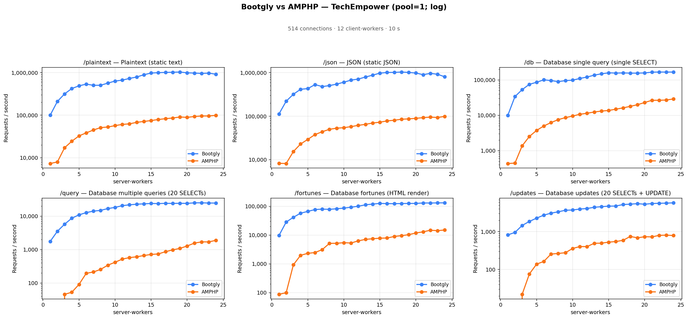
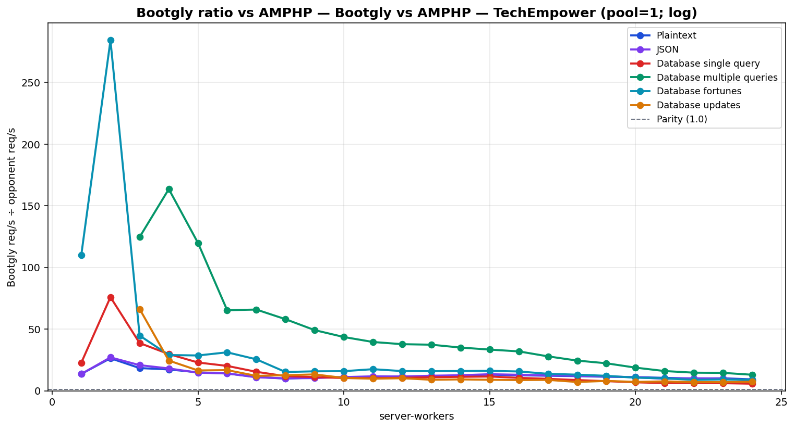

# Bootgly vs AMPHP — TechEmpower (pool=1; log)

`HTTP_Server_CLI` benchmark — sweep of 24 `.bench.marks` files
varying `server-workers` from `1` to `24`, load set
`techempower`. Generated by `chart.py` on `2026-07-04 00:21:14`.

## Environment

- **OS** — Linux 6.18.35.2-microsoft-standard-WSL2
- **CPU** — 24 logical processors
- **PHP** — 8.4.22
- **Runner** — `tcp_client`
- **Load set** — `techempower`
- **Connections** — `514`
- **Duration** — `10`
- **Client workers** — `12`
- **Pipeline** — `1`
- **DB pool max** — `1`

> **Equal per-worker DB connection — pool = `1` for every framework.** Bootgly, AMPHP inherit `DB_POOL_MAX=1` from the runner environment, so each worker holds at most 1 PostgreSQL connection(s). Every opponent therefore presents the same database footprint at each point (`server-workers` connections total), so no framework gets a connection-count advantage.

## Command

Reproduction sweep — replace `<IDS>` with the original `--loads=` argument:

```bash
for sw in 1 2 3 4 5 6 7 8 9 10 11 12 13 14 15 16 17 18 19 20 21 22 23 24; do
   php bootgly test benchmark HTTP_Server_CLI \
      --opponents=bootgly,amphp \
      --runner=tcp_client \
      --connections=514 \
      --duration=10 \
      --client-workers=12 \
      --server-workers="$sw" \
      --loads=techempower:<IDS>  # loads in this sweep: Plaintext, JSON, Database single query, Database multiple queries, Database fortunes, Database updates
done
```

## Throughput



## Bootgly / opponent ratio



Ratio > 1.0 means **Bootgly** is faster than the opponent at that server-workers.

## Comparison tables

### Plaintext

| `server-workers` | Bootgly | AMPHP | Δ (Bootgly vs AMPHP) |
|---:|---:|---:|---:|
| 1 | 99.921 | 7.317 | +1265.6% |
| 2 | 210.069 | 7.963 | +2538.1% |
| 3 | 316.322 | 17.180 | +1741.2% |
| 4 | 422.704 | 24.396 | +1632.7% |
| 5 | 488.312 | 32.639 | +1396.1% |
| 6 | 536.669 | 38.391 | +1297.9% |
| 7 | 502.562 | 44.817 | +1021.4% |
| 8 | 504.767 | 51.099 | +887.8% |
| 9 | 565.801 | 52.690 | +973.8% |
| 10 | 632.803 | 56.835 | +1013.4% |
| 11 | 665.553 | 60.638 | +997.6% |
| 12 | 728.921 | 62.598 | +1064.4% |
| 13 | 788.326 | 67.789 | +1062.9% |
| 14 | 890.178 | 71.227 | +1149.8% |
| 15 | 976.522 | 74.685 | +1207.5% |
| 16 | 996.948 | 79.064 | +1160.9% |
| 17 | 1.009.569 | 82.777 | +1119.6% |
| 18 | 1.019.602 | 85.787 | +1088.5% |
| 19 | 1.030.930 | 90.720 | +1036.4% |
| 20 | 988.302 | 88.961 | +1010.9% |
| 21 | 974.867 | 92.966 | +948.6% |
| 22 | 956.691 | 95.665 | +900.0% |
| 23 | 971.745 | 95.657 | +915.9% |
| 24 | 916.496 | 99.093 | +824.9% |

### JSON

| `server-workers` | Bootgly | AMPHP | Δ (Bootgly vs AMPHP) |
|---:|---:|---:|---:|
| 1 | 112.547 | 8.254 | +1263.5% |
| 2 | 221.290 | 8.169 | +2608.9% |
| 3 | 320.172 | 15.401 | +1978.9% |
| 4 | 416.173 | 22.962 | +1712.4% |
| 5 | 431.163 | 29.352 | +1368.9% |
| 6 | 534.119 | 37.818 | +1312.3% |
| 7 | 480.331 | 43.994 | +991.8% |
| 8 | 505.785 | 49.955 | +912.5% |
| 9 | 546.849 | 53.074 | +930.4% |
| 10 | 605.271 | 54.452 | +1011.6% |
| 11 | 676.673 | 57.652 | +1073.7% |
| 12 | 714.545 | 61.632 | +1059.4% |
| 13 | 796.470 | 65.117 | +1123.1% |
| 14 | 879.212 | 69.718 | +1161.1% |
| 15 | 978.960 | 72.832 | +1244.1% |
| 16 | 1.012.949 | 77.959 | +1199.3% |
| 17 | 1.018.295 | 80.845 | +1159.6% |
| 18 | 1.037.342 | 85.221 | +1117.2% |
| 19 | 1.014.478 | 86.782 | +1069.0% |
| 20 | 984.301 | 89.567 | +999.0% |
| 21 | 901.336 | 92.614 | +873.2% |
| 22 | 966.706 | 95.257 | +914.8% |
| 23 | 922.392 | 93.193 | +889.8% |
| 24 | 805.515 | 99.244 | +711.7% |

### Database single query

| `server-workers` | Bootgly | AMPHP | Δ (Bootgly vs AMPHP) |
|---:|---:|---:|---:|
| 1 | 9.850 | 433 | +2174.8% |
| 2 | 33.793 | 445 | +7493.9% |
| 3 | 53.029 | 1.371 | +3767.9% |
| 4 | 75.043 | 2.519 | +2879.1% |
| 5 | 85.549 | 3.731 | +2192.9% |
| 6 | 100.427 | 4.976 | +1918.2% |
| 7 | 95.756 | 6.216 | +1440.5% |
| 8 | 89.275 | 7.532 | +1085.3% |
| 9 | 95.309 | 8.583 | +1010.4% |
| 10 | 98.314 | 9.506 | +934.2% |
| 11 | 109.631 | 10.657 | +928.7% |
| 12 | 120.502 | 11.409 | +956.2% |
| 13 | 136.056 | 12.381 | +998.9% |
| 14 | 148.753 | 13.140 | +1032.1% |
| 15 | 158.429 | 13.681 | +1058.0% |
| 16 | 156.022 | 14.867 | +949.5% |
| 17 | 157.375 | 16.195 | +871.8% |
| 18 | 155.523 | 17.872 | +770.2% |
| 19 | 155.297 | 19.906 | +680.2% |
| 20 | 157.444 | 22.939 | +586.4% |
| 21 | 165.217 | 26.495 | +523.6% |
| 22 | 166.746 | 26.564 | +527.7% |
| 23 | 166.209 | 26.951 | +516.7% |
| 24 | 166.478 | 29.008 | +473.9% |

### Database multiple queries

| `server-workers` | Bootgly | AMPHP | Δ (Bootgly vs AMPHP) |
|---:|---:|---:|---:|
| 1 | 1.754 | 0 | — |
| 2 | 3.525 | 0 | — |
| 3 | 5.735 | 46 | +12367.4% |
| 4 | 8.668 | 53 | +16254.7% |
| 5 | 10.910 | 91 | +11889.0% |
| 6 | 12.744 | 195 | +6435.4% |
| 7 | 14.096 | 214 | +6486.9% |
| 8 | 14.862 | 256 | +5705.5% |
| 9 | 16.823 | 342 | +4819.0% |
| 10 | 18.224 | 418 | +4259.8% |
| 11 | 20.536 | 519 | +3856.8% |
| 12 | 21.767 | 576 | +3679.0% |
| 13 | 22.725 | 608 | +3637.7% |
| 14 | 23.273 | 664 | +3405.0% |
| 15 | 23.892 | 715 | +3241.5% |
| 16 | 23.668 | 741 | +3094.1% |
| 17 | 24.138 | 865 | +2690.5% |
| 18 | 23.975 | 979 | +2348.9% |
| 19 | 24.199 | 1.085 | +2130.3% |
| 20 | 24.025 | 1.280 | +1777.0% |
| 21 | 24.954 | 1.559 | +1500.6% |
| 22 | 24.966 | 1.699 | +1369.5% |
| 23 | 24.644 | 1.697 | +1352.2% |
| 24 | 24.577 | 1.890 | +1200.4% |

### Database fortunes

| `server-workers` | Bootgly | AMPHP | Δ (Bootgly vs AMPHP) |
|---:|---:|---:|---:|
| 1 | 9.584 | 87 | +10916.1% |
| 2 | 28.133 | 99 | +28317.2% |
| 3 | 41.327 | 923 | +4377.5% |
| 4 | 57.226 | 1.973 | +2800.5% |
| 5 | 66.085 | 2.307 | +2764.5% |
| 6 | 76.708 | 2.459 | +3019.5% |
| 7 | 79.356 | 3.109 | +2452.5% |
| 8 | 77.949 | 5.113 | +1424.5% |
| 9 | 81.724 | 5.175 | +1479.2% |
| 10 | 85.974 | 5.402 | +1491.5% |
| 11 | 92.399 | 5.271 | +1653.0% |
| 12 | 100.014 | 6.260 | +1497.7% |
| 13 | 112.051 | 7.053 | +1488.7% |
| 14 | 118.756 | 7.416 | +1501.3% |
| 15 | 125.300 | 7.755 | +1515.7% |
| 16 | 123.229 | 7.864 | +1467.0% |
| 17 | 122.659 | 8.915 | +1275.9% |
| 18 | 124.136 | 9.494 | +1207.5% |
| 19 | 124.679 | 10.266 | +1114.5% |
| 20 | 125.256 | 11.793 | +962.1% |
| 21 | 129.826 | 12.895 | +906.8% |
| 22 | 129.338 | 14.644 | +783.2% |
| 23 | 130.596 | 14.181 | +820.9% |
| 24 | 131.263 | 14.954 | +777.8% |

### Database updates

| `server-workers` | Bootgly | AMPHP | Δ (Bootgly vs AMPHP) |
|---:|---:|---:|---:|
| 1 | 819 | 0 | — |
| 2 | 954 | 0 | — |
| 3 | 1.459 | 22 | +6531.8% |
| 4 | 1.862 | 76 | +2350.0% |
| 5 | 2.276 | 138 | +1549.3% |
| 6 | 2.732 | 163 | +1576.1% |
| 7 | 3.081 | 255 | +1108.2% |
| 8 | 3.347 | 265 | +1163.0% |
| 9 | 3.679 | 277 | +1228.2% |
| 10 | 3.737 | 359 | +940.9% |
| 11 | 3.957 | 403 | +881.9% |
| 12 | 4.094 | 402 | +918.4% |
| 13 | 4.411 | 493 | +794.7% |
| 14 | 4.575 | 495 | +824.2% |
| 15 | 4.723 | 528 | +794.5% |
| 16 | 4.758 | 547 | +769.8% |
| 17 | 5.213 | 590 | +783.6% |
| 18 | 5.333 | 746 | +614.9% |
| 19 | 5.499 | 687 | +700.4% |
| 20 | 5.309 | 734 | +623.3% |
| 21 | 5.536 | 726 | +662.5% |
| 22 | 5.627 | 797 | +606.0% |
| 23 | 5.676 | 809 | +601.6% |
| 24 | 5.782 | 789 | +632.8% |

## Peaks

| Load | Bootgly peak (req/s @ server-workers) | AMPHP peak (req/s @ server-workers) | Δ at Bootgly peak |
|---|---|---|---|
| Plaintext | 1.030.930 @ 19 | 99.093 @ 24 | +1036.4% |
| JSON | 1.037.342 @ 18 | 99.244 @ 24 | +1117.2% |
| Database single query | 166.746 @ 22 | 29.008 @ 24 | +527.7% |
| Database multiple queries | 24.966 @ 22 | 1.890 @ 24 | +1369.5% |
| Database fortunes | 131.263 @ 24 | 14.954 @ 24 | +777.8% |
| Database updates | 5.782 @ 24 | 809 @ 23 | +632.8% |

## Notes

- The sweep crosses the CPU oversubscription threshold — `server-workers + client-workers > 24` logical processors. Above that point the kernel scheduler and external services (e.g. PostgreSQL) become the bottleneck, not the framework.
- Files consumed: `sw01_bench.marks`, `sw02_bench.marks`, `sw03_bench.marks` … (+21 more)
- Provenance: the Bootgly series was re-measured on `v0.19.1-beta` (2026-07-04, persistent Fiber pool + DBAL hot path); the opponent series is the previously published sweep (2026-06) on the same machine/runner/`DB_POOL_MAX=1` setup, merged per `server-workers` point. Opponent latency is omitted where the original `.bench.marks` were no longer available.
