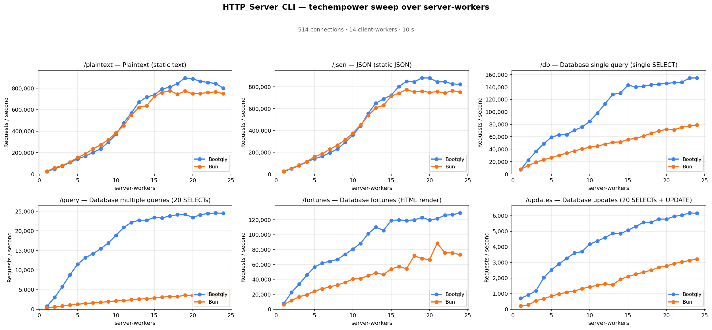
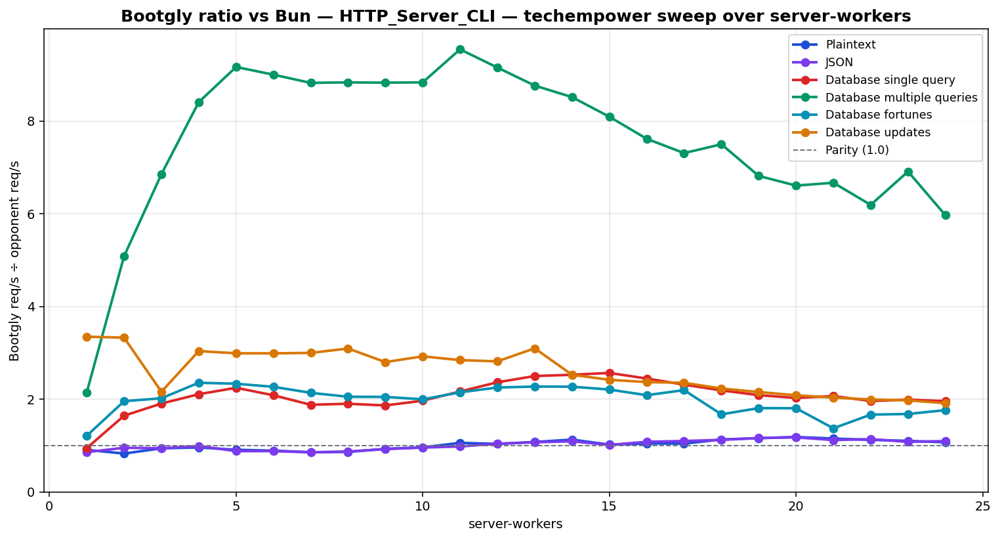

# HTTP_Server_CLI — techempower sweep over server-workers

`HTTP_Server_CLI` benchmark — sweep of 24 `.bench.marks` files
varying `server-workers` from `1` to `24`, load set
`techempower`. Generated by `chart.py` on `2026-07-21 20:15:30`.

## Environment

- **OS** — Linux 6.18.35.2-microsoft-standard-WSL2
- **CPU** — 24 logical processors
- **PHP** — 8.4.23
- **Source identity version** — `raw-delta-manifest-v1`
- **Framework version** — `0.24.0-beta`
- **Framework SHA** — `1e2e6145e253c46b07735766d2d9bf8bb4113181`
- **Framework dirty** — `true`
- **Framework tracked diff SHA-256** — `3289bea2c3fb2c34dc7911b15b80a6b372642b43f6fbc4eb19aa5dcad7912437`
- **Framework untracked manifest SHA-256** — `0958481adc9d9e558c790a6d152d6580f741064b0d6d6965bfdec7b3580ec0d2`
- **Benchmarks SHA** — `a10d5f9a2c604df15d07bfa61d7f608561fb3690`
- **Benchmarks dirty** — `true`
- **Benchmarks tracked diff SHA-256** — `7117a920b9ca51cbe43d3319af63aef99cdcc94bbe8df539c0dfe55eed1842b3`
- **Benchmarks untracked manifest SHA-256** — `a18886c804b9f1625baa26bfc83cc1427406f38a0718188dcff1679cc2205ed0`
- **Runner** — `tcp_client`
- **Load set** — `techempower`
- **Connections** — `514`
- **Duration** — `10`
- **Client workers** — `14`
- **Pipeline** — `1`
- **DB pool max** — `1`
- **DB pool comparability** — `capability-validated-v1`

> **Configured per-worker DB ceiling validated at `1`.** The harness accepted these results only after matching every selected opponent to a source-inspected pool-aware implementation or a fixed-one implementation whose ceiling equals the requested value. This validates the configured ceiling; it does not claim that this many PostgreSQL sessions were simultaneously open.

## Command

Reproduction sweep — replace `<IDS>` with the original `--loads=` argument:

```bash
php bootgly test benchmark HTTP_Server_CLI \
   --opponents=bootgly,bun \
   --runner=tcp_client \
   --connections=514 \
   --duration=10 \
   --client-workers=14 \
   --server-workers=1..24 \
   --loads=techempower:<IDS>  # loads in this sweep: Plaintext, JSON, Database single query, Database multiple queries, Database fortunes, Database updates
```

## Throughput



## Bootgly / opponent ratio



Ratio > 1.0 means **Bootgly** is faster than the opponent at that server-workers.

## Comparison tables

### Plaintext

| `server-workers` | Bootgly | Bun | Δ (Bootgly vs Bun) |
|---:|---:|---:|---:|
| 1 | 23.297 | 25.681 | -9.3% |
| 2 | 48.943 | 59.187 | -17.3% |
| 3 | 75.080 | 79.857 | -6.0% |
| 4 | 107.133 | 111.751 | -4.1% |
| 5 | 141.013 | 155.167 | -9.1% |
| 6 | 166.939 | 187.635 | -11.0% |
| 7 | 200.731 | 234.086 | -14.2% |
| 8 | 235.234 | 272.993 | -13.8% |
| 9 | 297.229 | 319.827 | -7.1% |
| 10 | 369.736 | 384.701 | -3.9% |
| 11 | 476.266 | 450.246 | +5.8% |
| 12 | 568.927 | 549.238 | +3.6% |
| 13 | 669.637 | 621.571 | +7.7% |
| 14 | 717.655 | 636.240 | +12.8% |
| 15 | 737.466 | 723.284 | +2.0% |
| 16 | 791.944 | 758.273 | +4.4% |
| 17 | 809.265 | 776.968 | +4.2% |
| 18 | 841.594 | 744.168 | +13.1% |
| 19 | 895.711 | 772.732 | +15.9% |
| 20 | 886.721 | 748.439 | +18.5% |
| 21 | 863.468 | 750.480 | +15.1% |
| 22 | 853.569 | 760.168 | +12.3% |
| 23 | 842.850 | 765.364 | +10.1% |
| 24 | 800.610 | 748.595 | +6.9% |

### JSON

| `server-workers` | Bootgly | Bun | Δ (Bootgly vs Bun) |
|---:|---:|---:|---:|
| 1 | 23.285 | 27.154 | -14.2% |
| 2 | 49.768 | 52.280 | -4.8% |
| 3 | 77.678 | 82.603 | -6.0% |
| 4 | 112.177 | 113.272 | -1.0% |
| 5 | 140.726 | 160.055 | -12.1% |
| 6 | 162.815 | 185.080 | -12.0% |
| 7 | 194.799 | 228.286 | -14.7% |
| 8 | 231.703 | 265.624 | -12.8% |
| 9 | 290.545 | 314.865 | -7.7% |
| 10 | 358.084 | 374.538 | -4.4% |
| 11 | 441.719 | 450.632 | -2.0% |
| 12 | 557.515 | 537.287 | +3.8% |
| 13 | 650.626 | 608.098 | +7.0% |
| 14 | 688.980 | 631.556 | +9.1% |
| 15 | 723.981 | 714.491 | +1.3% |
| 16 | 802.538 | 742.338 | +8.1% |
| 17 | 851.264 | 775.374 | +9.8% |
| 18 | 844.989 | 753.100 | +12.2% |
| 19 | 882.620 | 759.808 | +16.2% |
| 20 | 880.778 | 749.478 | +17.5% |
| 21 | 845.768 | 756.406 | +11.8% |
| 22 | 847.521 | 745.231 | +13.7% |
| 23 | 826.908 | 765.770 | +8.0% |
| 24 | 823.549 | 751.215 | +9.6% |

### Database single query

| `server-workers` | Bootgly | Bun | Δ (Bootgly vs Bun) |
|---:|---:|---:|---:|
| 1 | 7.247 | 7.680 | -5.6% |
| 2 | 22.564 | 13.725 | +64.4% |
| 3 | 36.387 | 19.094 | +90.6% |
| 4 | 49.008 | 23.259 | +110.7% |
| 5 | 59.206 | 26.362 | +124.6% |
| 6 | 63.057 | 30.255 | +108.4% |
| 7 | 63.434 | 33.745 | +88.0% |
| 8 | 70.641 | 37.155 | +90.1% |
| 9 | 75.514 | 40.491 | +86.5% |
| 10 | 84.879 | 43.143 | +96.7% |
| 11 | 97.995 | 45.256 | +116.5% |
| 12 | 113.066 | 47.826 | +136.4% |
| 13 | 127.927 | 51.190 | +149.9% |
| 14 | 130.585 | 51.699 | +152.6% |
| 15 | 143.009 | 55.727 | +156.6% |
| 16 | 139.998 | 57.262 | +144.5% |
| 17 | 141.336 | 61.088 | +131.4% |
| 18 | 143.525 | 65.552 | +118.9% |
| 19 | 144.549 | 69.263 | +108.7% |
| 20 | 145.766 | 71.934 | +102.6% |
| 21 | 147.038 | 71.143 | +106.7% |
| 22 | 147.648 | 75.311 | +96.1% |
| 23 | 154.443 | 77.619 | +99.0% |
| 24 | 154.675 | 78.997 | +95.8% |

### Database multiple queries

| `server-workers` | Bootgly | Bun | Δ (Bootgly vs Bun) |
|---:|---:|---:|---:|
| 1 | 771 | 359 | +114.8% |
| 2 | 2.999 | 590 | +408.3% |
| 3 | 5.742 | 838 | +585.2% |
| 4 | 8.784 | 1.045 | +740.6% |
| 5 | 11.474 | 1.252 | +816.5% |
| 6 | 13.121 | 1.458 | +799.9% |
| 7 | 14.141 | 1.603 | +782.2% |
| 8 | 15.440 | 1.748 | +783.3% |
| 9 | 16.893 | 1.914 | +782.6% |
| 10 | 18.860 | 2.135 | +783.4% |
| 11 | 20.846 | 2.184 | +854.5% |
| 12 | 22.140 | 2.419 | +815.3% |
| 13 | 22.698 | 2.590 | +776.4% |
| 14 | 22.709 | 2.667 | +751.5% |
| 15 | 23.432 | 2.896 | +709.1% |
| 16 | 23.289 | 3.058 | +661.6% |
| 17 | 23.792 | 3.256 | +630.7% |
| 18 | 24.106 | 3.215 | +649.8% |
| 19 | 24.236 | 3.556 | +581.6% |
| 20 | 23.406 | 3.543 | +560.6% |
| 21 | 24.079 | 3.611 | +566.8% |
| 22 | 24.457 | 3.951 | +519.0% |
| 23 | 24.553 | 3.553 | +591.0% |
| 24 | 24.479 | 4.102 | +496.8% |

### Database fortunes

| `server-workers` | Bootgly | Bun | Δ (Bootgly vs Bun) |
|---:|---:|---:|---:|
| 1 | 7.789 | 6.433 | +21.1% |
| 2 | 22.572 | 11.538 | +95.6% |
| 3 | 33.673 | 16.675 | +101.9% |
| 4 | 45.748 | 19.433 | +135.4% |
| 5 | 56.516 | 24.223 | +133.3% |
| 6 | 61.808 | 27.268 | +126.7% |
| 7 | 64.263 | 30.074 | +113.7% |
| 8 | 66.797 | 32.552 | +105.2% |
| 9 | 73.749 | 35.988 | +104.9% |
| 10 | 80.656 | 40.392 | +99.7% |
| 11 | 88.257 | 41.100 | +114.7% |
| 12 | 101.226 | 44.951 | +125.2% |
| 13 | 110.167 | 48.492 | +127.2% |
| 14 | 105.658 | 46.552 | +127.0% |
| 15 | 119.033 | 53.930 | +120.7% |
| 16 | 119.656 | 57.366 | +108.6% |
| 17 | 119.075 | 54.230 | +119.6% |
| 18 | 119.757 | 71.595 | +67.3% |
| 19 | 123.013 | 68.059 | +80.7% |
| 20 | 119.753 | 66.373 | +80.4% |
| 21 | 121.406 | 88.494 | +37.2% |
| 22 | 126.131 | 75.681 | +66.7% |
| 23 | 126.785 | 75.436 | +68.1% |
| 24 | 129.063 | 73.160 | +76.4% |

### Database updates

| `server-workers` | Bootgly | Bun | Δ (Bootgly vs Bun) |
|---:|---:|---:|---:|
| 1 | 703 | 210 | +234.8% |
| 2 | 915 | 275 | +232.7% |
| 3 | 1.182 | 547 | +116.1% |
| 4 | 2.026 | 667 | +203.7% |
| 5 | 2.526 | 845 | +198.9% |
| 6 | 2.902 | 971 | +198.9% |
| 7 | 3.265 | 1.089 | +199.8% |
| 8 | 3.603 | 1.165 | +209.3% |
| 9 | 3.696 | 1.320 | +180.0% |
| 10 | 4.175 | 1.428 | +192.4% |
| 11 | 4.375 | 1.539 | +184.3% |
| 12 | 4.587 | 1.629 | +181.6% |
| 13 | 4.862 | 1.570 | +209.7% |
| 14 | 4.841 | 1.917 | +152.5% |
| 15 | 5.071 | 2.097 | +141.8% |
| 16 | 5.302 | 2.239 | +136.8% |
| 17 | 5.572 | 2.368 | +135.3% |
| 18 | 5.575 | 2.500 | +123.0% |
| 19 | 5.779 | 2.683 | +115.4% |
| 20 | 5.781 | 2.773 | +108.5% |
| 21 | 5.953 | 2.928 | +103.3% |
| 22 | 6.028 | 3.023 | +99.4% |
| 23 | 6.171 | 3.125 | +97.5% |
| 24 | 6.153 | 3.216 | +91.3% |

## Peaks

| Load | Bootgly peak (req/s @ server-workers) | Bun peak (req/s @ server-workers) | Δ at Bootgly peak |
|---|---|---|---|
| Plaintext | 895.711 @ 19 | 776.968 @ 17 | +15.9% |
| JSON | 882.620 @ 19 | 775.374 @ 17 | +16.2% |
| Database single query | 154.675 @ 24 | 78.997 @ 24 | +95.8% |
| Database multiple queries | 24.553 @ 23 | 4.102 @ 24 | +591.0% |
| Database fortunes | 129.063 @ 24 | 88.494 @ 21 | +76.4% |
| Database updates | 6.171 @ 23 | 3.216 @ 24 | +97.5% |

## Notes

- **Dirty source tree:** framework and benchmark suite contained uncommitted or untracked changes when the benchmark started.
- The sweep crosses the CPU oversubscription threshold — `server-workers + client-workers > 24` logical processors. Above that point the kernel scheduler and external services (e.g. PostgreSQL) become the bottleneck, not the framework.
- Files consumed: `r01_bench.marks`, `r02_bench.marks`, `r03_bench.marks` … (+21 more)
- Provenance: all series come from one combined `bootgly,express,bun` sweep (2026-07-21, this machine, `DB_POOL_MAX=1`), split per opponent pair for this report; the `Cached queries` load was measured in the same sweep but is excluded here for parity with the earlier opponent reports. Three cells — Bootgly × Database multiple queries @ `server-workers` 3, 17 and 24 — failed the fail-closed warmup proof during the sweep (single `read_failed` probe under peak oversubscription) and were re-measured immediately after it on the same machine/configuration, then merged per `server-workers` point.
