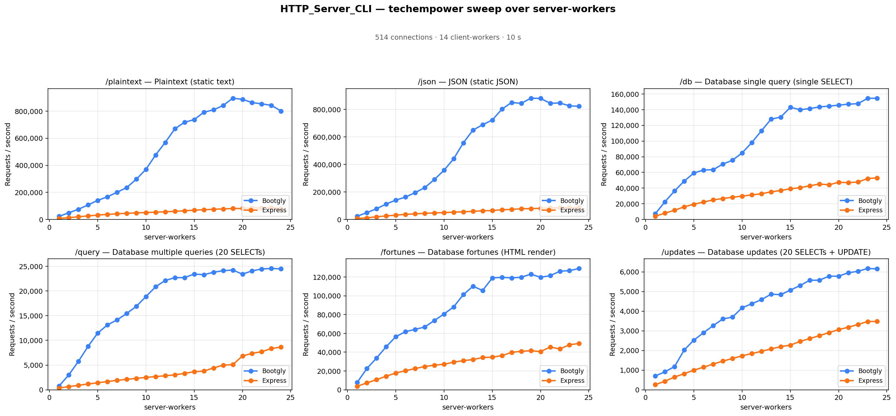
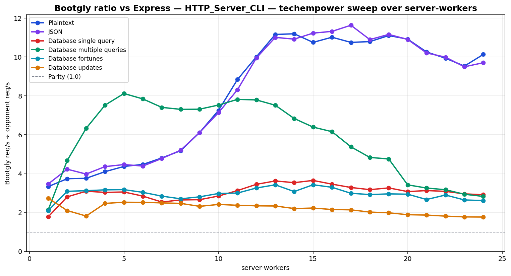

# HTTP_Server_CLI — techempower sweep over server-workers

`HTTP_Server_CLI` benchmark — sweep of 24 `.bench.marks` files
varying `server-workers` from `1` to `24`, load set
`techempower`. Generated by `chart.py` on `2026-07-21 20:15:35`.

## Environment

- **OS** — Linux 6.18.35.2-microsoft-standard-WSL2
- **CPU** — 24 logical processors
- **PHP** — 8.4.23
- **Source identity version** — `raw-delta-manifest-v1`
- **Framework version** — `0.24.0-beta`
- **Framework SHA** — `1e2e6145e253c46b07735766d2d9bf8bb4113181`
- **Framework dirty** — `true`
- **Framework tracked diff SHA-256** — `3289bea2c3fb2c34dc7911b15b80a6b372642b43f6fbc4eb19aa5dcad7912437`
- **Framework untracked manifest SHA-256** — `0958481adc9d9e558c790a6d152d6580f741064b0d6d6965bfdec7b3580ec0d2`
- **Benchmarks SHA** — `a10d5f9a2c604df15d07bfa61d7f608561fb3690`
- **Benchmarks dirty** — `true`
- **Benchmarks tracked diff SHA-256** — `7117a920b9ca51cbe43d3319af63aef99cdcc94bbe8df539c0dfe55eed1842b3`
- **Benchmarks untracked manifest SHA-256** — `a18886c804b9f1625baa26bfc83cc1427406f38a0718188dcff1679cc2205ed0`
- **Runner** — `tcp_client`
- **Load set** — `techempower`
- **Connections** — `514`
- **Duration** — `10`
- **Client workers** — `14`
- **Pipeline** — `1`
- **DB pool max** — `1`
- **DB pool comparability** — `capability-validated-v1`

> **Configured per-worker DB ceiling validated at `1`.** The harness accepted these results only after matching every selected opponent to a source-inspected pool-aware implementation or a fixed-one implementation whose ceiling equals the requested value. This validates the configured ceiling; it does not claim that this many PostgreSQL sessions were simultaneously open.

## Command

Reproduction sweep — replace `<IDS>` with the original `--loads=` argument:

```bash
php bootgly test benchmark HTTP_Server_CLI \
   --opponents=bootgly,express \
   --runner=tcp_client \
   --connections=514 \
   --duration=10 \
   --client-workers=14 \
   --server-workers=1..24 \
   --loads=techempower:<IDS>  # loads in this sweep: Plaintext, JSON, Database single query, Database multiple queries, Database fortunes, Database updates
```

## Throughput



## Bootgly / opponent ratio



Ratio > 1.0 means **Bootgly** is faster than the opponent at that server-workers.

## Comparison tables

### Plaintext

| `server-workers` | Bootgly | Express | Δ (Bootgly vs Express) |
|---:|---:|---:|---:|
| 1 | 23.297 | 6.980 | +233.8% |
| 2 | 48.943 | 13.085 | +274.0% |
| 3 | 75.080 | 19.953 | +276.3% |
| 4 | 107.133 | 26.104 | +310.4% |
| 5 | 141.013 | 32.250 | +337.2% |
| 6 | 166.939 | 37.291 | +347.7% |
| 7 | 200.731 | 41.733 | +381.0% |
| 8 | 235.234 | 45.390 | +418.3% |
| 9 | 297.229 | 48.572 | +511.9% |
| 10 | 369.736 | 50.946 | +625.7% |
| 11 | 476.266 | 53.851 | +784.4% |
| 12 | 568.927 | 56.830 | +901.1% |
| 13 | 669.637 | 59.972 | +1016.6% |
| 14 | 717.655 | 64.089 | +1019.8% |
| 15 | 737.466 | 68.555 | +975.7% |
| 16 | 791.944 | 71.853 | +1002.2% |
| 17 | 809.265 | 75.236 | +975.6% |
| 18 | 841.594 | 77.952 | +979.6% |
| 19 | 895.711 | 80.641 | +1010.7% |
| 20 | 886.721 | 81.165 | +992.5% |
| 21 | 863.468 | 84.131 | +926.3% |
| 22 | 853.569 | 85.862 | +894.1% |
| 23 | 842.850 | 88.381 | +853.7% |
| 24 | 800.610 | 78.981 | +913.7% |

### JSON

| `server-workers` | Bootgly | Express | Δ (Bootgly vs Express) |
|---:|---:|---:|---:|
| 1 | 23.285 | 6.705 | +247.3% |
| 2 | 49.768 | 11.764 | +323.1% |
| 3 | 77.678 | 19.508 | +298.2% |
| 4 | 112.177 | 25.704 | +336.4% |
| 5 | 140.726 | 31.487 | +346.9% |
| 6 | 162.815 | 37.069 | +339.2% |
| 7 | 194.799 | 40.744 | +378.1% |
| 8 | 231.703 | 44.463 | +421.1% |
| 9 | 290.545 | 47.483 | +511.9% |
| 10 | 358.084 | 50.139 | +614.2% |
| 11 | 441.719 | 53.114 | +731.6% |
| 12 | 557.515 | 56.025 | +895.1% |
| 13 | 650.626 | 59.075 | +1001.4% |
| 14 | 688.980 | 63.074 | +992.3% |
| 15 | 723.981 | 64.454 | +1023.3% |
| 16 | 802.538 | 70.878 | +1032.3% |
| 17 | 851.264 | 73.140 | +1063.9% |
| 18 | 844.989 | 77.516 | +990.1% |
| 19 | 882.620 | 79.039 | +1016.7% |
| 20 | 880.778 | 80.749 | +990.8% |
| 21 | 845.768 | 82.815 | +921.3% |
| 22 | 847.521 | 84.784 | +899.6% |
| 23 | 826.908 | 87.042 | +850.0% |
| 24 | 823.549 | 84.815 | +871.0% |

### Database single query

| `server-workers` | Bootgly | Express | Δ (Bootgly vs Express) |
|---:|---:|---:|---:|
| 1 | 7.247 | 4.060 | +78.5% |
| 2 | 22.564 | 8.036 | +180.8% |
| 3 | 36.387 | 11.754 | +209.6% |
| 4 | 49.008 | 16.129 | +203.9% |
| 5 | 59.206 | 19.361 | +205.8% |
| 6 | 63.057 | 22.159 | +184.6% |
| 7 | 63.434 | 24.960 | +154.1% |
| 8 | 70.641 | 26.664 | +164.9% |
| 9 | 75.514 | 28.376 | +166.1% |
| 10 | 84.879 | 29.785 | +185.0% |
| 11 | 97.995 | 31.304 | +213.0% |
| 12 | 113.066 | 32.758 | +245.2% |
| 13 | 127.927 | 35.281 | +262.6% |
| 14 | 130.585 | 36.907 | +253.8% |
| 15 | 143.009 | 39.156 | +265.2% |
| 16 | 139.998 | 40.444 | +246.2% |
| 17 | 141.336 | 42.962 | +229.0% |
| 18 | 143.525 | 45.162 | +217.8% |
| 19 | 144.549 | 44.232 | +226.8% |
| 20 | 145.766 | 47.350 | +207.8% |
| 21 | 147.038 | 46.967 | +213.1% |
| 22 | 147.648 | 47.764 | +209.1% |
| 23 | 154.443 | 52.152 | +196.1% |
| 24 | 154.675 | 53.038 | +191.6% |

### Database multiple queries

| `server-workers` | Bootgly | Express | Δ (Bootgly vs Express) |
|---:|---:|---:|---:|
| 1 | 771 | 359 | +114.8% |
| 2 | 2.999 | 641 | +367.9% |
| 3 | 5.742 | 907 | +533.1% |
| 4 | 8.784 | 1.167 | +652.7% |
| 5 | 11.474 | 1.412 | +712.6% |
| 6 | 13.121 | 1.672 | +684.7% |
| 7 | 14.141 | 1.908 | +641.1% |
| 8 | 15.440 | 2.112 | +631.1% |
| 9 | 16.893 | 2.308 | +631.9% |
| 10 | 18.860 | 2.504 | +653.2% |
| 11 | 20.846 | 2.665 | +682.2% |
| 12 | 22.140 | 2.840 | +679.6% |
| 13 | 22.698 | 3.017 | +652.3% |
| 14 | 22.709 | 3.320 | +584.0% |
| 15 | 23.432 | 3.663 | +539.7% |
| 16 | 23.289 | 3.780 | +516.1% |
| 17 | 23.792 | 4.419 | +438.4% |
| 18 | 24.106 | 4.984 | +383.7% |
| 19 | 24.236 | 5.094 | +375.8% |
| 20 | 23.406 | 6.833 | +242.5% |
| 21 | 24.079 | 7.383 | +226.1% |
| 22 | 24.457 | 7.704 | +217.5% |
| 23 | 24.553 | 8.349 | +194.1% |
| 24 | 24.479 | 8.649 | +183.0% |

### Database fortunes

| `server-workers` | Bootgly | Express | Δ (Bootgly vs Express) |
|---:|---:|---:|---:|
| 1 | 7.789 | 3.704 | +110.3% |
| 2 | 22.572 | 7.298 | +209.3% |
| 3 | 33.673 | 10.773 | +212.6% |
| 4 | 45.748 | 14.445 | +216.7% |
| 5 | 56.516 | 17.778 | +217.9% |
| 6 | 61.808 | 20.334 | +204.0% |
| 7 | 64.263 | 22.585 | +184.5% |
| 8 | 66.797 | 24.675 | +170.7% |
| 9 | 73.749 | 26.252 | +180.9% |
| 10 | 80.656 | 27.058 | +198.1% |
| 11 | 88.257 | 29.394 | +200.3% |
| 12 | 101.226 | 31.024 | +226.3% |
| 13 | 110.167 | 32.148 | +242.7% |
| 14 | 105.658 | 34.306 | +208.0% |
| 15 | 119.033 | 34.707 | +243.0% |
| 16 | 119.656 | 36.266 | +229.9% |
| 17 | 119.075 | 39.812 | +199.1% |
| 18 | 119.757 | 40.938 | +192.5% |
| 19 | 123.013 | 41.554 | +196.0% |
| 20 | 119.753 | 40.666 | +194.5% |
| 21 | 121.406 | 45.458 | +167.1% |
| 22 | 126.131 | 43.469 | +190.2% |
| 23 | 126.785 | 47.876 | +164.8% |
| 24 | 129.063 | 49.312 | +161.7% |

### Database updates

| `server-workers` | Bootgly | Express | Δ (Bootgly vs Express) |
|---:|---:|---:|---:|
| 1 | 703 | 257 | +173.5% |
| 2 | 915 | 435 | +110.3% |
| 3 | 1.182 | 649 | +82.1% |
| 4 | 2.026 | 820 | +147.1% |
| 5 | 2.526 | 998 | +153.1% |
| 6 | 2.902 | 1.149 | +152.6% |
| 7 | 3.265 | 1.308 | +149.6% |
| 8 | 3.603 | 1.457 | +147.3% |
| 9 | 3.696 | 1.594 | +131.9% |
| 10 | 4.175 | 1.727 | +141.7% |
| 11 | 4.375 | 1.843 | +137.4% |
| 12 | 4.587 | 1.955 | +134.6% |
| 13 | 4.862 | 2.080 | +133.8% |
| 14 | 4.841 | 2.194 | +120.6% |
| 15 | 5.071 | 2.272 | +123.2% |
| 16 | 5.302 | 2.459 | +115.6% |
| 17 | 5.572 | 2.605 | +113.9% |
| 18 | 5.575 | 2.753 | +102.5% |
| 19 | 5.779 | 2.908 | +98.7% |
| 20 | 5.781 | 3.060 | +88.9% |
| 21 | 5.953 | 3.183 | +87.0% |
| 22 | 6.028 | 3.319 | +81.6% |
| 23 | 6.171 | 3.475 | +77.6% |
| 24 | 6.153 | 3.477 | +77.0% |

## Peaks

| Load | Bootgly peak (req/s @ server-workers) | Express peak (req/s @ server-workers) | Δ at Bootgly peak |
|---|---|---|---|
| Plaintext | 895.711 @ 19 | 88.381 @ 23 | +1010.7% |
| JSON | 882.620 @ 19 | 87.042 @ 23 | +1016.7% |
| Database single query | 154.675 @ 24 | 53.038 @ 24 | +191.6% |
| Database multiple queries | 24.553 @ 23 | 8.649 @ 24 | +194.1% |
| Database fortunes | 129.063 @ 24 | 49.312 @ 24 | +161.7% |
| Database updates | 6.171 @ 23 | 3.477 @ 24 | +77.6% |

## Notes

- **Dirty source tree:** framework and benchmark suite contained uncommitted or untracked changes when the benchmark started.
- The sweep crosses the CPU oversubscription threshold — `server-workers + client-workers > 24` logical processors. Above that point the kernel scheduler and external services (e.g. PostgreSQL) become the bottleneck, not the framework.
- Files consumed: `r01_bench.marks`, `r02_bench.marks`, `r03_bench.marks` … (+21 more)
- Provenance: all series come from one combined `bootgly,express,bun` sweep (2026-07-21, this machine, `DB_POOL_MAX=1`), split per opponent pair for this report; the `Cached queries` load was measured in the same sweep but is excluded here for parity with the earlier opponent reports. Three cells — Bootgly × Database multiple queries @ `server-workers` 3, 17 and 24 — failed the fail-closed warmup proof during the sweep (single `read_failed` probe under peak oversubscription) and were re-measured immediately after it on the same machine/configuration, then merged per `server-workers` point.
