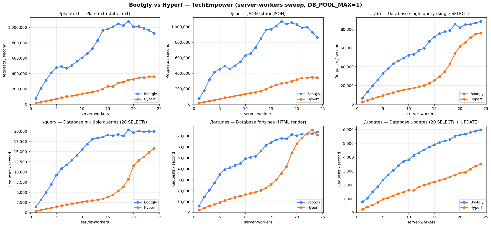
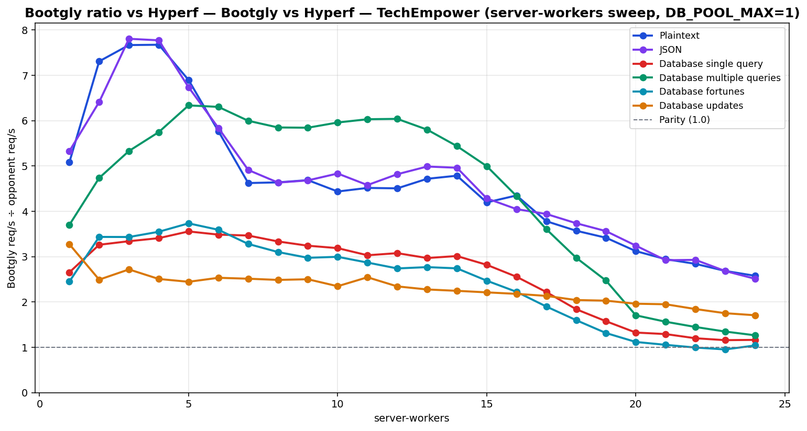

# Bootgly vs Hyperf — TechEmpower (server-workers sweep, DB_POOL_MAX=1)

`HTTP_Server_CLI` benchmark — sweep of 24 `.bench.marks` files
varying `server-workers` from `1` to `24`, load set
`techempower`. Generated by `chart.py` on `2026-06-24 10:34:21`.

## Environment

- **OS** — Linux 6.18.33.1-microsoft-standard-WSL2
- **CPU** — 24 logical processors
- **PHP** — 8.4.22
- **Runner** — `tcp_client`
- **Load set** — `techempower`
- **Connections** — `514`
- **Duration** — `10`
- **Client workers** — `12`
- **Pipeline** — `1`
- **DB pool max** — `1`

> **Equal per-worker DB connection — pool = `1` for every framework.** Bootgly, Hyperf inherit `DB_POOL_MAX=1` from the runner environment, so each worker holds at most 1 PostgreSQL connection(s). Every opponent therefore presents the same database footprint at each point (`server-workers` connections total), so no framework gets a connection-count advantage.

## Command

Reproduction sweep — replace `<IDS>` with the original `--loads=` argument:

```bash
for sw in 1 2 3 4 5 6 7 8 9 10 11 12 13 14 15 16 17 18 19 20 21 22 23 24; do
   php bootgly test benchmark HTTP_Server_CLI \
      --opponents=bootgly,hyperf \
      --runner=tcp_client \
      --connections=514 \
      --duration=10 \
      --client-workers=12 \
      --server-workers="$sw" \
      --loads=techempower:<IDS>  # loads in this sweep: Plaintext, JSON, Database single query, Database multiple queries, Database fortunes, Database updates
done
```

## Throughput



## Bootgly / opponent ratio



Ratio > 1.0 means **Bootgly** is faster than the opponent at that server-workers.

## Comparison tables

### Plaintext

| `server-workers` | Bootgly | Hyperf | Δ (Bootgly vs Hyperf) |
|---:|---:|---:|---:|
| 1 | 74.641 | 14.694 | +408.0% |
| 2 | 206.386 | 28.236 | +630.9% |
| 3 | 311.894 | 40.671 | +666.9% |
| 4 | 410.588 | 53.492 | +667.6% |
| 5 | 477.642 | 69.250 | +589.7% |
| 6 | 490.579 | 85.050 | +476.8% |
| 7 | 468.383 | 101.291 | +362.4% |
| 8 | 506.931 | 109.274 | +363.9% |
| 9 | 558.891 | 119.208 | +368.8% |
| 10 | 603.394 | 135.972 | +343.8% |
| 11 | 660.312 | 146.198 | +351.7% |
| 12 | 723.007 | 160.413 | +350.7% |
| 13 | 829.708 | 175.863 | +371.8% |
| 14 | 960.632 | 200.702 | +378.6% |
| 15 | 977.610 | 232.924 | +319.7% |
| 16 | 1.009.526 | 232.067 | +335.0% |
| 17 | 1.047.019 | 276.854 | +278.2% |
| 18 | 1.024.865 | 286.941 | +257.2% |
| 19 | 1.076.709 | 315.059 | +241.7% |
| 20 | 1.010.337 | 323.597 | +212.2% |
| 21 | 1.010.614 | 343.179 | +194.5% |
| 22 | 986.084 | 347.063 | +184.1% |
| 23 | 962.778 | 358.576 | +168.5% |
| 24 | 922.350 | 357.811 | +157.8% |

### JSON

| `server-workers` | Bootgly | Hyperf | Δ (Bootgly vs Hyperf) |
|---:|---:|---:|---:|
| 1 | 75.585 | 14.191 | +432.6% |
| 2 | 176.250 | 27.488 | +541.2% |
| 3 | 318.366 | 40.779 | +680.7% |
| 4 | 415.175 | 53.409 | +677.4% |
| 5 | 451.320 | 66.983 | +573.8% |
| 6 | 492.405 | 84.323 | +484.0% |
| 7 | 455.781 | 92.779 | +391.3% |
| 8 | 497.033 | 107.254 | +363.4% |
| 9 | 547.974 | 117.029 | +368.2% |
| 10 | 630.039 | 130.324 | +383.4% |
| 11 | 655.306 | 143.092 | +358.0% |
| 12 | 734.330 | 152.382 | +381.9% |
| 13 | 846.746 | 169.743 | +398.8% |
| 14 | 959.046 | 193.284 | +396.2% |
| 15 | 969.540 | 226.218 | +328.6% |
| 16 | 1.010.140 | 249.494 | +304.9% |
| 17 | 1.068.765 | 271.168 | +294.1% |
| 18 | 1.036.983 | 277.448 | +273.8% |
| 19 | 1.056.053 | 296.371 | +256.3% |
| 20 | 1.028.655 | 317.144 | +224.3% |
| 21 | 987.581 | 338.048 | +192.1% |
| 22 | 995.933 | 339.986 | +192.9% |
| 23 | 931.368 | 347.233 | +168.2% |
| 24 | 863.204 | 343.679 | +151.2% |

### Database single query

| `server-workers` | Bootgly | Hyperf | Δ (Bootgly vs Hyperf) |
|---:|---:|---:|---:|
| 1 | 6.361 | 2.398 | +165.3% |
| 2 | 13.353 | 4.093 | +226.2% |
| 3 | 19.701 | 5.897 | +234.1% |
| 4 | 25.848 | 7.584 | +240.8% |
| 5 | 32.915 | 9.255 | +255.6% |
| 6 | 37.983 | 10.895 | +248.6% |
| 7 | 43.131 | 12.444 | +246.6% |
| 8 | 46.311 | 13.886 | +233.5% |
| 9 | 49.197 | 15.177 | +224.2% |
| 10 | 52.267 | 16.395 | +218.8% |
| 11 | 53.149 | 17.537 | +203.1% |
| 12 | 57.409 | 18.657 | +207.7% |
| 13 | 59.656 | 20.086 | +197.0% |
| 14 | 66.932 | 22.213 | +201.3% |
| 15 | 71.671 | 25.415 | +182.0% |
| 16 | 75.347 | 29.476 | +155.6% |
| 17 | 77.464 | 34.912 | +121.9% |
| 18 | 78.539 | 42.688 | +84.0% |
| 19 | 85.448 | 54.248 | +57.5% |
| 20 | 81.749 | 61.688 | +32.5% |
| 21 | 85.023 | 65.823 | +29.2% |
| 22 | 85.194 | 71.021 | +20.0% |
| 23 | 86.601 | 74.817 | +15.8% |
| 24 | 88.304 | 75.883 | +16.4% |

### Database multiple queries

| `server-workers` | Bootgly | Hyperf | Δ (Bootgly vs Hyperf) |
|---:|---:|---:|---:|
| 1 | 1.428 | 386 | +269.9% |
| 2 | 3.121 | 659 | +373.6% |
| 3 | 4.974 | 933 | +433.1% |
| 4 | 6.898 | 1.200 | +474.8% |
| 5 | 9.253 | 1.460 | +533.8% |
| 6 | 10.825 | 1.717 | +530.5% |
| 7 | 11.744 | 1.958 | +499.8% |
| 8 | 12.883 | 2.202 | +485.1% |
| 9 | 14.092 | 2.411 | +484.5% |
| 10 | 15.502 | 2.601 | +496.0% |
| 11 | 16.866 | 2.796 | +503.2% |
| 12 | 18.035 | 2.986 | +504.0% |
| 13 | 18.367 | 3.165 | +480.3% |
| 14 | 18.602 | 3.420 | +443.9% |
| 15 | 19.129 | 3.828 | +399.7% |
| 16 | 18.902 | 4.358 | +333.7% |
| 17 | 19.207 | 5.328 | +260.5% |
| 18 | 18.871 | 6.341 | +197.6% |
| 19 | 20.341 | 8.229 | +147.2% |
| 20 | 19.703 | 11.552 | +70.6% |
| 21 | 20.077 | 12.837 | +56.4% |
| 22 | 19.829 | 13.691 | +44.8% |
| 23 | 19.990 | 14.839 | +34.7% |
| 24 | 19.983 | 15.800 | +26.5% |

### Database fortunes

| `server-workers` | Bootgly | Hyperf | Δ (Bootgly vs Hyperf) |
|---:|---:|---:|---:|
| 1 | 6.000 | 2.450 | +144.9% |
| 2 | 14.502 | 4.221 | +243.6% |
| 3 | 20.467 | 5.961 | +243.3% |
| 4 | 27.135 | 7.645 | +254.9% |
| 5 | 34.794 | 9.316 | +273.5% |
| 6 | 39.393 | 10.965 | +259.3% |
| 7 | 41.128 | 12.538 | +228.0% |
| 8 | 43.146 | 13.911 | +210.2% |
| 9 | 44.944 | 15.108 | +197.5% |
| 10 | 49.420 | 16.493 | +199.6% |
| 11 | 50.483 | 17.593 | +186.9% |
| 12 | 51.481 | 18.789 | +174.0% |
| 13 | 56.255 | 20.315 | +176.9% |
| 14 | 61.497 | 22.428 | +174.2% |
| 15 | 64.047 | 25.932 | +147.0% |
| 16 | 66.542 | 29.923 | +122.4% |
| 17 | 67.871 | 35.737 | +89.9% |
| 18 | 67.481 | 42.212 | +59.9% |
| 19 | 71.404 | 54.316 | +31.5% |
| 20 | 70.318 | 62.911 | +11.8% |
| 21 | 71.878 | 68.162 | +5.5% |
| 22 | 71.746 | 72.162 | -0.6% |
| 23 | 72.103 | 75.650 | -4.7% |
| 24 | 73.640 | 70.801 | +4.0% |

### Database updates

| `server-workers` | Bootgly | Hyperf | Δ (Bootgly vs Hyperf) |
|---:|---:|---:|---:|
| 1 | 786 | 240 | +227.5% |
| 2 | 1.047 | 420 | +149.3% |
| 3 | 1.506 | 554 | +171.8% |
| 4 | 1.868 | 745 | +150.7% |
| 5 | 2.355 | 963 | +144.5% |
| 6 | 2.721 | 1.074 | +153.4% |
| 7 | 3.051 | 1.214 | +151.3% |
| 8 | 3.392 | 1.364 | +148.7% |
| 9 | 3.692 | 1.476 | +150.1% |
| 10 | 3.817 | 1.626 | +134.7% |
| 11 | 4.128 | 1.622 | +154.5% |
| 12 | 4.317 | 1.842 | +134.4% |
| 13 | 4.534 | 1.992 | +127.6% |
| 14 | 4.730 | 2.106 | +124.6% |
| 15 | 4.904 | 2.217 | +121.2% |
| 16 | 5.055 | 2.320 | +117.9% |
| 17 | 5.188 | 2.431 | +113.4% |
| 18 | 5.261 | 2.576 | +104.2% |
| 19 | 5.505 | 2.713 | +102.9% |
| 20 | 5.610 | 2.860 | +96.2% |
| 21 | 5.660 | 2.903 | +95.0% |
| 22 | 5.788 | 3.139 | +84.4% |
| 23 | 5.880 | 3.356 | +75.2% |
| 24 | 5.974 | 3.499 | +70.7% |

## Peaks

| Load | Bootgly peak (req/s @ server-workers) | Hyperf peak (req/s @ server-workers) | Δ at Bootgly peak |
|---|---|---|---|
| Plaintext | 1.076.709 @ 19 | 358.576 @ 23 | +241.7% |
| JSON | 1.068.765 @ 17 | 347.233 @ 23 | +294.1% |
| Database single query | 88.304 @ 24 | 75.883 @ 24 | +16.4% |
| Database multiple queries | 20.341 @ 19 | 15.800 @ 24 | +147.2% |
| Database fortunes | 73.640 @ 24 | 75.650 @ 23 | +4.0% |
| Database updates | 5.974 @ 24 | 3.499 @ 24 | +70.7% |

## Notes

- The sweep crosses the CPU oversubscription threshold — `server-workers + client-workers > 24` logical processors. Above that point the kernel scheduler and external services (e.g. PostgreSQL) become the bottleneck, not the framework.
- Files consumed: `2026-06-22_182645_bench.marks`, `2026-06-22_182920_bench.marks`, `2026-06-22_194059_bench.marks` … (+21 more)
