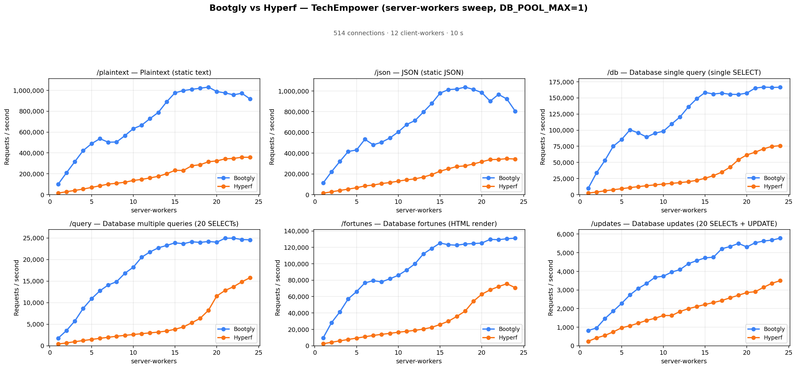
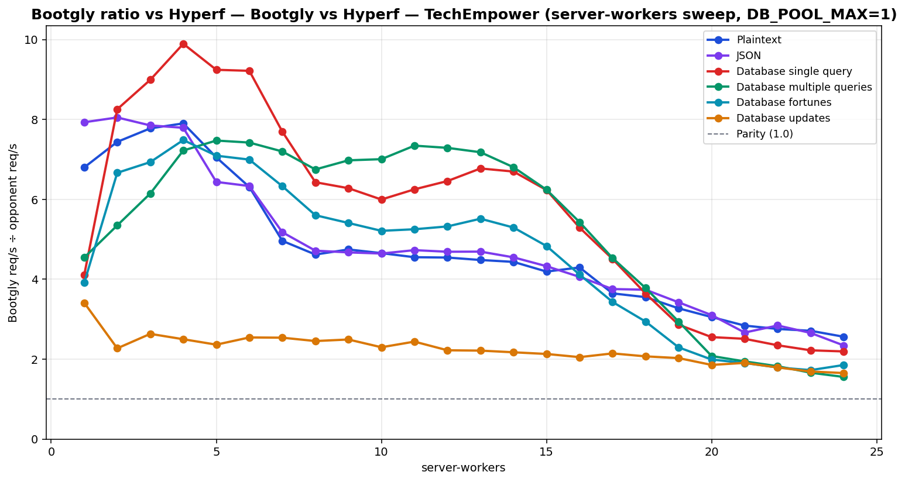

# Bootgly vs Hyperf — TechEmpower (server-workers sweep, DB_POOL_MAX=1)

`HTTP_Server_CLI` benchmark — sweep of 24 `.bench.marks` files
varying `server-workers` from `1` to `24`, load set
`techempower`. Generated by `chart.py` on `2026-07-04 00:21:08`.

## Environment

- **OS** — Linux 6.18.35.2-microsoft-standard-WSL2
- **CPU** — 24 logical processors
- **PHP** — 8.4.22
- **Runner** — `tcp_client`
- **Load set** — `techempower`
- **Connections** — `514`
- **Duration** — `10`
- **Client workers** — `12`
- **Pipeline** — `1`
- **DB pool max** — `1`

> **Equal per-worker DB connection — pool = `1` for every framework.** Bootgly, Hyperf inherit `DB_POOL_MAX=1` from the runner environment, so each worker holds at most 1 PostgreSQL connection(s). Every opponent therefore presents the same database footprint at each point (`server-workers` connections total), so no framework gets a connection-count advantage.

## Command

Reproduction sweep — replace `<IDS>` with the original `--loads=` argument:

```bash
for sw in 1 2 3 4 5 6 7 8 9 10 11 12 13 14 15 16 17 18 19 20 21 22 23 24; do
   php bootgly test benchmark HTTP_Server_CLI \
      --opponents=bootgly,hyperf \
      --runner=tcp_client \
      --connections=514 \
      --duration=10 \
      --client-workers=12 \
      --server-workers="$sw" \
      --loads=techempower:<IDS>  # loads in this sweep: Plaintext, JSON, Database single query, Database multiple queries, Database fortunes, Database updates
done
```

## Throughput



## Bootgly / opponent ratio



Ratio > 1.0 means **Bootgly** is faster than the opponent at that server-workers.

## Comparison tables

### Plaintext

| `server-workers` | Bootgly | Hyperf | Δ (Bootgly vs Hyperf) |
|---:|---:|---:|---:|
| 1 | 99.921 | 14.694 | +580.0% |
| 2 | 210.069 | 28.236 | +644.0% |
| 3 | 316.322 | 40.671 | +677.8% |
| 4 | 422.704 | 53.492 | +690.2% |
| 5 | 488.312 | 69.250 | +605.1% |
| 6 | 536.669 | 85.050 | +531.0% |
| 7 | 502.562 | 101.291 | +396.2% |
| 8 | 504.767 | 109.274 | +361.9% |
| 9 | 565.801 | 119.208 | +374.6% |
| 10 | 632.803 | 135.972 | +365.4% |
| 11 | 665.553 | 146.198 | +355.2% |
| 12 | 728.921 | 160.413 | +354.4% |
| 13 | 788.326 | 175.863 | +348.3% |
| 14 | 890.178 | 200.702 | +343.5% |
| 15 | 976.522 | 232.924 | +319.2% |
| 16 | 996.948 | 232.067 | +329.6% |
| 17 | 1.009.569 | 276.854 | +264.7% |
| 18 | 1.019.602 | 286.941 | +255.3% |
| 19 | 1.030.930 | 315.059 | +227.2% |
| 20 | 988.302 | 323.597 | +205.4% |
| 21 | 974.867 | 343.179 | +184.1% |
| 22 | 956.691 | 347.063 | +175.7% |
| 23 | 971.745 | 358.576 | +171.0% |
| 24 | 916.496 | 357.811 | +156.1% |

### JSON

| `server-workers` | Bootgly | Hyperf | Δ (Bootgly vs Hyperf) |
|---:|---:|---:|---:|
| 1 | 112.547 | 14.191 | +693.1% |
| 2 | 221.290 | 27.488 | +705.0% |
| 3 | 320.172 | 40.779 | +685.1% |
| 4 | 416.173 | 53.409 | +679.2% |
| 5 | 431.163 | 66.983 | +543.7% |
| 6 | 534.119 | 84.323 | +533.4% |
| 7 | 480.331 | 92.779 | +417.7% |
| 8 | 505.785 | 107.254 | +371.6% |
| 9 | 546.849 | 117.029 | +367.3% |
| 10 | 605.271 | 130.324 | +364.4% |
| 11 | 676.673 | 143.092 | +372.9% |
| 12 | 714.545 | 152.382 | +368.9% |
| 13 | 796.470 | 169.743 | +369.2% |
| 14 | 879.212 | 193.284 | +354.9% |
| 15 | 978.960 | 226.218 | +332.8% |
| 16 | 1.012.949 | 249.494 | +306.0% |
| 17 | 1.018.295 | 271.168 | +275.5% |
| 18 | 1.037.342 | 277.448 | +273.9% |
| 19 | 1.014.478 | 296.371 | +242.3% |
| 20 | 984.301 | 317.144 | +210.4% |
| 21 | 901.336 | 338.048 | +166.6% |
| 22 | 966.706 | 339.986 | +184.3% |
| 23 | 922.392 | 347.233 | +165.6% |
| 24 | 805.515 | 343.679 | +134.4% |

### Database single query

| `server-workers` | Bootgly | Hyperf | Δ (Bootgly vs Hyperf) |
|---:|---:|---:|---:|
| 1 | 9.850 | 2.398 | +310.8% |
| 2 | 33.793 | 4.093 | +725.6% |
| 3 | 53.029 | 5.897 | +799.3% |
| 4 | 75.043 | 7.584 | +889.5% |
| 5 | 85.549 | 9.255 | +824.4% |
| 6 | 100.427 | 10.895 | +821.8% |
| 7 | 95.756 | 12.444 | +669.5% |
| 8 | 89.275 | 13.886 | +542.9% |
| 9 | 95.309 | 15.177 | +528.0% |
| 10 | 98.314 | 16.395 | +499.7% |
| 11 | 109.631 | 17.537 | +525.1% |
| 12 | 120.502 | 18.657 | +545.9% |
| 13 | 136.056 | 20.086 | +577.4% |
| 14 | 148.753 | 22.213 | +569.7% |
| 15 | 158.429 | 25.415 | +523.4% |
| 16 | 156.022 | 29.476 | +429.3% |
| 17 | 157.375 | 34.912 | +350.8% |
| 18 | 155.523 | 42.688 | +264.3% |
| 19 | 155.297 | 54.248 | +186.3% |
| 20 | 157.444 | 61.688 | +155.2% |
| 21 | 165.217 | 65.823 | +151.0% |
| 22 | 166.746 | 71.021 | +134.8% |
| 23 | 166.209 | 74.817 | +122.2% |
| 24 | 166.478 | 75.883 | +119.4% |

### Database multiple queries

| `server-workers` | Bootgly | Hyperf | Δ (Bootgly vs Hyperf) |
|---:|---:|---:|---:|
| 1 | 1.754 | 386 | +354.4% |
| 2 | 3.525 | 659 | +434.9% |
| 3 | 5.735 | 933 | +514.7% |
| 4 | 8.668 | 1.200 | +622.3% |
| 5 | 10.910 | 1.460 | +647.3% |
| 6 | 12.744 | 1.717 | +642.2% |
| 7 | 14.096 | 1.958 | +619.9% |
| 8 | 14.862 | 2.202 | +574.9% |
| 9 | 16.823 | 2.411 | +597.8% |
| 10 | 18.224 | 2.601 | +600.7% |
| 11 | 20.536 | 2.796 | +634.5% |
| 12 | 21.767 | 2.986 | +629.0% |
| 13 | 22.725 | 3.165 | +618.0% |
| 14 | 23.273 | 3.420 | +580.5% |
| 15 | 23.892 | 3.828 | +524.1% |
| 16 | 23.668 | 4.358 | +443.1% |
| 17 | 24.138 | 5.328 | +353.0% |
| 18 | 23.975 | 6.341 | +278.1% |
| 19 | 24.199 | 8.229 | +194.1% |
| 20 | 24.025 | 11.552 | +108.0% |
| 21 | 24.954 | 12.837 | +94.4% |
| 22 | 24.966 | 13.691 | +82.4% |
| 23 | 24.644 | 14.839 | +66.1% |
| 24 | 24.577 | 15.800 | +55.6% |

### Database fortunes

| `server-workers` | Bootgly | Hyperf | Δ (Bootgly vs Hyperf) |
|---:|---:|---:|---:|
| 1 | 9.584 | 2.450 | +291.2% |
| 2 | 28.133 | 4.221 | +566.5% |
| 3 | 41.327 | 5.961 | +593.3% |
| 4 | 57.226 | 7.645 | +648.5% |
| 5 | 66.085 | 9.316 | +609.4% |
| 6 | 76.708 | 10.965 | +599.6% |
| 7 | 79.356 | 12.538 | +532.9% |
| 8 | 77.949 | 13.911 | +460.3% |
| 9 | 81.724 | 15.108 | +440.9% |
| 10 | 85.974 | 16.493 | +421.3% |
| 11 | 92.399 | 17.593 | +425.2% |
| 12 | 100.014 | 18.789 | +432.3% |
| 13 | 112.051 | 20.315 | +451.6% |
| 14 | 118.756 | 22.428 | +429.5% |
| 15 | 125.300 | 25.932 | +383.2% |
| 16 | 123.229 | 29.923 | +311.8% |
| 17 | 122.659 | 35.737 | +243.2% |
| 18 | 124.136 | 42.212 | +194.1% |
| 19 | 124.679 | 54.316 | +129.5% |
| 20 | 125.256 | 62.911 | +99.1% |
| 21 | 129.826 | 68.162 | +90.5% |
| 22 | 129.338 | 72.162 | +79.2% |
| 23 | 130.596 | 75.650 | +72.6% |
| 24 | 131.263 | 70.801 | +85.4% |

### Database updates

| `server-workers` | Bootgly | Hyperf | Δ (Bootgly vs Hyperf) |
|---:|---:|---:|---:|
| 1 | 819 | 240 | +241.2% |
| 2 | 954 | 420 | +127.1% |
| 3 | 1.459 | 554 | +163.4% |
| 4 | 1.862 | 745 | +149.9% |
| 5 | 2.276 | 963 | +136.3% |
| 6 | 2.732 | 1.074 | +154.4% |
| 7 | 3.081 | 1.214 | +153.8% |
| 8 | 3.347 | 1.364 | +145.4% |
| 9 | 3.679 | 1.476 | +149.3% |
| 10 | 3.737 | 1.626 | +129.8% |
| 11 | 3.957 | 1.622 | +144.0% |
| 12 | 4.094 | 1.842 | +122.3% |
| 13 | 4.411 | 1.992 | +121.4% |
| 14 | 4.575 | 2.106 | +117.2% |
| 15 | 4.723 | 2.217 | +113.0% |
| 16 | 4.758 | 2.320 | +105.1% |
| 17 | 5.213 | 2.431 | +114.4% |
| 18 | 5.333 | 2.576 | +107.0% |
| 19 | 5.499 | 2.713 | +102.7% |
| 20 | 5.309 | 2.860 | +85.6% |
| 21 | 5.536 | 2.903 | +90.7% |
| 22 | 5.627 | 3.139 | +79.3% |
| 23 | 5.676 | 3.356 | +69.1% |
| 24 | 5.782 | 3.499 | +65.2% |

## Peaks

| Load | Bootgly peak (req/s @ server-workers) | Hyperf peak (req/s @ server-workers) | Δ at Bootgly peak |
|---|---|---|---|
| Plaintext | 1.030.930 @ 19 | 358.576 @ 23 | +227.2% |
| JSON | 1.037.342 @ 18 | 347.233 @ 23 | +273.9% |
| Database single query | 166.746 @ 22 | 75.883 @ 24 | +134.8% |
| Database multiple queries | 24.966 @ 22 | 15.800 @ 24 | +82.4% |
| Database fortunes | 131.263 @ 24 | 75.650 @ 23 | +85.4% |
| Database updates | 5.782 @ 24 | 3.499 @ 24 | +65.2% |

## Notes

- The sweep crosses the CPU oversubscription threshold — `server-workers + client-workers > 24` logical processors. Above that point the kernel scheduler and external services (e.g. PostgreSQL) become the bottleneck, not the framework.
- Files consumed: `sw01_bench.marks`, `sw02_bench.marks`, `sw03_bench.marks` … (+21 more)
- Provenance: the Bootgly series was re-measured on `v0.19.1-beta` (2026-07-04, persistent Fiber pool + DBAL hot path); the opponent series is the previously published sweep (2026-06) on the same machine/runner/`DB_POOL_MAX=1` setup, merged per `server-workers` point. Opponent latency is omitted where the original `.bench.marks` were no longer available.
