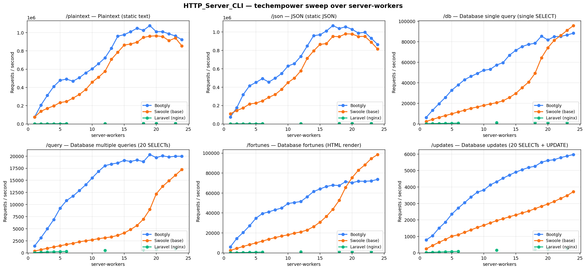
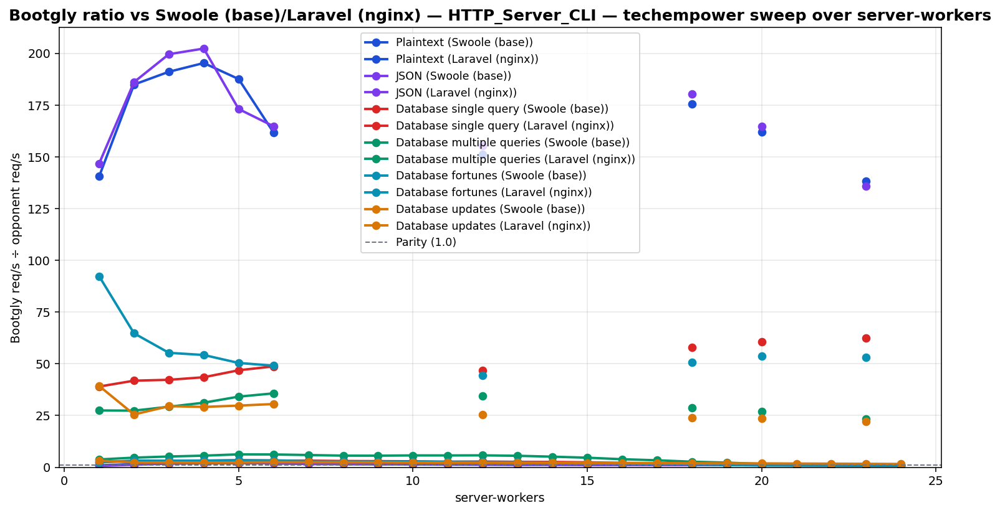

# HTTP_Server_CLI — techempower sweep over server-workers

`HTTP_Server_CLI` benchmark — sweep of 24 `.bench.marks` files
varying `server-workers` from `1` to `24`, load set
`techempower`. Generated by `chart.py` on `2026-06-22 20:59:21`.

## Environment

- **OS** — Linux 6.18.33.1-microsoft-standard-WSL2
- **CPU** — 24 logical processors
- **PHP** — 8.4.22
- **Swoole** — 6.2.0
- **Runner** — `tcp_client`
- **Load set** — `techempower`
- **Connections** — `514`
- **Duration** — `10`
- **Client workers** — `12`
- **Pipeline** — `1`
- **DB pool max** — `1`

> **Equal per-worker DB connection — pool = `1` for every framework.** Bootgly, Swoole (base) inherit `DB_POOL_MAX=1` from the runner environment, so each worker holds at most 1 PostgreSQL connection(s). Laravel (nginx) runs PHP-FPM with `pm.max_children = server-workers`, so each FPM child also opens exactly one connection — matching the pooled servers' per-worker footprint. Every opponent therefore presents the same database footprint at each point (`server-workers` connections total), so no framework gets a connection-count advantage.

## Command

Reproduction sweep — replace `<IDS>` with the original `--loads=` argument:

```bash
for sw in 1 2 3 4 5 6 7 8 9 10 11 12 13 14 15 16 17 18 19 20 21 22 23 24; do
   php bootgly test benchmark HTTP_Server_CLI \
      --opponents=bootgly,swoole-(base),laravel-(nginx) \
      --runner=tcp_client \
      --connections=514 \
      --duration=10 \
      --client-workers=12 \
      --server-workers="$sw" \
      --loads=techempower:<IDS>  # loads in this sweep: Plaintext, JSON, Database single query, Database multiple queries, Database fortunes, Database updates
done
```

## Throughput



## Bootgly / opponent ratio



Ratio > 1.0 means **Bootgly** is faster than the opponent at that server-workers.

## Comparison tables

### Plaintext

| `server-workers` | Bootgly | Swoole (base) | Laravel (nginx) | Δ (Bootgly vs Swoole (base)) |
|---:|---:|---:|---:|---:|
| 1 | 74.641 | 75.323 | 531 | -0.9% |
| 2 | 206.386 | 139.193 | 1.116 | +48.3% |
| 3 | 311.894 | 170.765 | 1.632 | +82.6% |
| 4 | 410.588 | 197.474 | 2.102 | +107.9% |
| 5 | 477.642 | 234.482 | 2.546 | +103.7% |
| 6 | 490.579 | 245.326 | 3.032 | +100.0% |
| 7 | 468.383 | 282.574 | N/A | +65.8% |
| 8 | 506.931 | 322.820 | N/A | +57.0% |
| 9 | 558.891 | 377.087 | N/A | +48.2% |
| 10 | 603.394 | 457.770 | N/A | +31.8% |
| 11 | 660.312 | 512.440 | N/A | +28.9% |
| 12 | 723.007 | 575.538 | 4.782 | +25.6% |
| 13 | 829.708 | 707.330 | N/A | +17.3% |
| 14 | 960.632 | 785.542 | N/A | +22.3% |
| 15 | 977.610 | 863.289 | N/A | +13.2% |
| 16 | 1.009.526 | 875.396 | N/A | +15.3% |
| 17 | 1.047.019 | 894.030 | N/A | +17.1% |
| 18 | 1.024.865 | 947.321 | 5.839 | +8.2% |
| 19 | 1.076.709 | 960.536 | N/A | +12.1% |
| 20 | 1.010.337 | 964.908 | 6.237 | +4.7% |
| 21 | 1.010.614 | 956.866 | N/A | +5.6% |
| 22 | 986.084 | 911.846 | N/A | +8.1% |
| 23 | 962.778 | 940.921 | 6.959 | +2.3% |
| 24 | 922.350 | 855.105 | N/A | +7.9% |

### JSON

| `server-workers` | Bootgly | Swoole (base) | Laravel (nginx) | Δ (Bootgly vs Swoole (base)) |
|---:|---:|---:|---:|---:|
| 1 | 75.585 | 111.723 | 515 | -32.3% |
| 2 | 176.250 | 145.587 | 947 | +21.1% |
| 3 | 318.366 | 173.736 | 1.595 | +83.2% |
| 4 | 415.175 | 216.745 | 2.052 | +91.5% |
| 5 | 451.320 | 226.808 | 2.607 | +99.0% |
| 6 | 492.405 | 250.534 | 2.988 | +96.5% |
| 7 | 455.781 | 289.187 | N/A | +57.6% |
| 8 | 497.033 | 319.835 | N/A | +55.4% |
| 9 | 547.974 | 376.437 | N/A | +45.6% |
| 10 | 630.039 | 450.452 | N/A | +39.9% |
| 11 | 655.306 | 498.003 | N/A | +31.6% |
| 12 | 734.330 | 576.984 | 4.723 | +27.3% |
| 13 | 846.746 | 712.793 | N/A | +18.8% |
| 14 | 959.046 | 793.587 | N/A | +20.8% |
| 15 | 969.540 | 864.553 | N/A | +12.1% |
| 16 | 1.010.140 | 873.292 | N/A | +15.7% |
| 17 | 1.068.765 | 951.610 | N/A | +12.3% |
| 18 | 1.036.983 | 948.489 | 5.753 | +9.3% |
| 19 | 1.056.053 | 979.082 | N/A | +7.9% |
| 20 | 1.028.655 | 977.558 | 6.247 | +5.2% |
| 21 | 987.581 | 950.104 | N/A | +3.9% |
| 22 | 995.933 | 951.882 | N/A | +4.6% |
| 23 | 931.368 | 888.543 | 6.858 | +4.8% |
| 24 | 863.204 | 814.287 | N/A | +6.0% |

### Database single query

| `server-workers` | Bootgly | Swoole (base) | Laravel (nginx) | Δ (Bootgly vs Swoole (base)) |
|---:|---:|---:|---:|---:|
| 1 | 6.361 | 2.441 | 163 | +160.6% |
| 2 | 13.353 | 4.447 | 319 | +200.3% |
| 3 | 19.701 | 6.348 | 466 | +210.3% |
| 4 | 25.848 | 8.173 | 594 | +216.3% |
| 5 | 32.915 | 9.874 | 702 | +233.4% |
| 6 | 37.983 | 11.697 | 779 | +224.7% |
| 7 | 43.131 | 13.367 | N/A | +222.7% |
| 8 | 46.311 | 15.201 | N/A | +204.7% |
| 9 | 49.197 | 16.580 | N/A | +196.7% |
| 10 | 52.267 | 18.077 | N/A | +189.1% |
| 11 | 53.149 | 19.470 | N/A | +173.0% |
| 12 | 57.409 | 20.701 | 1.226 | +177.3% |
| 13 | 59.656 | 22.548 | N/A | +164.6% |
| 14 | 66.932 | 25.767 | N/A | +159.8% |
| 15 | 71.671 | 29.733 | N/A | +141.0% |
| 16 | 75.347 | 35.416 | N/A | +112.7% |
| 17 | 77.464 | 40.745 | N/A | +90.1% |
| 18 | 78.539 | 49.261 | 1.357 | +59.4% |
| 19 | 85.448 | 64.345 | N/A | +32.8% |
| 20 | 81.749 | 74.202 | 1.345 | +10.2% |
| 21 | 85.023 | 81.443 | N/A | +4.4% |
| 22 | 85.194 | 86.052 | N/A | -1.0% |
| 23 | 86.601 | 91.075 | 1.385 | -4.9% |
| 24 | 88.304 | 95.718 | N/A | -7.7% |

### Database multiple queries

| `server-workers` | Bootgly | Swoole (base) | Laravel (nginx) | Δ (Bootgly vs Swoole (base)) |
|---:|---:|---:|---:|---:|
| 1 | 1.428 | 376 | 52 | +279.8% |
| 2 | 3.121 | 669 | 114 | +366.5% |
| 3 | 4.974 | 954 | 170 | +421.4% |
| 4 | 6.898 | 1.224 | 221 | +463.6% |
| 5 | 9.253 | 1.479 | 271 | +525.6% |
| 6 | 10.825 | 1.745 | 303 | +520.3% |
| 7 | 11.744 | 1.980 | N/A | +493.1% |
| 8 | 12.883 | 2.284 | N/A | +464.1% |
| 9 | 14.092 | 2.507 | N/A | +462.1% |
| 10 | 15.502 | 2.698 | N/A | +474.6% |
| 11 | 16.866 | 2.941 | N/A | +473.5% |
| 12 | 18.035 | 3.120 | 522 | +478.0% |
| 13 | 18.367 | 3.302 | N/A | +456.2% |
| 14 | 18.602 | 3.623 | N/A | +413.4% |
| 15 | 19.129 | 4.124 | N/A | +363.8% |
| 16 | 18.902 | 4.834 | N/A | +291.0% |
| 17 | 19.207 | 5.669 | N/A | +238.8% |
| 18 | 18.871 | 6.975 | 658 | +170.6% |
| 19 | 20.341 | 8.983 | N/A | +126.4% |
| 20 | 19.703 | 12.202 | 732 | +61.5% |
| 21 | 20.077 | 13.761 | N/A | +45.9% |
| 22 | 19.829 | 14.915 | N/A | +32.9% |
| 23 | 19.990 | 16.071 | 855 | +24.4% |
| 24 | 19.983 | 17.263 | N/A | +15.8% |

### Database fortunes

| `server-workers` | Bootgly | Swoole (base) | Laravel (nginx) | Δ (Bootgly vs Swoole (base)) |
|---:|---:|---:|---:|---:|
| 1 | 6.000 | 2.516 | 65 | +138.5% |
| 2 | 14.502 | 4.500 | 224 | +222.3% |
| 3 | 20.467 | 6.443 | 370 | +217.7% |
| 4 | 27.135 | 8.284 | 500 | +227.6% |
| 5 | 34.794 | 10.034 | 690 | +246.8% |
| 6 | 39.393 | 11.804 | 802 | +233.7% |
| 7 | 41.128 | 13.670 | N/A | +200.9% |
| 8 | 43.146 | 15.352 | N/A | +181.0% |
| 9 | 44.944 | 16.847 | N/A | +166.8% |
| 10 | 49.420 | 18.112 | N/A | +172.9% |
| 11 | 50.483 | 19.727 | N/A | +155.9% |
| 12 | 51.481 | 21.043 | 1.163 | +144.6% |
| 13 | 56.255 | 22.899 | N/A | +145.7% |
| 14 | 61.497 | 26.321 | N/A | +133.6% |
| 15 | 64.047 | 30.807 | N/A | +107.9% |
| 16 | 66.542 | 36.528 | N/A | +82.2% |
| 17 | 67.871 | 43.695 | N/A | +55.3% |
| 18 | 67.481 | 52.657 | 1.332 | +28.2% |
| 19 | 71.404 | 65.621 | N/A | +8.8% |
| 20 | 70.318 | 75.341 | 1.308 | -6.7% |
| 21 | 71.878 | 82.886 | N/A | -13.3% |
| 22 | 71.746 | 88.145 | N/A | -18.6% |
| 23 | 72.103 | 94.502 | 1.361 | -23.7% |
| 24 | 73.640 | 98.557 | N/A | -25.3% |

### Database updates

| `server-workers` | Bootgly | Swoole (base) | Laravel (nginx) | Δ (Bootgly vs Swoole (base)) |
|---:|---:|---:|---:|---:|
| 1 | 786 | 243 | 20 | +223.5% |
| 2 | 1.047 | 451 | 41 | +132.2% |
| 3 | 1.506 | 641 | 51 | +134.9% |
| 4 | 1.868 | 818 | 64 | +128.4% |
| 5 | 2.355 | 1.010 | 79 | +133.2% |
| 6 | 2.721 | 1.100 | 89 | +147.4% |
| 7 | 3.051 | 1.248 | N/A | +144.5% |
| 8 | 3.392 | 1.397 | N/A | +142.8% |
| 9 | 3.692 | 1.545 | N/A | +139.0% |
| 10 | 3.817 | 1.674 | N/A | +128.0% |
| 11 | 4.128 | 1.819 | N/A | +126.9% |
| 12 | 4.317 | 1.957 | 169 | +120.6% |
| 13 | 4.534 | 2.073 | N/A | +118.7% |
| 14 | 4.730 | 2.196 | N/A | +115.4% |
| 15 | 4.904 | 2.304 | N/A | +112.8% |
| 16 | 5.055 | 2.425 | N/A | +108.5% |
| 17 | 5.188 | 2.539 | N/A | +104.3% |
| 18 | 5.261 | 2.683 | 220 | +96.1% |
| 19 | 5.505 | 2.832 | N/A | +94.4% |
| 20 | 5.610 | 2.967 | 238 | +89.1% |
| 21 | 5.660 | 3.126 | N/A | +81.1% |
| 22 | 5.788 | 3.307 | N/A | +75.0% |
| 23 | 5.880 | 3.480 | 265 | +69.0% |
| 24 | 5.974 | 3.721 | N/A | +60.5% |

## Peaks

| Load | Bootgly peak (req/s @ server-workers) | Swoole (base) peak (req/s @ server-workers) | Laravel (nginx) peak (req/s @ server-workers) | Δ at Bootgly peak |
|---|---|---|---|---|
| Plaintext | 1.076.709 @ 19 | 964.908 @ 20 | 6.959 @ 23 | +12.1% |
| JSON | 1.068.765 @ 17 | 979.082 @ 19 | 6.858 @ 23 | +12.3% |
| Database single query | 88.304 @ 24 | 95.718 @ 24 | 1.385 @ 23 | -7.7% |
| Database multiple queries | 20.341 @ 19 | 17.263 @ 24 | 855 @ 23 | +126.4% |
| Database fortunes | 73.640 @ 24 | 98.557 @ 24 | 1.361 @ 23 | -25.3% |
| Database updates | 5.974 @ 24 | 3.721 @ 24 | 265 @ 23 | +60.5% |

## Notes

- One or more cells are `N/A`. The Bootgly benchmark runner emits `N/A` when a preflight check times out (default 3 s) on the very first request of a cold worker; the immediately next run of the same load usually succeeds. Consider re-running just those cells in isolation.
- The sweep crosses the CPU oversubscription threshold — `server-workers + client-workers > 24` logical processors. Above that point the kernel scheduler and external services (e.g. PostgreSQL) become the bottleneck, not the framework.
- Files consumed: `2026-06-22_182645_bench.marks`, `2026-06-22_182920_bench.marks`, `2026-06-22_194059_bench.marks` … (+21 more)
