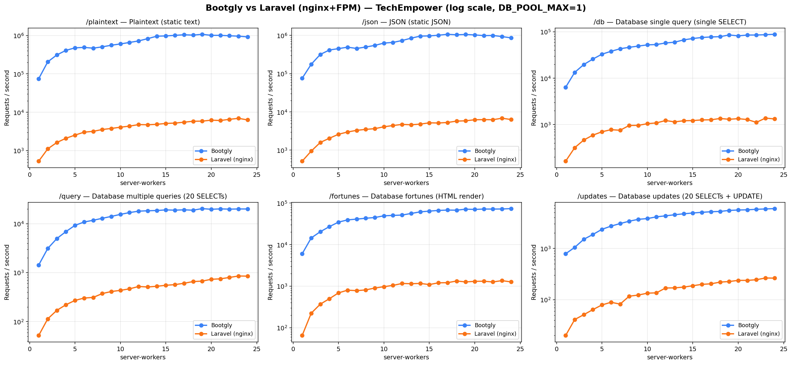
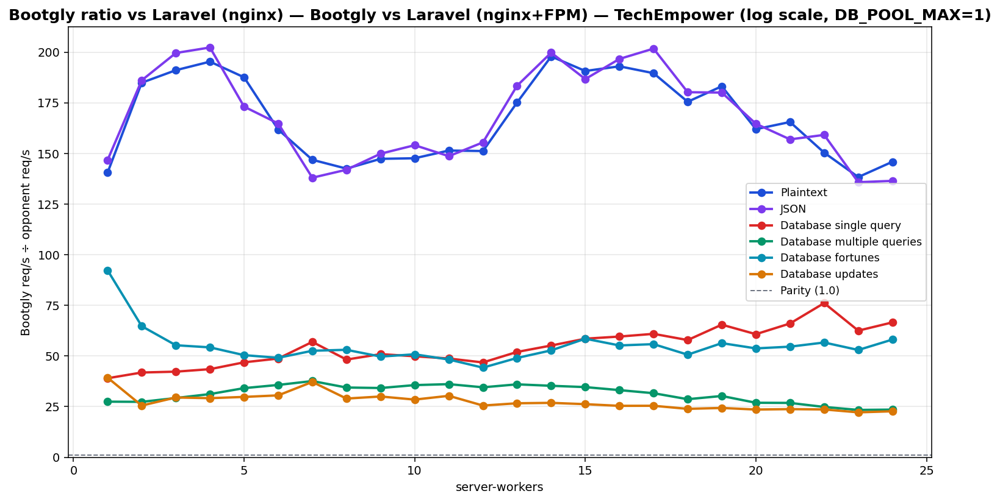

# Bootgly vs Laravel (nginx+FPM) — TechEmpower (log scale, DB_POOL_MAX=1)

`HTTP_Server_CLI` benchmark — sweep of 24 `.bench.marks` files
varying `server-workers` from `1` to `24`, load set
`techempower`. Generated by `chart.py` on `2026-06-22 23:29:59`.

## Environment

- **OS** — Linux 6.18.33.1-microsoft-standard-WSL2
- **CPU** — 24 logical processors
- **PHP** — 8.4.22
- **Runner** — `tcp_client`
- **Load set** — `techempower`
- **Connections** — `514`
- **Duration** — `10`
- **Client workers** — `12`
- **Pipeline** — `1`
- **DB pool max** — `1`

> **Equal per-worker DB connection — pool = `1` for every framework.** Bootgly inherit `DB_POOL_MAX=1` from the runner environment, so each worker holds at most 1 PostgreSQL connection(s). Laravel (nginx) runs PHP-FPM with `pm.max_children = server-workers`, so each FPM child also opens exactly one connection — matching the pooled servers' per-worker footprint. Every opponent therefore presents the same database footprint at each point (`server-workers` connections total), so no framework gets a connection-count advantage.

## Command

Reproduction sweep — replace `<IDS>` with the original `--loads=` argument:

```bash
for sw in 1 2 3 4 5 6 7 8 9 10 11 12 13 14 15 16 17 18 19 20 21 22 23 24; do
   php bootgly test benchmark HTTP_Server_CLI \
      --opponents=bootgly,laravel-(nginx) \
      --runner=tcp_client \
      --connections=514 \
      --duration=10 \
      --client-workers=12 \
      --server-workers="$sw" \
      --loads=techempower:<IDS>  # loads in this sweep: Plaintext, JSON, Database single query, Database multiple queries, Database fortunes, Database updates
done
```

## Throughput



## Bootgly / opponent ratio



Ratio > 1.0 means **Bootgly** is faster than the opponent at that server-workers.

## Comparison tables

### Plaintext

| `server-workers` | Bootgly | Laravel (nginx) | Δ (Bootgly vs Laravel (nginx)) |
|---:|---:|---:|---:|
| 1 | 74.641 | 531 | +13956.7% |
| 2 | 206.386 | 1.116 | +18393.4% |
| 3 | 311.894 | 1.632 | +19011.2% |
| 4 | 410.588 | 2.102 | +19433.2% |
| 5 | 477.642 | 2.546 | +18660.5% |
| 6 | 490.579 | 3.032 | +16080.0% |
| 7 | 468.383 | 3.189 | +14587.5% |
| 8 | 506.931 | 3.557 | +14151.6% |
| 9 | 558.891 | 3.793 | +14634.8% |
| 10 | 603.394 | 4.087 | +14663.7% |
| 11 | 660.312 | 4.360 | +15044.8% |
| 12 | 723.007 | 4.782 | +15019.3% |
| 13 | 829.708 | 4.737 | +17415.5% |
| 14 | 960.632 | 4.854 | +19690.5% |
| 15 | 977.610 | 5.126 | +18971.6% |
| 16 | 1.009.526 | 5.230 | +19202.6% |
| 17 | 1.047.019 | 5.521 | +18864.3% |
| 18 | 1.024.865 | 5.839 | +17452.1% |
| 19 | 1.076.709 | 5.878 | +18217.6% |
| 20 | 1.010.337 | 6.237 | +16099.1% |
| 21 | 1.010.614 | 6.105 | +16453.9% |
| 22 | 986.084 | 6.556 | +14940.9% |
| 23 | 962.778 | 6.959 | +13735.0% |
| 24 | 922.350 | 6.322 | +14489.5% |

### JSON

| `server-workers` | Bootgly | Laravel (nginx) | Δ (Bootgly vs Laravel (nginx)) |
|---:|---:|---:|---:|
| 1 | 75.585 | 515 | +14576.7% |
| 2 | 176.250 | 947 | +18511.4% |
| 3 | 318.366 | 1.595 | +19860.3% |
| 4 | 415.175 | 2.052 | +20132.7% |
| 5 | 451.320 | 2.607 | +17211.9% |
| 6 | 492.405 | 2.988 | +16379.4% |
| 7 | 455.781 | 3.302 | +13703.2% |
| 8 | 497.033 | 3.501 | +14096.9% |
| 9 | 547.974 | 3.656 | +14888.3% |
| 10 | 630.039 | 4.089 | +15308.1% |
| 11 | 655.306 | 4.408 | +14766.3% |
| 12 | 734.330 | 4.723 | +15448.0% |
| 13 | 846.746 | 4.616 | +18243.7% |
| 14 | 959.046 | 4.801 | +19876.0% |
| 15 | 969.540 | 5.192 | +18573.7% |
| 16 | 1.010.140 | 5.136 | +19567.8% |
| 17 | 1.068.765 | 5.297 | +20076.8% |
| 18 | 1.036.983 | 5.753 | +17925.1% |
| 19 | 1.056.053 | 5.865 | +17906.0% |
| 20 | 1.028.655 | 6.247 | +16366.4% |
| 21 | 987.581 | 6.292 | +15595.8% |
| 22 | 995.933 | 6.257 | +15817.1% |
| 23 | 931.368 | 6.858 | +13480.8% |
| 24 | 863.204 | 6.325 | +13547.5% |

### Database single query

| `server-workers` | Bootgly | Laravel (nginx) | Δ (Bootgly vs Laravel (nginx)) |
|---:|---:|---:|---:|
| 1 | 6.361 | 163 | +3802.5% |
| 2 | 13.353 | 319 | +4085.9% |
| 3 | 19.701 | 466 | +4127.7% |
| 4 | 25.848 | 594 | +4251.5% |
| 5 | 32.915 | 702 | +4588.7% |
| 6 | 37.983 | 779 | +4775.9% |
| 7 | 43.131 | 757 | +5597.6% |
| 8 | 46.311 | 960 | +4724.1% |
| 9 | 49.197 | 966 | +4992.9% |
| 10 | 52.267 | 1.048 | +4887.3% |
| 11 | 53.149 | 1.090 | +4776.1% |
| 12 | 57.409 | 1.226 | +4582.6% |
| 13 | 59.656 | 1.147 | +5101.0% |
| 14 | 66.932 | 1.213 | +5417.9% |
| 15 | 71.671 | 1.224 | +5755.5% |
| 16 | 75.347 | 1.264 | +5861.0% |
| 17 | 77.464 | 1.271 | +5994.7% |
| 18 | 78.539 | 1.357 | +5687.7% |
| 19 | 85.448 | 1.305 | +6447.7% |
| 20 | 81.749 | 1.345 | +5978.0% |
| 21 | 85.023 | 1.287 | +6506.3% |
| 22 | 85.194 | 1.119 | +7513.4% |
| 23 | 86.601 | 1.385 | +6152.8% |
| 24 | 88.304 | 1.326 | +6559.4% |

### Database multiple queries

| `server-workers` | Bootgly | Laravel (nginx) | Δ (Bootgly vs Laravel (nginx)) |
|---:|---:|---:|---:|
| 1 | 1.428 | 52 | +2646.2% |
| 2 | 3.121 | 114 | +2637.7% |
| 3 | 4.974 | 170 | +2825.9% |
| 4 | 6.898 | 221 | +3021.3% |
| 5 | 9.253 | 271 | +3314.4% |
| 6 | 10.825 | 303 | +3472.6% |
| 7 | 11.744 | 312 | +3664.1% |
| 8 | 12.883 | 374 | +3344.7% |
| 9 | 14.092 | 412 | +3320.4% |
| 10 | 15.502 | 435 | +3463.7% |
| 11 | 16.866 | 467 | +3511.6% |
| 12 | 18.035 | 522 | +3355.0% |
| 13 | 18.367 | 510 | +3501.4% |
| 14 | 18.602 | 527 | +3429.8% |
| 15 | 19.129 | 552 | +3365.4% |
| 16 | 18.902 | 570 | +3216.1% |
| 17 | 19.207 | 607 | +3064.3% |
| 18 | 18.871 | 658 | +2767.9% |
| 19 | 20.341 | 672 | +2926.9% |
| 20 | 19.703 | 732 | +2591.7% |
| 21 | 20.077 | 748 | +2584.1% |
| 22 | 19.829 | 798 | +2384.8% |
| 23 | 19.990 | 855 | +2238.0% |
| 24 | 19.983 | 849 | +2253.7% |

### Database fortunes

| `server-workers` | Bootgly | Laravel (nginx) | Δ (Bootgly vs Laravel (nginx)) |
|---:|---:|---:|---:|
| 1 | 6.000 | 65 | +9130.8% |
| 2 | 14.502 | 224 | +6374.1% |
| 3 | 20.467 | 370 | +5431.6% |
| 4 | 27.135 | 500 | +5327.0% |
| 5 | 34.794 | 690 | +4942.6% |
| 6 | 39.393 | 802 | +4811.8% |
| 7 | 41.128 | 782 | +5159.3% |
| 8 | 43.146 | 813 | +5207.0% |
| 9 | 44.944 | 904 | +4871.7% |
| 10 | 49.420 | 972 | +4984.4% |
| 11 | 50.483 | 1.046 | +4726.3% |
| 12 | 51.481 | 1.163 | +4326.6% |
| 13 | 56.255 | 1.147 | +4804.5% |
| 14 | 61.497 | 1.165 | +5178.7% |
| 15 | 64.047 | 1.094 | +5754.4% |
| 16 | 66.542 | 1.205 | +5422.2% |
| 17 | 67.871 | 1.215 | +5486.1% |
| 18 | 67.481 | 1.332 | +4966.1% |
| 19 | 71.404 | 1.267 | +5535.7% |
| 20 | 70.318 | 1.308 | +5276.0% |
| 21 | 71.878 | 1.316 | +5361.9% |
| 22 | 71.746 | 1.266 | +5567.1% |
| 23 | 72.103 | 1.361 | +5197.8% |
| 24 | 73.640 | 1.267 | +5712.2% |

### Database updates

| `server-workers` | Bootgly | Laravel (nginx) | Δ (Bootgly vs Laravel (nginx)) |
|---:|---:|---:|---:|
| 1 | 786 | 20 | +3830.0% |
| 2 | 1.047 | 41 | +2453.7% |
| 3 | 1.506 | 51 | +2852.9% |
| 4 | 1.868 | 64 | +2818.8% |
| 5 | 2.355 | 79 | +2881.0% |
| 6 | 2.721 | 89 | +2957.3% |
| 7 | 3.051 | 82 | +3620.7% |
| 8 | 3.392 | 117 | +2799.1% |
| 9 | 3.692 | 123 | +2901.6% |
| 10 | 3.817 | 134 | +2748.5% |
| 11 | 4.128 | 136 | +2935.3% |
| 12 | 4.317 | 169 | +2454.4% |
| 13 | 4.534 | 170 | +2567.1% |
| 14 | 4.730 | 176 | +2587.5% |
| 15 | 4.904 | 187 | +2522.5% |
| 16 | 5.055 | 199 | +2440.2% |
| 17 | 5.188 | 204 | +2443.1% |
| 18 | 5.261 | 220 | +2291.4% |
| 19 | 5.505 | 226 | +2335.8% |
| 20 | 5.610 | 238 | +2257.1% |
| 21 | 5.660 | 238 | +2278.2% |
| 22 | 5.788 | 245 | +2262.4% |
| 23 | 5.880 | 265 | +2118.9% |
| 24 | 5.974 | 263 | +2171.5% |

## Peaks

| Load | Bootgly peak (req/s @ server-workers) | Laravel (nginx) peak (req/s @ server-workers) | Δ at Bootgly peak |
|---|---|---|---|
| Plaintext | 1.076.709 @ 19 | 6.959 @ 23 | +18217.6% |
| JSON | 1.068.765 @ 17 | 6.858 @ 23 | +20076.8% |
| Database single query | 88.304 @ 24 | 1.385 @ 23 | +6559.4% |
| Database multiple queries | 20.341 @ 19 | 855 @ 23 | +2926.9% |
| Database fortunes | 73.640 @ 24 | 1.361 @ 23 | +5712.2% |
| Database updates | 5.974 @ 24 | 265 @ 23 | +2171.5% |

## Notes

- The sweep crosses the CPU oversubscription threshold — `server-workers + client-workers > 24` logical processors. Above that point the kernel scheduler and external services (e.g. PostgreSQL) become the bottleneck, not the framework.
- Files consumed: `2026-06-22_182645_bench.marks`, `2026-06-22_182920_bench.marks`, `2026-06-22_194059_bench.marks` … (+21 more)
