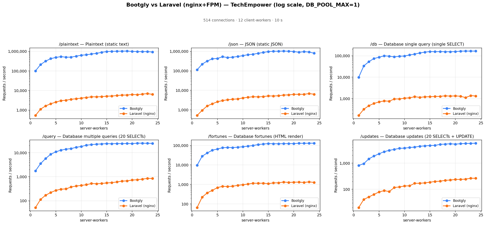
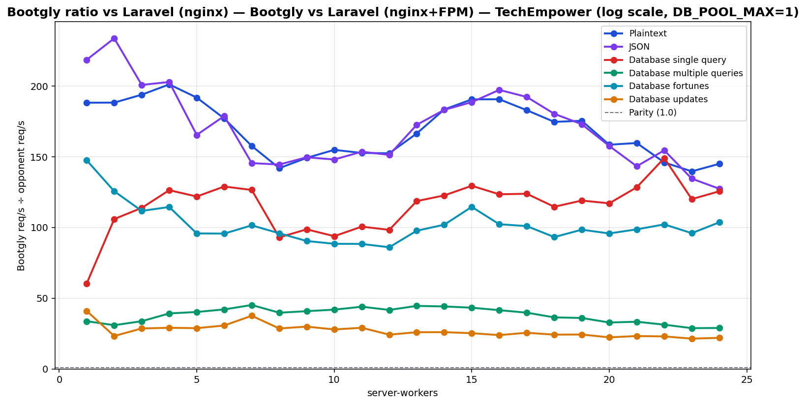

# Bootgly vs Laravel (nginx+FPM) — TechEmpower (log scale, DB_POOL_MAX=1)

`HTTP_Server_CLI` benchmark — sweep of 24 `.bench.marks` files
varying `server-workers` from `1` to `24`, load set
`techempower`. Generated by `chart.py` on `2026-07-04 00:21:18`.

## Environment

- **OS** — Linux 6.18.35.2-microsoft-standard-WSL2
- **CPU** — 24 logical processors
- **PHP** — 8.4.22
- **Runner** — `tcp_client`
- **Load set** — `techempower`
- **Connections** — `514`
- **Duration** — `10`
- **Client workers** — `12`
- **Pipeline** — `1`
- **DB pool max** — `1`

> **Equal per-worker DB connection — pool = `1` for every framework.** Bootgly inherit `DB_POOL_MAX=1` from the runner environment, so each worker holds at most 1 PostgreSQL connection(s). Laravel (nginx) runs PHP-FPM with `pm.max_children = server-workers`, so each FPM child also opens exactly one connection — matching the pooled servers' per-worker footprint. Every opponent therefore presents the same database footprint at each point (`server-workers` connections total), so no framework gets a connection-count advantage.

## Command

Reproduction sweep — replace `<IDS>` with the original `--loads=` argument:

```bash
for sw in 1 2 3 4 5 6 7 8 9 10 11 12 13 14 15 16 17 18 19 20 21 22 23 24; do
   php bootgly test benchmark HTTP_Server_CLI \
      --opponents=bootgly,laravel-(nginx) \
      --runner=tcp_client \
      --connections=514 \
      --duration=10 \
      --client-workers=12 \
      --server-workers="$sw" \
      --loads=techempower:<IDS>  # loads in this sweep: Plaintext, JSON, Database single query, Database multiple queries, Database fortunes, Database updates
done
```

## Throughput



## Bootgly / opponent ratio



Ratio > 1.0 means **Bootgly** is faster than the opponent at that server-workers.

## Comparison tables

### Plaintext

| `server-workers` | Bootgly | Laravel (nginx) | Δ (Bootgly vs Laravel (nginx)) |
|---:|---:|---:|---:|
| 1 | 99.921 | 531 | +18717.5% |
| 2 | 210.069 | 1.116 | +18723.4% |
| 3 | 316.322 | 1.632 | +19282.5% |
| 4 | 422.704 | 2.102 | +20009.6% |
| 5 | 488.312 | 2.546 | +19079.6% |
| 6 | 536.669 | 3.032 | +17600.2% |
| 7 | 502.562 | 3.189 | +15659.2% |
| 8 | 504.767 | 3.557 | +14090.8% |
| 9 | 565.801 | 3.793 | +14817.0% |
| 10 | 632.803 | 4.087 | +15383.3% |
| 11 | 665.553 | 4.360 | +15165.0% |
| 12 | 728.921 | 4.782 | +15143.0% |
| 13 | 788.326 | 4.737 | +16541.9% |
| 14 | 890.178 | 4.854 | +18239.1% |
| 15 | 976.522 | 5.126 | +18950.4% |
| 16 | 996.948 | 5.230 | +18962.1% |
| 17 | 1.009.569 | 5.521 | +18186.0% |
| 18 | 1.019.602 | 5.839 | +17361.9% |
| 19 | 1.030.930 | 5.878 | +17438.8% |
| 20 | 988.302 | 6.237 | +15745.8% |
| 21 | 974.867 | 6.105 | +15868.3% |
| 22 | 956.691 | 6.556 | +14492.6% |
| 23 | 971.745 | 6.959 | +13863.9% |
| 24 | 916.496 | 6.322 | +14396.9% |

### JSON

| `server-workers` | Bootgly | Laravel (nginx) | Δ (Bootgly vs Laravel (nginx)) |
|---:|---:|---:|---:|
| 1 | 112.547 | 515 | +21753.8% |
| 2 | 221.290 | 947 | +23267.5% |
| 3 | 320.172 | 1.595 | +19973.5% |
| 4 | 416.173 | 2.052 | +20181.3% |
| 5 | 431.163 | 2.607 | +16438.7% |
| 6 | 534.119 | 2.988 | +17775.5% |
| 7 | 480.331 | 3.302 | +14446.7% |
| 8 | 505.785 | 3.501 | +14346.9% |
| 9 | 546.849 | 3.656 | +14857.6% |
| 10 | 605.271 | 4.089 | +14702.4% |
| 11 | 676.673 | 4.408 | +15251.0% |
| 12 | 714.545 | 4.723 | +15029.0% |
| 13 | 796.470 | 4.616 | +17154.5% |
| 14 | 879.212 | 4.801 | +18213.1% |
| 15 | 978.960 | 5.192 | +18755.2% |
| 16 | 1.012.949 | 5.136 | +19622.5% |
| 17 | 1.018.295 | 5.297 | +19124.0% |
| 18 | 1.037.342 | 5.753 | +17931.3% |
| 19 | 1.014.478 | 5.865 | +17197.2% |
| 20 | 984.301 | 6.247 | +15656.4% |
| 21 | 901.336 | 6.292 | +14225.1% |
| 22 | 966.706 | 6.257 | +15350.0% |
| 23 | 922.392 | 6.858 | +13349.9% |
| 24 | 805.515 | 6.325 | +12635.4% |

### Database single query

| `server-workers` | Bootgly | Laravel (nginx) | Δ (Bootgly vs Laravel (nginx)) |
|---:|---:|---:|---:|
| 1 | 9.850 | 163 | +5942.9% |
| 2 | 33.793 | 319 | +10493.4% |
| 3 | 53.029 | 466 | +11279.6% |
| 4 | 75.043 | 594 | +12533.5% |
| 5 | 85.549 | 702 | +12086.5% |
| 6 | 100.427 | 779 | +12791.8% |
| 7 | 95.756 | 757 | +12549.4% |
| 8 | 89.275 | 960 | +9199.5% |
| 9 | 95.309 | 966 | +9766.4% |
| 10 | 98.314 | 1.048 | +9281.1% |
| 11 | 109.631 | 1.090 | +9957.9% |
| 12 | 120.502 | 1.226 | +9728.9% |
| 13 | 136.056 | 1.147 | +11761.9% |
| 14 | 148.753 | 1.213 | +12163.2% |
| 15 | 158.429 | 1.224 | +12843.5% |
| 16 | 156.022 | 1.264 | +12243.5% |
| 17 | 157.375 | 1.271 | +12282.0% |
| 18 | 155.523 | 1.357 | +11360.8% |
| 19 | 155.297 | 1.305 | +11800.2% |
| 20 | 157.444 | 1.345 | +11605.9% |
| 21 | 165.217 | 1.287 | +12737.4% |
| 22 | 166.746 | 1.119 | +14801.3% |
| 23 | 166.209 | 1.385 | +11900.6% |
| 24 | 166.478 | 1.326 | +12454.9% |

### Database multiple queries

| `server-workers` | Bootgly | Laravel (nginx) | Δ (Bootgly vs Laravel (nginx)) |
|---:|---:|---:|---:|
| 1 | 1.754 | 52 | +3273.1% |
| 2 | 3.525 | 114 | +2992.1% |
| 3 | 5.735 | 170 | +3273.5% |
| 4 | 8.668 | 221 | +3822.2% |
| 5 | 10.910 | 271 | +3925.8% |
| 6 | 12.744 | 303 | +4105.9% |
| 7 | 14.096 | 312 | +4417.9% |
| 8 | 14.862 | 374 | +3873.8% |
| 9 | 16.823 | 412 | +3983.3% |
| 10 | 18.224 | 435 | +4089.4% |
| 11 | 20.536 | 467 | +4297.4% |
| 12 | 21.767 | 522 | +4069.9% |
| 13 | 22.725 | 510 | +4355.9% |
| 14 | 23.273 | 527 | +4316.1% |
| 15 | 23.892 | 552 | +4228.3% |
| 16 | 23.668 | 570 | +4052.3% |
| 17 | 24.138 | 607 | +3876.6% |
| 18 | 23.975 | 658 | +3543.6% |
| 19 | 24.199 | 672 | +3501.0% |
| 20 | 24.025 | 732 | +3182.1% |
| 21 | 24.954 | 748 | +3236.1% |
| 22 | 24.966 | 798 | +3028.6% |
| 23 | 24.644 | 855 | +2782.3% |
| 24 | 24.577 | 849 | +2794.8% |

### Database fortunes

| `server-workers` | Bootgly | Laravel (nginx) | Δ (Bootgly vs Laravel (nginx)) |
|---:|---:|---:|---:|
| 1 | 9.584 | 65 | +14644.6% |
| 2 | 28.133 | 224 | +12459.4% |
| 3 | 41.327 | 370 | +11069.5% |
| 4 | 57.226 | 500 | +11345.2% |
| 5 | 66.085 | 690 | +9477.5% |
| 6 | 76.708 | 802 | +9464.6% |
| 7 | 79.356 | 782 | +10047.8% |
| 8 | 77.949 | 813 | +9487.8% |
| 9 | 81.724 | 904 | +8940.3% |
| 10 | 85.974 | 972 | +8745.1% |
| 11 | 92.399 | 1.046 | +8733.6% |
| 12 | 100.014 | 1.163 | +8499.7% |
| 13 | 112.051 | 1.147 | +9669.0% |
| 14 | 118.756 | 1.165 | +10093.6% |
| 15 | 125.300 | 1.094 | +11353.4% |
| 16 | 123.229 | 1.205 | +10126.5% |
| 17 | 122.659 | 1.215 | +9995.4% |
| 18 | 124.136 | 1.332 | +9219.5% |
| 19 | 124.679 | 1.267 | +9740.5% |
| 20 | 125.256 | 1.308 | +9476.1% |
| 21 | 129.826 | 1.316 | +9765.2% |
| 22 | 129.338 | 1.266 | +10116.3% |
| 23 | 130.596 | 1.361 | +9495.6% |
| 24 | 131.263 | 1.267 | +10260.1% |

### Database updates

| `server-workers` | Bootgly | Laravel (nginx) | Δ (Bootgly vs Laravel (nginx)) |
|---:|---:|---:|---:|
| 1 | 819 | 20 | +3995.0% |
| 2 | 954 | 41 | +2226.8% |
| 3 | 1.459 | 51 | +2760.8% |
| 4 | 1.862 | 64 | +2809.4% |
| 5 | 2.276 | 79 | +2781.0% |
| 6 | 2.732 | 89 | +2969.7% |
| 7 | 3.081 | 82 | +3657.3% |
| 8 | 3.347 | 117 | +2760.7% |
| 9 | 3.679 | 123 | +2891.1% |
| 10 | 3.737 | 134 | +2688.8% |
| 11 | 3.957 | 136 | +2809.6% |
| 12 | 4.094 | 169 | +2322.5% |
| 13 | 4.411 | 170 | +2494.7% |
| 14 | 4.575 | 176 | +2499.4% |
| 15 | 4.723 | 187 | +2425.7% |
| 16 | 4.758 | 199 | +2291.0% |
| 17 | 5.213 | 204 | +2455.4% |
| 18 | 5.333 | 220 | +2324.1% |
| 19 | 5.499 | 226 | +2333.2% |
| 20 | 5.309 | 238 | +2130.7% |
| 21 | 5.536 | 238 | +2226.1% |
| 22 | 5.627 | 245 | +2196.7% |
| 23 | 5.676 | 265 | +2041.9% |
| 24 | 5.782 | 263 | +2098.5% |

## Peaks

| Load | Bootgly peak (req/s @ server-workers) | Laravel (nginx) peak (req/s @ server-workers) | Δ at Bootgly peak |
|---|---|---|---|
| Plaintext | 1.030.930 @ 19 | 6.959 @ 23 | +17438.8% |
| JSON | 1.037.342 @ 18 | 6.858 @ 23 | +17931.3% |
| Database single query | 166.746 @ 22 | 1.385 @ 23 | +14801.3% |
| Database multiple queries | 24.966 @ 22 | 855 @ 23 | +3028.6% |
| Database fortunes | 131.263 @ 24 | 1.361 @ 23 | +10260.1% |
| Database updates | 5.782 @ 24 | 265 @ 23 | +2098.5% |

## Notes

- The sweep crosses the CPU oversubscription threshold — `server-workers + client-workers > 24` logical processors. Above that point the kernel scheduler and external services (e.g. PostgreSQL) become the bottleneck, not the framework.
- Files consumed: `sw01_bench.marks`, `sw02_bench.marks`, `sw03_bench.marks` … (+21 more)
- Provenance: the Bootgly series was re-measured on `v0.19.1-beta` (2026-07-04, persistent Fiber pool + DBAL hot path); the opponent series is the previously published sweep (2026-06) on the same machine/runner/`DB_POOL_MAX=1` setup, merged per `server-workers` point. Opponent latency is omitted where the original `.bench.marks` were no longer available.
