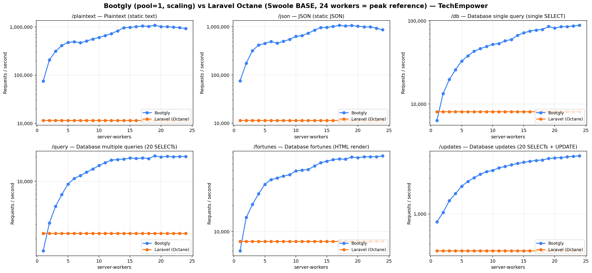
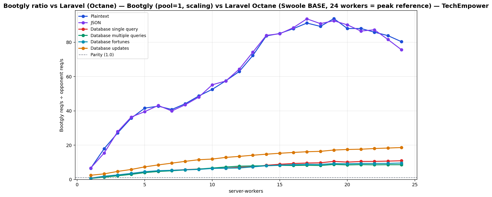

# Bootgly (pool=1, scaling) vs Laravel Octane (Swoole BASE, 24 workers = peak reference) — TechEmpower

`HTTP_Server_CLI` benchmark — sweep of 24 `.bench.marks` files
varying `server-workers` from `1` to `24`, load set
`techempower`. Generated by `chart.py` on `2026-06-22 23:54:23`.

## Environment

- **OS** — Linux 6.18.33.1-microsoft-standard-WSL2
- **CPU** — 24 logical processors
- **PHP** — 8.4.22
- **Runner** — `tcp_client`
- **Load set** — `techempower`
- **Connections** — `514`
- **Duration** — `10`
- **Client workers** — `12`
- **Pipeline** — `1`

## Command

Reproduction sweep — replace `<IDS>` with the original `--loads=` argument:

```bash
for sw in 1 2 3 4 5 6 7 8 9 10 11 12 13 14 15 16 17 18 19 20 21 22 23 24; do
   php bootgly test benchmark HTTP_Server_CLI \
      --opponents=bootgly,laravel-(octane) \
      --runner=tcp_client \
      --connections=514 \
      --duration=10 \
      --client-workers=12 \
      --server-workers="$sw" \
      --loads=techempower:<IDS>  # loads in this sweep: Plaintext, JSON, Database single query, Database multiple queries, Database fortunes, Database updates
done
```

## Throughput



## Bootgly / opponent ratio



Ratio > 1.0 means **Bootgly** is faster than the opponent at that server-workers.

## Comparison tables

### Plaintext

| `server-workers` | Bootgly | Laravel (Octane) | Δ (Bootgly vs Laravel (Octane)) |
|---:|---:|---:|---:|
| 1 | 74.641 | 11.482 | +550.1% |
| 2 | 206.386 | 11.482 | +1697.5% |
| 3 | 311.894 | 11.482 | +2616.4% |
| 4 | 410.588 | 11.482 | +3475.9% |
| 5 | 477.642 | 11.482 | +4059.9% |
| 6 | 490.579 | 11.482 | +4172.6% |
| 7 | 468.383 | 11.482 | +3979.3% |
| 8 | 506.931 | 11.482 | +4315.0% |
| 9 | 558.891 | 11.482 | +4767.5% |
| 10 | 603.394 | 11.482 | +5155.1% |
| 11 | 660.312 | 11.482 | +5650.8% |
| 12 | 723.007 | 11.482 | +6196.9% |
| 13 | 829.708 | 11.482 | +7126.2% |
| 14 | 960.632 | 11.482 | +8266.4% |
| 15 | 977.610 | 11.482 | +8414.3% |
| 16 | 1.009.526 | 11.482 | +8692.2% |
| 17 | 1.047.019 | 11.482 | +9018.8% |
| 18 | 1.024.865 | 11.482 | +8825.8% |
| 19 | 1.076.709 | 11.482 | +9277.4% |
| 20 | 1.010.337 | 11.482 | +8699.3% |
| 21 | 1.010.614 | 11.482 | +8701.7% |
| 22 | 986.084 | 11.482 | +8488.1% |
| 23 | 962.778 | 11.482 | +8285.1% |
| 24 | 922.350 | 11.482 | +7933.0% |

### JSON

| `server-workers` | Bootgly | Laravel (Octane) | Δ (Bootgly vs Laravel (Octane)) |
|---:|---:|---:|---:|
| 1 | 75.585 | 11.413 | +562.3% |
| 2 | 176.250 | 11.413 | +1444.3% |
| 3 | 318.366 | 11.413 | +2689.5% |
| 4 | 415.175 | 11.413 | +3537.7% |
| 5 | 451.320 | 11.413 | +3854.4% |
| 6 | 492.405 | 11.413 | +4214.4% |
| 7 | 455.781 | 11.413 | +3893.5% |
| 8 | 497.033 | 11.413 | +4255.0% |
| 9 | 547.974 | 11.413 | +4701.3% |
| 10 | 630.039 | 11.413 | +5420.4% |
| 11 | 655.306 | 11.413 | +5641.8% |
| 12 | 734.330 | 11.413 | +6334.2% |
| 13 | 846.746 | 11.413 | +7319.1% |
| 14 | 959.046 | 11.413 | +8303.1% |
| 15 | 969.540 | 11.413 | +8395.0% |
| 16 | 1.010.140 | 11.413 | +8750.8% |
| 17 | 1.068.765 | 11.413 | +9264.5% |
| 18 | 1.036.983 | 11.413 | +8986.0% |
| 19 | 1.056.053 | 11.413 | +9153.1% |
| 20 | 1.028.655 | 11.413 | +8913.0% |
| 21 | 987.581 | 11.413 | +8553.1% |
| 22 | 995.933 | 11.413 | +8626.3% |
| 23 | 931.368 | 11.413 | +8060.6% |
| 24 | 863.204 | 11.413 | +7463.3% |

### Database single query

| `server-workers` | Bootgly | Laravel (Octane) | Δ (Bootgly vs Laravel (Octane)) |
|---:|---:|---:|---:|
| 1 | 6.361 | 8.094 | -21.4% |
| 2 | 13.353 | 8.094 | +65.0% |
| 3 | 19.701 | 8.094 | +143.4% |
| 4 | 25.848 | 8.094 | +219.3% |
| 5 | 32.915 | 8.094 | +306.7% |
| 6 | 37.983 | 8.094 | +369.3% |
| 7 | 43.131 | 8.094 | +432.9% |
| 8 | 46.311 | 8.094 | +472.2% |
| 9 | 49.197 | 8.094 | +507.8% |
| 10 | 52.267 | 8.094 | +545.7% |
| 11 | 53.149 | 8.094 | +556.6% |
| 12 | 57.409 | 8.094 | +609.3% |
| 13 | 59.656 | 8.094 | +637.0% |
| 14 | 66.932 | 8.094 | +726.9% |
| 15 | 71.671 | 8.094 | +785.5% |
| 16 | 75.347 | 8.094 | +830.9% |
| 17 | 77.464 | 8.094 | +857.1% |
| 18 | 78.539 | 8.094 | +870.3% |
| 19 | 85.448 | 8.094 | +955.7% |
| 20 | 81.749 | 8.094 | +910.0% |
| 21 | 85.023 | 8.094 | +950.4% |
| 22 | 85.194 | 8.094 | +952.6% |
| 23 | 86.601 | 8.094 | +969.9% |
| 24 | 88.304 | 8.094 | +991.0% |

### Database multiple queries

| `server-workers` | Bootgly | Laravel (Octane) | Δ (Bootgly vs Laravel (Octane)) |
|---:|---:|---:|---:|
| 1 | 1.428 | 2.326 | -38.6% |
| 2 | 3.121 | 2.326 | +34.2% |
| 3 | 4.974 | 2.326 | +113.8% |
| 4 | 6.898 | 2.326 | +196.6% |
| 5 | 9.253 | 2.326 | +297.8% |
| 6 | 10.825 | 2.326 | +365.4% |
| 7 | 11.744 | 2.326 | +404.9% |
| 8 | 12.883 | 2.326 | +453.9% |
| 9 | 14.092 | 2.326 | +505.8% |
| 10 | 15.502 | 2.326 | +566.5% |
| 11 | 16.866 | 2.326 | +625.1% |
| 12 | 18.035 | 2.326 | +675.4% |
| 13 | 18.367 | 2.326 | +689.6% |
| 14 | 18.602 | 2.326 | +699.7% |
| 15 | 19.129 | 2.326 | +722.4% |
| 16 | 18.902 | 2.326 | +712.6% |
| 17 | 19.207 | 2.326 | +725.8% |
| 18 | 18.871 | 2.326 | +711.3% |
| 19 | 20.341 | 2.326 | +774.5% |
| 20 | 19.703 | 2.326 | +747.1% |
| 21 | 20.077 | 2.326 | +763.2% |
| 22 | 19.829 | 2.326 | +752.5% |
| 23 | 19.990 | 2.326 | +759.4% |
| 24 | 19.983 | 2.326 | +759.1% |

### Database fortunes

| `server-workers` | Bootgly | Laravel (Octane) | Δ (Bootgly vs Laravel (Octane)) |
|---:|---:|---:|---:|
| 1 | 6.000 | 7.695 | -22.0% |
| 2 | 14.502 | 7.695 | +88.5% |
| 3 | 20.467 | 7.695 | +166.0% |
| 4 | 27.135 | 7.695 | +252.6% |
| 5 | 34.794 | 7.695 | +352.2% |
| 6 | 39.393 | 7.695 | +411.9% |
| 7 | 41.128 | 7.695 | +434.5% |
| 8 | 43.146 | 7.695 | +460.7% |
| 9 | 44.944 | 7.695 | +484.1% |
| 10 | 49.420 | 7.695 | +542.2% |
| 11 | 50.483 | 7.695 | +556.0% |
| 12 | 51.481 | 7.695 | +569.0% |
| 13 | 56.255 | 7.695 | +631.1% |
| 14 | 61.497 | 7.695 | +699.2% |
| 15 | 64.047 | 7.695 | +732.3% |
| 16 | 66.542 | 7.695 | +764.7% |
| 17 | 67.871 | 7.695 | +782.0% |
| 18 | 67.481 | 7.695 | +776.9% |
| 19 | 71.404 | 7.695 | +827.9% |
| 20 | 70.318 | 7.695 | +813.8% |
| 21 | 71.878 | 7.695 | +834.1% |
| 22 | 71.746 | 7.695 | +832.4% |
| 23 | 72.103 | 7.695 | +837.0% |
| 24 | 73.640 | 7.695 | +857.0% |

### Database updates

| `server-workers` | Bootgly | Laravel (Octane) | Δ (Bootgly vs Laravel (Octane)) |
|---:|---:|---:|---:|
| 1 | 786 | 321 | +144.9% |
| 2 | 1.047 | 321 | +226.2% |
| 3 | 1.506 | 321 | +369.2% |
| 4 | 1.868 | 321 | +481.9% |
| 5 | 2.355 | 321 | +633.6% |
| 6 | 2.721 | 321 | +747.7% |
| 7 | 3.051 | 321 | +850.5% |
| 8 | 3.392 | 321 | +956.7% |
| 9 | 3.692 | 321 | +1050.2% |
| 10 | 3.817 | 321 | +1089.1% |
| 11 | 4.128 | 321 | +1186.0% |
| 12 | 4.317 | 321 | +1244.9% |
| 13 | 4.534 | 321 | +1312.5% |
| 14 | 4.730 | 321 | +1373.5% |
| 15 | 4.904 | 321 | +1427.7% |
| 16 | 5.055 | 321 | +1474.8% |
| 17 | 5.188 | 321 | +1516.2% |
| 18 | 5.261 | 321 | +1538.9% |
| 19 | 5.505 | 321 | +1615.0% |
| 20 | 5.610 | 321 | +1647.7% |
| 21 | 5.660 | 321 | +1663.2% |
| 22 | 5.788 | 321 | +1703.1% |
| 23 | 5.880 | 321 | +1731.8% |
| 24 | 5.974 | 321 | +1761.1% |

## Peaks

| Load | Bootgly peak (req/s @ server-workers) | Laravel (Octane) peak (req/s @ server-workers) | Δ at Bootgly peak |
|---|---|---|---|
| Plaintext | 1.076.709 @ 19 | 11.482 @ 1 | +9277.4% |
| JSON | 1.068.765 @ 17 | 11.413 @ 1 | +9264.5% |
| Database single query | 88.304 @ 24 | 8.094 @ 1 | +991.0% |
| Database multiple queries | 20.341 @ 19 | 2.326 @ 1 | +774.5% |
| Database fortunes | 73.640 @ 24 | 7.695 @ 1 | +857.0% |
| Database updates | 5.974 @ 24 | 321 @ 1 | +1761.1% |

## Notes

- The sweep crosses the CPU oversubscription threshold — `server-workers + client-workers > 24` logical processors. Above that point the kernel scheduler and external services (e.g. PostgreSQL) become the bottleneck, not the framework.
- Files consumed: `2026-06-22_182645_bench.marks`, `2026-06-22_182920_bench.marks`, `2026-06-22_194059_bench.marks` … (+21 more)
