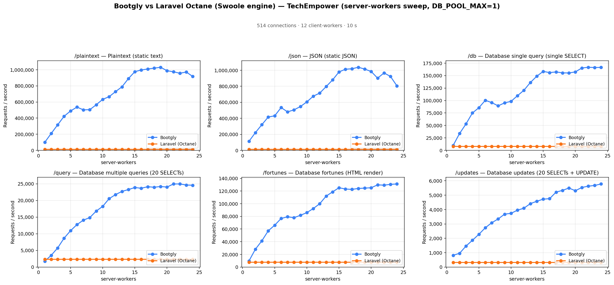
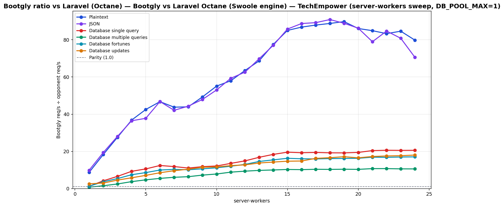

# Bootgly vs Laravel Octane (Swoole engine) — TechEmpower (server-workers sweep, DB_POOL_MAX=1)

`HTTP_Server_CLI` benchmark — sweep of 24 `.bench.marks` files
varying `server-workers` from `1` to `24`, load set
`techempower`. Generated by `chart.py` on `2026-07-04 00:21:20`.

## Environment

- **OS** — Linux 6.18.35.2-microsoft-standard-WSL2
- **CPU** — 24 logical processors
- **PHP** — 8.4.22
- **Runner** — `tcp_client`
- **Load set** — `techempower`
- **Connections** — `514`
- **Duration** — `10`
- **Client workers** — `12`
- **Pipeline** — `1`
- **DB pool max** — `1`

> **Equal per-worker DB connection — pool = `1` for every framework.** Bootgly inherit `DB_POOL_MAX=1` from the runner environment, so each worker holds at most 1 PostgreSQL connection(s). Laravel (Octane) runs PHP-FPM with `pm.max_children = server-workers`, so each FPM child also opens exactly one connection — matching the pooled servers' per-worker footprint. Every opponent therefore presents the same database footprint at each point (`server-workers` connections total), so no framework gets a connection-count advantage.

## Command

Reproduction sweep — replace `<IDS>` with the original `--loads=` argument:

```bash
for sw in 1 2 3 4 5 6 7 8 9 10 11 12 13 14 15 16 17 18 19 20 21 22 23 24; do
   php bootgly test benchmark HTTP_Server_CLI \
      --opponents=bootgly,laravel-(octane) \
      --runner=tcp_client \
      --connections=514 \
      --duration=10 \
      --client-workers=12 \
      --server-workers="$sw" \
      --loads=techempower:<IDS>  # loads in this sweep: Plaintext, JSON, Database single query, Database multiple queries, Database fortunes, Database updates
done
```

## Throughput



## Bootgly / opponent ratio



Ratio > 1.0 means **Bootgly** is faster than the opponent at that server-workers.

## Comparison tables

### Plaintext

| `server-workers` | Bootgly | Laravel (Octane) | Δ (Bootgly vs Laravel (Octane)) |
|---:|---:|---:|---:|
| 1 | 99.921 | 11.482 | +770.2% |
| 2 | 210.069 | 11.482 | +1729.6% |
| 3 | 316.322 | 11.482 | +2654.9% |
| 4 | 422.704 | 11.482 | +3581.4% |
| 5 | 488.312 | 11.482 | +4152.8% |
| 6 | 536.669 | 11.482 | +4574.0% |
| 7 | 502.562 | 11.482 | +4277.0% |
| 8 | 504.767 | 11.482 | +4296.2% |
| 9 | 565.801 | 11.482 | +4827.7% |
| 10 | 632.803 | 11.482 | +5411.3% |
| 11 | 665.553 | 11.482 | +5696.5% |
| 12 | 728.921 | 11.482 | +6248.4% |
| 13 | 788.326 | 11.482 | +6765.8% |
| 14 | 890.178 | 11.482 | +7652.8% |
| 15 | 976.522 | 11.482 | +8404.8% |
| 16 | 996.948 | 11.482 | +8582.7% |
| 17 | 1.009.569 | 11.482 | +8692.6% |
| 18 | 1.019.602 | 11.482 | +8780.0% |
| 19 | 1.030.930 | 11.482 | +8878.7% |
| 20 | 988.302 | 11.482 | +8507.4% |
| 21 | 974.867 | 11.482 | +8390.4% |
| 22 | 956.691 | 11.482 | +8232.1% |
| 23 | 971.745 | 11.482 | +8363.2% |
| 24 | 916.496 | 11.482 | +7882.0% |

### JSON

| `server-workers` | Bootgly | Laravel (Octane) | Δ (Bootgly vs Laravel (Octane)) |
|---:|---:|---:|---:|
| 1 | 112.547 | 11.413 | +886.1% |
| 2 | 221.290 | 11.413 | +1838.9% |
| 3 | 320.172 | 11.413 | +2705.3% |
| 4 | 416.173 | 11.413 | +3546.5% |
| 5 | 431.163 | 11.413 | +3677.8% |
| 6 | 534.119 | 11.413 | +4579.9% |
| 7 | 480.331 | 11.413 | +4108.6% |
| 8 | 505.785 | 11.413 | +4331.7% |
| 9 | 546.849 | 11.413 | +4691.5% |
| 10 | 605.271 | 11.413 | +5203.3% |
| 11 | 676.673 | 11.413 | +5829.0% |
| 12 | 714.545 | 11.413 | +6160.8% |
| 13 | 796.470 | 11.413 | +6878.6% |
| 14 | 879.212 | 11.413 | +7603.6% |
| 15 | 978.960 | 11.413 | +8477.6% |
| 16 | 1.012.949 | 11.413 | +8775.4% |
| 17 | 1.018.295 | 11.413 | +8822.2% |
| 18 | 1.037.342 | 11.413 | +8989.1% |
| 19 | 1.014.478 | 11.413 | +8788.8% |
| 20 | 984.301 | 11.413 | +8524.4% |
| 21 | 901.336 | 11.413 | +7797.5% |
| 22 | 966.706 | 11.413 | +8370.2% |
| 23 | 922.392 | 11.413 | +7981.9% |
| 24 | 805.515 | 11.413 | +6957.9% |

### Database single query

| `server-workers` | Bootgly | Laravel (Octane) | Δ (Bootgly vs Laravel (Octane)) |
|---:|---:|---:|---:|
| 1 | 9.850 | 8.094 | +21.7% |
| 2 | 33.793 | 8.094 | +317.5% |
| 3 | 53.029 | 8.094 | +555.2% |
| 4 | 75.043 | 8.094 | +827.1% |
| 5 | 85.549 | 8.094 | +956.9% |
| 6 | 100.427 | 8.094 | +1140.8% |
| 7 | 95.756 | 8.094 | +1083.0% |
| 8 | 89.275 | 8.094 | +1003.0% |
| 9 | 95.309 | 8.094 | +1077.5% |
| 10 | 98.314 | 8.094 | +1114.7% |
| 11 | 109.631 | 8.094 | +1254.5% |
| 12 | 120.502 | 8.094 | +1388.8% |
| 13 | 136.056 | 8.094 | +1580.9% |
| 14 | 148.753 | 8.094 | +1737.8% |
| 15 | 158.429 | 8.094 | +1857.4% |
| 16 | 156.022 | 8.094 | +1827.6% |
| 17 | 157.375 | 8.094 | +1844.3% |
| 18 | 155.523 | 8.094 | +1821.5% |
| 19 | 155.297 | 8.094 | +1818.7% |
| 20 | 157.444 | 8.094 | +1845.2% |
| 21 | 165.217 | 8.094 | +1941.2% |
| 22 | 166.746 | 8.094 | +1960.1% |
| 23 | 166.209 | 8.094 | +1953.5% |
| 24 | 166.478 | 8.094 | +1956.8% |

### Database multiple queries

| `server-workers` | Bootgly | Laravel (Octane) | Δ (Bootgly vs Laravel (Octane)) |
|---:|---:|---:|---:|
| 1 | 1.754 | 2.326 | -24.6% |
| 2 | 3.525 | 2.326 | +51.5% |
| 3 | 5.735 | 2.326 | +146.6% |
| 4 | 8.668 | 2.326 | +272.7% |
| 5 | 10.910 | 2.326 | +369.0% |
| 6 | 12.744 | 2.326 | +447.9% |
| 7 | 14.096 | 2.326 | +506.0% |
| 8 | 14.862 | 2.326 | +539.0% |
| 9 | 16.823 | 2.326 | +623.3% |
| 10 | 18.224 | 2.326 | +683.5% |
| 11 | 20.536 | 2.326 | +782.9% |
| 12 | 21.767 | 2.326 | +835.8% |
| 13 | 22.725 | 2.326 | +877.0% |
| 14 | 23.273 | 2.326 | +900.6% |
| 15 | 23.892 | 2.326 | +927.2% |
| 16 | 23.668 | 2.326 | +917.5% |
| 17 | 24.138 | 2.326 | +937.7% |
| 18 | 23.975 | 2.326 | +930.7% |
| 19 | 24.199 | 2.326 | +940.4% |
| 20 | 24.025 | 2.326 | +932.9% |
| 21 | 24.954 | 2.326 | +972.8% |
| 22 | 24.966 | 2.326 | +973.3% |
| 23 | 24.644 | 2.326 | +959.5% |
| 24 | 24.577 | 2.326 | +956.6% |

### Database fortunes

| `server-workers` | Bootgly | Laravel (Octane) | Δ (Bootgly vs Laravel (Octane)) |
|---:|---:|---:|---:|
| 1 | 9.584 | 7.695 | +24.5% |
| 2 | 28.133 | 7.695 | +265.6% |
| 3 | 41.327 | 7.695 | +437.1% |
| 4 | 57.226 | 7.695 | +643.7% |
| 5 | 66.085 | 7.695 | +758.8% |
| 6 | 76.708 | 7.695 | +896.9% |
| 7 | 79.356 | 7.695 | +931.3% |
| 8 | 77.949 | 7.695 | +913.0% |
| 9 | 81.724 | 7.695 | +962.0% |
| 10 | 85.974 | 7.695 | +1017.3% |
| 11 | 92.399 | 7.695 | +1100.8% |
| 12 | 100.014 | 7.695 | +1199.7% |
| 13 | 112.051 | 7.695 | +1356.2% |
| 14 | 118.756 | 7.695 | +1443.3% |
| 15 | 125.300 | 7.695 | +1528.3% |
| 16 | 123.229 | 7.695 | +1501.4% |
| 17 | 122.659 | 7.695 | +1494.0% |
| 18 | 124.136 | 7.695 | +1513.2% |
| 19 | 124.679 | 7.695 | +1520.3% |
| 20 | 125.256 | 7.695 | +1527.8% |
| 21 | 129.826 | 7.695 | +1587.1% |
| 22 | 129.338 | 7.695 | +1580.8% |
| 23 | 130.596 | 7.695 | +1597.2% |
| 24 | 131.263 | 7.695 | +1605.8% |

### Database updates

| `server-workers` | Bootgly | Laravel (Octane) | Δ (Bootgly vs Laravel (Octane)) |
|---:|---:|---:|---:|
| 1 | 819 | 321 | +155.1% |
| 2 | 954 | 321 | +197.2% |
| 3 | 1.459 | 321 | +354.5% |
| 4 | 1.862 | 321 | +480.1% |
| 5 | 2.276 | 321 | +609.0% |
| 6 | 2.732 | 321 | +751.1% |
| 7 | 3.081 | 321 | +859.8% |
| 8 | 3.347 | 321 | +942.7% |
| 9 | 3.679 | 321 | +1046.1% |
| 10 | 3.737 | 321 | +1064.2% |
| 11 | 3.957 | 321 | +1132.7% |
| 12 | 4.094 | 321 | +1175.4% |
| 13 | 4.411 | 321 | +1274.1% |
| 14 | 4.575 | 321 | +1325.2% |
| 15 | 4.723 | 321 | +1371.3% |
| 16 | 4.758 | 321 | +1382.2% |
| 17 | 5.213 | 321 | +1524.0% |
| 18 | 5.333 | 321 | +1561.4% |
| 19 | 5.499 | 321 | +1613.1% |
| 20 | 5.309 | 321 | +1553.9% |
| 21 | 5.536 | 321 | +1624.6% |
| 22 | 5.627 | 321 | +1653.0% |
| 23 | 5.676 | 321 | +1668.2% |
| 24 | 5.782 | 321 | +1701.2% |

## Peaks

| Load | Bootgly peak (req/s @ server-workers) | Laravel (Octane) peak (req/s @ server-workers) | Δ at Bootgly peak |
|---|---|---|---|
| Plaintext | 1.030.930 @ 19 | 11.482 @ 1 | +8878.7% |
| JSON | 1.037.342 @ 18 | 11.413 @ 1 | +8989.1% |
| Database single query | 166.746 @ 22 | 8.094 @ 1 | +1960.1% |
| Database multiple queries | 24.966 @ 22 | 2.326 @ 1 | +973.3% |
| Database fortunes | 131.263 @ 24 | 7.695 @ 1 | +1605.8% |
| Database updates | 5.782 @ 24 | 321 @ 1 | +1701.2% |

## Notes

- The sweep crosses the CPU oversubscription threshold — `server-workers + client-workers > 24` logical processors. Above that point the kernel scheduler and external services (e.g. PostgreSQL) become the bottleneck, not the framework.
- Files consumed: `sw01_bench.marks`, `sw02_bench.marks`, `sw03_bench.marks` … (+21 more)
- Provenance: the Bootgly series was re-measured on `v0.19.1-beta` (2026-07-04, persistent Fiber pool + DBAL hot path); the opponent series is the previously published sweep (2026-06) on the same machine/runner/`DB_POOL_MAX=1` setup, merged per `server-workers` point. Opponent latency is omitted where the original `.bench.marks` were no longer available.
