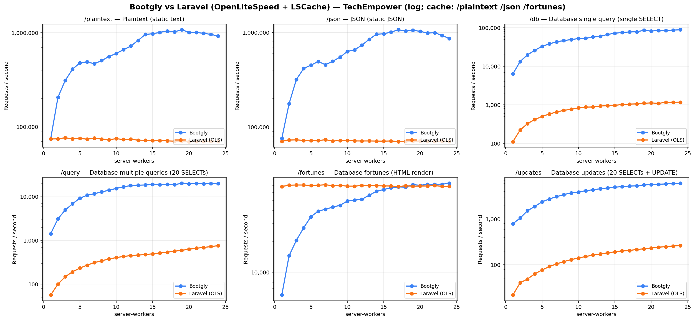
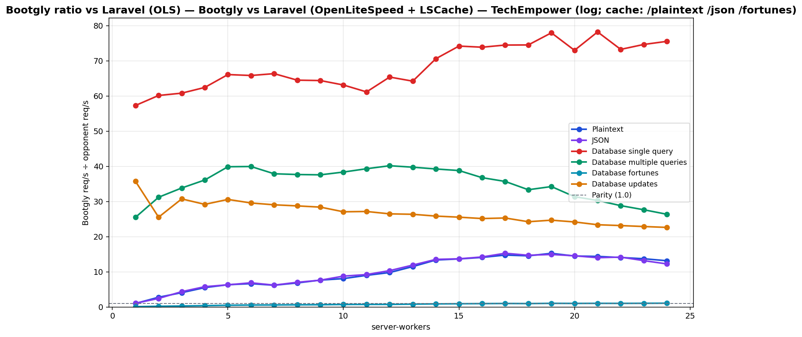

# Bootgly vs Laravel (OpenLiteSpeed + LSCache) — TechEmpower (log; cache: /plaintext /json /fortunes)

`HTTP_Server_CLI` benchmark — sweep of 24 `.bench.marks` files
varying `server-workers` from `1` to `24`, load set
`techempower`. Generated by `chart.py` on `2026-06-24 12:02:36`.

## Environment

- **OS** — Linux 6.18.33.1-microsoft-standard-WSL2
- **CPU** — 24 logical processors
- **PHP** — 8.4.22
- **Runner** — `tcp_client`
- **Load set** — `techempower`
- **Connections** — `514`
- **Duration** — `10`
- **Client workers** — `12`
- **Pipeline** — `1`

## Command

Reproduction sweep — replace `<IDS>` with the original `--loads=` argument:

```bash
for sw in 1 2 3 4 5 6 7 8 9 10 11 12 13 14 15 16 17 18 19 20 21 22 23 24; do
   php bootgly test benchmark HTTP_Server_CLI \
      --opponents=bootgly,laravel-(ols) \
      --runner=tcp_client \
      --connections=514 \
      --duration=10 \
      --client-workers=12 \
      --server-workers="$sw" \
      --loads=techempower:<IDS>  # loads in this sweep: Plaintext, JSON, Database single query, Database multiple queries, Database fortunes, Database updates
done
```

## Throughput



## Bootgly / opponent ratio



Ratio > 1.0 means **Bootgly** is faster than the opponent at that server-workers.

## Comparison tables

### Plaintext

| `server-workers` | Bootgly | Laravel (OLS) | Δ (Bootgly vs Laravel (OLS)) |
|---:|---:|---:|---:|
| 1 | 74.641 | 74.299 | +0.5% |
| 2 | 206.386 | 74.511 | +177.0% |
| 3 | 311.894 | 76.557 | +307.4% |
| 4 | 410.588 | 74.464 | +451.4% |
| 5 | 477.642 | 75.457 | +533.0% |
| 6 | 490.579 | 73.905 | +563.8% |
| 7 | 468.383 | 75.802 | +517.9% |
| 8 | 506.931 | 74.082 | +584.3% |
| 9 | 558.891 | 73.147 | +664.1% |
| 10 | 603.394 | 74.763 | +707.1% |
| 11 | 660.312 | 73.388 | +799.8% |
| 12 | 723.007 | 73.782 | +879.9% |
| 13 | 829.708 | 72.225 | +1048.8% |
| 14 | 960.632 | 71.886 | +1236.3% |
| 15 | 977.610 | 71.577 | +1265.8% |
| 16 | 1.009.526 | 71.601 | +1309.9% |
| 17 | 1.047.019 | 70.917 | +1376.4% |
| 18 | 1.024.865 | 70.451 | +1354.7% |
| 19 | 1.076.709 | 70.558 | +1426.0% |
| 20 | 1.010.337 | 69.703 | +1349.5% |
| 21 | 1.010.614 | 70.274 | +1338.1% |
| 22 | 986.084 | 70.067 | +1307.3% |
| 23 | 962.778 | 70.174 | +1272.0% |
| 24 | 922.350 | 70.148 | +1214.9% |

### JSON

| `server-workers` | Bootgly | Laravel (OLS) | Δ (Bootgly vs Laravel (OLS)) |
|---:|---:|---:|---:|
| 1 | 75.585 | 70.479 | +7.2% |
| 2 | 176.250 | 72.603 | +142.8% |
| 3 | 318.366 | 73.024 | +336.0% |
| 4 | 415.175 | 71.911 | +477.3% |
| 5 | 451.320 | 71.559 | +530.7% |
| 6 | 492.405 | 71.612 | +587.6% |
| 7 | 455.781 | 73.296 | +521.8% |
| 8 | 497.033 | 70.839 | +601.6% |
| 9 | 547.974 | 71.902 | +662.1% |
| 10 | 630.039 | 71.792 | +777.6% |
| 11 | 655.306 | 71.079 | +821.9% |
| 12 | 734.330 | 71.037 | +933.7% |
| 13 | 846.746 | 71.058 | +1091.6% |
| 14 | 959.046 | 70.857 | +1253.5% |
| 15 | 969.540 | 70.738 | +1270.6% |
| 16 | 1.010.140 | 71.025 | +1322.2% |
| 17 | 1.068.765 | 69.970 | +1427.5% |
| 18 | 1.036.983 | 70.479 | +1371.3% |
| 19 | 1.056.053 | 70.706 | +1393.6% |
| 20 | 1.028.655 | 70.656 | +1355.9% |
| 21 | 987.581 | 70.482 | +1301.2% |
| 22 | 995.933 | 70.200 | +1318.7% |
| 23 | 931.368 | 70.665 | +1218.0% |
| 24 | 863.204 | 70.482 | +1124.7% |

### Database single query

| `server-workers` | Bootgly | Laravel (OLS) | Δ (Bootgly vs Laravel (OLS)) |
|---:|---:|---:|---:|
| 1 | 6.361 | 111 | +5630.6% |
| 2 | 13.353 | 222 | +5914.9% |
| 3 | 19.701 | 324 | +5980.6% |
| 4 | 25.848 | 414 | +6143.5% |
| 5 | 32.915 | 498 | +6509.4% |
| 6 | 37.983 | 577 | +6482.8% |
| 7 | 43.131 | 650 | +6535.5% |
| 8 | 46.311 | 718 | +6350.0% |
| 9 | 49.197 | 764 | +6339.4% |
| 10 | 52.267 | 828 | +6212.4% |
| 11 | 53.149 | 869 | +6016.1% |
| 12 | 57.409 | 878 | +6438.6% |
| 13 | 59.656 | 929 | +6321.5% |
| 14 | 66.932 | 948 | +6960.3% |
| 15 | 71.671 | 966 | +7319.4% |
| 16 | 75.347 | 1.020 | +7287.0% |
| 17 | 77.464 | 1.040 | +7348.5% |
| 18 | 78.539 | 1.054 | +7351.5% |
| 19 | 85.448 | 1.096 | +7696.4% |
| 20 | 81.749 | 1.120 | +7199.0% |
| 21 | 85.023 | 1.087 | +7721.8% |
| 22 | 85.194 | 1.163 | +7225.4% |
| 23 | 86.601 | 1.160 | +7365.6% |
| 24 | 88.304 | 1.169 | +7453.8% |

### Database multiple queries

| `server-workers` | Bootgly | Laravel (OLS) | Δ (Bootgly vs Laravel (OLS)) |
|---:|---:|---:|---:|
| 1 | 1.428 | 56 | +2450.0% |
| 2 | 3.121 | 100 | +3021.0% |
| 3 | 4.974 | 147 | +3283.7% |
| 4 | 6.898 | 191 | +3511.5% |
| 5 | 9.253 | 232 | +3888.4% |
| 6 | 10.825 | 271 | +3894.5% |
| 7 | 11.744 | 310 | +3688.4% |
| 8 | 12.883 | 342 | +3667.0% |
| 9 | 14.092 | 375 | +3657.9% |
| 10 | 15.502 | 404 | +3737.1% |
| 11 | 16.866 | 429 | +3831.5% |
| 12 | 18.035 | 449 | +3916.7% |
| 13 | 18.367 | 462 | +3875.5% |
| 14 | 18.602 | 474 | +3824.5% |
| 15 | 19.129 | 493 | +3780.1% |
| 16 | 18.902 | 514 | +3577.4% |
| 17 | 19.207 | 538 | +3470.1% |
| 18 | 18.871 | 566 | +3234.1% |
| 19 | 20.341 | 594 | +3324.4% |
| 20 | 19.703 | 628 | +3037.4% |
| 21 | 20.077 | 663 | +2928.2% |
| 22 | 19.829 | 688 | +2782.1% |
| 23 | 19.990 | 723 | +2664.9% |
| 24 | 19.983 | 758 | +2536.3% |

### Database fortunes

| `server-workers` | Bootgly | Laravel (OLS) | Δ (Bootgly vs Laravel (OLS)) |
|---:|---:|---:|---:|
| 1 | 6.000 | 68.514 | -91.2% |
| 2 | 14.502 | 70.512 | -79.4% |
| 3 | 20.467 | 70.827 | -71.1% |
| 4 | 27.135 | 70.782 | -61.7% |
| 5 | 34.794 | 70.245 | -50.5% |
| 6 | 39.393 | 70.444 | -44.1% |
| 7 | 41.128 | 71.204 | -42.2% |
| 8 | 43.146 | 69.830 | -38.2% |
| 9 | 44.944 | 70.135 | -35.9% |
| 10 | 49.420 | 69.076 | -28.5% |
| 11 | 50.483 | 69.038 | -26.9% |
| 12 | 51.481 | 70.203 | -26.7% |
| 13 | 56.255 | 69.813 | -19.4% |
| 14 | 61.497 | 69.750 | -11.8% |
| 15 | 64.047 | 69.384 | -7.7% |
| 16 | 66.542 | 69.314 | -4.0% |
| 17 | 67.871 | 68.199 | -0.5% |
| 18 | 67.481 | 69.736 | -3.2% |
| 19 | 71.404 | 68.866 | +3.7% |
| 20 | 70.318 | 69.216 | +1.6% |
| 21 | 71.878 | 69.328 | +3.7% |
| 22 | 71.746 | 69.954 | +2.6% |
| 23 | 72.103 | 68.705 | +4.9% |
| 24 | 73.640 | 68.679 | +7.2% |

### Database updates

| `server-workers` | Bootgly | Laravel (OLS) | Δ (Bootgly vs Laravel (OLS)) |
|---:|---:|---:|---:|
| 1 | 786 | 22 | +3472.7% |
| 2 | 1.047 | 41 | +2453.7% |
| 3 | 1.506 | 49 | +2973.5% |
| 4 | 1.868 | 64 | +2818.8% |
| 5 | 2.355 | 77 | +2958.4% |
| 6 | 2.721 | 92 | +2857.6% |
| 7 | 3.051 | 105 | +2805.7% |
| 8 | 3.392 | 118 | +2774.6% |
| 9 | 3.692 | 130 | +2740.0% |
| 10 | 3.817 | 141 | +2607.1% |
| 11 | 4.128 | 152 | +2615.8% |
| 12 | 4.317 | 163 | +2548.5% |
| 13 | 4.534 | 172 | +2536.0% |
| 14 | 4.730 | 183 | +2484.7% |
| 15 | 4.904 | 192 | +2454.2% |
| 16 | 5.055 | 201 | +2414.9% |
| 17 | 5.188 | 205 | +2430.7% |
| 18 | 5.261 | 217 | +2324.4% |
| 19 | 5.505 | 223 | +2368.6% |
| 20 | 5.610 | 232 | +2318.1% |
| 21 | 5.660 | 242 | +2238.8% |
| 22 | 5.788 | 250 | +2215.2% |
| 23 | 5.880 | 257 | +2187.9% |
| 24 | 5.974 | 264 | +2162.9% |

## Peaks

| Load | Bootgly peak (req/s @ server-workers) | Laravel (OLS) peak (req/s @ server-workers) | Δ at Bootgly peak |
|---|---|---|---|
| Plaintext | 1.076.709 @ 19 | 76.557 @ 3 | +1426.0% |
| JSON | 1.068.765 @ 17 | 73.296 @ 7 | +1427.5% |
| Database single query | 88.304 @ 24 | 1.169 @ 24 | +7453.8% |
| Database multiple queries | 20.341 @ 19 | 758 @ 24 | +3324.4% |
| Database fortunes | 73.640 @ 24 | 71.204 @ 7 | +7.2% |
| Database updates | 5.974 @ 24 | 264 @ 24 | +2162.9% |

## Notes

- The sweep crosses the CPU oversubscription threshold — `server-workers + client-workers > 24` logical processors. Above that point the kernel scheduler and external services (e.g. PostgreSQL) become the bottleneck, not the framework.
- Files consumed: `2026-06-22_182645_bench.marks`, `2026-06-22_182920_bench.marks`, `2026-06-22_194059_bench.marks` … (+21 more)
