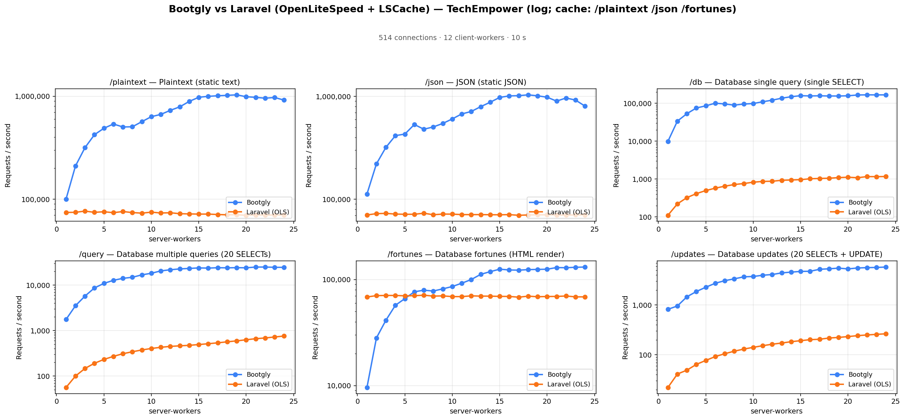
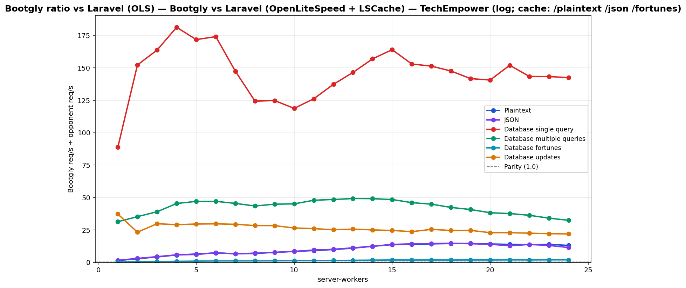

# Bootgly vs Laravel (OpenLiteSpeed + LSCache) — TechEmpower (log; cache: /plaintext /json /fortunes)

`HTTP_Server_CLI` benchmark — sweep of 24 `.bench.marks` files
varying `server-workers` from `1` to `24`, load set
`techempower`. Generated by `chart.py` on `2026-07-04 00:21:23`.

## Environment

- **OS** — Linux 6.18.35.2-microsoft-standard-WSL2
- **CPU** — 24 logical processors
- **PHP** — 8.4.22
- **Runner** — `tcp_client`
- **Load set** — `techempower`
- **Connections** — `514`
- **Duration** — `10`
- **Client workers** — `12`
- **Pipeline** — `1`
- **DB pool max** — `1`

> **Equal per-worker DB connection — pool = `1` for every framework.** Bootgly inherit `DB_POOL_MAX=1` from the runner environment, so each worker holds at most 1 PostgreSQL connection(s). Laravel (OLS) runs PHP-FPM with `pm.max_children = server-workers`, so each FPM child also opens exactly one connection — matching the pooled servers' per-worker footprint. Every opponent therefore presents the same database footprint at each point (`server-workers` connections total), so no framework gets a connection-count advantage.

## Command

Reproduction sweep — replace `<IDS>` with the original `--loads=` argument:

```bash
for sw in 1 2 3 4 5 6 7 8 9 10 11 12 13 14 15 16 17 18 19 20 21 22 23 24; do
   php bootgly test benchmark HTTP_Server_CLI \
      --opponents=bootgly,laravel-(ols) \
      --runner=tcp_client \
      --connections=514 \
      --duration=10 \
      --client-workers=12 \
      --server-workers="$sw" \
      --loads=techempower:<IDS>  # loads in this sweep: Plaintext, JSON, Database single query, Database multiple queries, Database fortunes, Database updates
done
```

## Throughput



## Bootgly / opponent ratio



Ratio > 1.0 means **Bootgly** is faster than the opponent at that server-workers.

## Comparison tables

### Plaintext

| `server-workers` | Bootgly | Laravel (OLS) | Δ (Bootgly vs Laravel (OLS)) |
|---:|---:|---:|---:|
| 1 | 99.921 | 74.299 | +34.5% |
| 2 | 210.069 | 74.511 | +181.9% |
| 3 | 316.322 | 76.557 | +313.2% |
| 4 | 422.704 | 74.464 | +467.7% |
| 5 | 488.312 | 75.457 | +547.1% |
| 6 | 536.669 | 73.905 | +626.2% |
| 7 | 502.562 | 75.802 | +563.0% |
| 8 | 504.767 | 74.082 | +581.4% |
| 9 | 565.801 | 73.147 | +673.5% |
| 10 | 632.803 | 74.763 | +746.4% |
| 11 | 665.553 | 73.388 | +806.9% |
| 12 | 728.921 | 73.782 | +887.9% |
| 13 | 788.326 | 72.225 | +991.5% |
| 14 | 890.178 | 71.886 | +1138.3% |
| 15 | 976.522 | 71.577 | +1264.3% |
| 16 | 996.948 | 71.601 | +1292.4% |
| 17 | 1.009.569 | 70.917 | +1323.6% |
| 18 | 1.019.602 | 70.451 | +1347.2% |
| 19 | 1.030.930 | 70.558 | +1361.1% |
| 20 | 988.302 | 69.703 | +1317.9% |
| 21 | 974.867 | 70.274 | +1287.2% |
| 22 | 956.691 | 70.067 | +1265.4% |
| 23 | 971.745 | 70.174 | +1284.8% |
| 24 | 916.496 | 70.148 | +1206.5% |

### JSON

| `server-workers` | Bootgly | Laravel (OLS) | Δ (Bootgly vs Laravel (OLS)) |
|---:|---:|---:|---:|
| 1 | 112.547 | 70.479 | +59.7% |
| 2 | 221.290 | 72.603 | +204.8% |
| 3 | 320.172 | 73.024 | +338.4% |
| 4 | 416.173 | 71.911 | +478.7% |
| 5 | 431.163 | 71.559 | +502.5% |
| 6 | 534.119 | 71.612 | +645.9% |
| 7 | 480.331 | 73.296 | +555.3% |
| 8 | 505.785 | 70.839 | +614.0% |
| 9 | 546.849 | 71.902 | +660.5% |
| 10 | 605.271 | 71.792 | +743.1% |
| 11 | 676.673 | 71.079 | +852.0% |
| 12 | 714.545 | 71.037 | +905.9% |
| 13 | 796.470 | 71.058 | +1020.9% |
| 14 | 879.212 | 70.857 | +1140.8% |
| 15 | 978.960 | 70.738 | +1283.9% |
| 16 | 1.012.949 | 71.025 | +1326.2% |
| 17 | 1.018.295 | 69.970 | +1355.3% |
| 18 | 1.037.342 | 70.479 | +1371.8% |
| 19 | 1.014.478 | 70.706 | +1334.8% |
| 20 | 984.301 | 70.656 | +1293.1% |
| 21 | 901.336 | 70.482 | +1178.8% |
| 22 | 966.706 | 70.200 | +1277.1% |
| 23 | 922.392 | 70.665 | +1205.3% |
| 24 | 805.515 | 70.482 | +1042.9% |

### Database single query

| `server-workers` | Bootgly | Laravel (OLS) | Δ (Bootgly vs Laravel (OLS)) |
|---:|---:|---:|---:|
| 1 | 9.850 | 111 | +8773.9% |
| 2 | 33.793 | 222 | +15122.1% |
| 3 | 53.029 | 324 | +16267.0% |
| 4 | 75.043 | 414 | +18026.3% |
| 5 | 85.549 | 498 | +17078.5% |
| 6 | 100.427 | 577 | +17305.0% |
| 7 | 95.756 | 650 | +14631.7% |
| 8 | 89.275 | 718 | +12333.8% |
| 9 | 95.309 | 764 | +12375.0% |
| 10 | 98.314 | 828 | +11773.7% |
| 11 | 109.631 | 869 | +12515.8% |
| 12 | 120.502 | 878 | +13624.6% |
| 13 | 136.056 | 929 | +14545.4% |
| 14 | 148.753 | 948 | +15591.2% |
| 15 | 158.429 | 966 | +16300.5% |
| 16 | 156.022 | 1.020 | +15196.3% |
| 17 | 157.375 | 1.040 | +15032.2% |
| 18 | 155.523 | 1.054 | +14655.5% |
| 19 | 155.297 | 1.096 | +14069.4% |
| 20 | 157.444 | 1.120 | +13957.5% |
| 21 | 165.217 | 1.087 | +15099.4% |
| 22 | 166.746 | 1.163 | +14237.6% |
| 23 | 166.209 | 1.160 | +14228.4% |
| 24 | 166.478 | 1.169 | +14141.1% |

### Database multiple queries

| `server-workers` | Bootgly | Laravel (OLS) | Δ (Bootgly vs Laravel (OLS)) |
|---:|---:|---:|---:|
| 1 | 1.754 | 56 | +3032.1% |
| 2 | 3.525 | 100 | +3425.0% |
| 3 | 5.735 | 147 | +3801.4% |
| 4 | 8.668 | 191 | +4438.2% |
| 5 | 10.910 | 232 | +4602.6% |
| 6 | 12.744 | 271 | +4602.6% |
| 7 | 14.096 | 310 | +4447.1% |
| 8 | 14.862 | 342 | +4245.6% |
| 9 | 16.823 | 375 | +4386.1% |
| 10 | 18.224 | 404 | +4410.9% |
| 11 | 20.536 | 429 | +4686.9% |
| 12 | 21.767 | 449 | +4747.9% |
| 13 | 22.725 | 462 | +4818.8% |
| 14 | 23.273 | 474 | +4809.9% |
| 15 | 23.892 | 493 | +4746.2% |
| 16 | 23.668 | 514 | +4504.7% |
| 17 | 24.138 | 538 | +4386.6% |
| 18 | 23.975 | 566 | +4135.9% |
| 19 | 24.199 | 594 | +3973.9% |
| 20 | 24.025 | 628 | +3725.6% |
| 21 | 24.954 | 663 | +3663.8% |
| 22 | 24.966 | 688 | +3528.8% |
| 23 | 24.644 | 723 | +3308.6% |
| 24 | 24.577 | 758 | +3142.3% |

### Database fortunes

| `server-workers` | Bootgly | Laravel (OLS) | Δ (Bootgly vs Laravel (OLS)) |
|---:|---:|---:|---:|
| 1 | 9.584 | 68.514 | -86.0% |
| 2 | 28.133 | 70.512 | -60.1% |
| 3 | 41.327 | 70.827 | -41.7% |
| 4 | 57.226 | 70.782 | -19.2% |
| 5 | 66.085 | 70.245 | -5.9% |
| 6 | 76.708 | 70.444 | +8.9% |
| 7 | 79.356 | 71.204 | +11.4% |
| 8 | 77.949 | 69.830 | +11.6% |
| 9 | 81.724 | 70.135 | +16.5% |
| 10 | 85.974 | 69.076 | +24.5% |
| 11 | 92.399 | 69.038 | +33.8% |
| 12 | 100.014 | 70.203 | +42.5% |
| 13 | 112.051 | 69.813 | +60.5% |
| 14 | 118.756 | 69.750 | +70.3% |
| 15 | 125.300 | 69.384 | +80.6% |
| 16 | 123.229 | 69.314 | +77.8% |
| 17 | 122.659 | 68.199 | +79.9% |
| 18 | 124.136 | 69.736 | +78.0% |
| 19 | 124.679 | 68.866 | +81.0% |
| 20 | 125.256 | 69.216 | +81.0% |
| 21 | 129.826 | 69.328 | +87.3% |
| 22 | 129.338 | 69.954 | +84.9% |
| 23 | 130.596 | 68.705 | +90.1% |
| 24 | 131.263 | 68.679 | +91.1% |

### Database updates

| `server-workers` | Bootgly | Laravel (OLS) | Δ (Bootgly vs Laravel (OLS)) |
|---:|---:|---:|---:|
| 1 | 819 | 22 | +3622.7% |
| 2 | 954 | 41 | +2226.8% |
| 3 | 1.459 | 49 | +2877.6% |
| 4 | 1.862 | 64 | +2809.4% |
| 5 | 2.276 | 77 | +2855.8% |
| 6 | 2.732 | 92 | +2869.6% |
| 7 | 3.081 | 105 | +2834.3% |
| 8 | 3.347 | 118 | +2736.4% |
| 9 | 3.679 | 130 | +2730.0% |
| 10 | 3.737 | 141 | +2550.4% |
| 11 | 3.957 | 152 | +2503.3% |
| 12 | 4.094 | 163 | +2411.7% |
| 13 | 4.411 | 172 | +2464.5% |
| 14 | 4.575 | 183 | +2400.0% |
| 15 | 4.723 | 192 | +2359.9% |
| 16 | 4.758 | 201 | +2267.2% |
| 17 | 5.213 | 205 | +2442.9% |
| 18 | 5.333 | 217 | +2357.6% |
| 19 | 5.499 | 223 | +2365.9% |
| 20 | 5.309 | 232 | +2188.4% |
| 21 | 5.536 | 242 | +2187.6% |
| 22 | 5.627 | 250 | +2150.8% |
| 23 | 5.676 | 257 | +2108.6% |
| 24 | 5.782 | 264 | +2090.2% |

## Peaks

| Load | Bootgly peak (req/s @ server-workers) | Laravel (OLS) peak (req/s @ server-workers) | Δ at Bootgly peak |
|---|---|---|---|
| Plaintext | 1.030.930 @ 19 | 76.557 @ 3 | +1361.1% |
| JSON | 1.037.342 @ 18 | 73.296 @ 7 | +1371.8% |
| Database single query | 166.746 @ 22 | 1.169 @ 24 | +14237.6% |
| Database multiple queries | 24.966 @ 22 | 758 @ 24 | +3528.8% |
| Database fortunes | 131.263 @ 24 | 71.204 @ 7 | +91.1% |
| Database updates | 5.782 @ 24 | 264 @ 24 | +2090.2% |

## Notes

- The sweep crosses the CPU oversubscription threshold — `server-workers + client-workers > 24` logical processors. Above that point the kernel scheduler and external services (e.g. PostgreSQL) become the bottleneck, not the framework.
- Files consumed: `sw01_bench.marks`, `sw02_bench.marks`, `sw03_bench.marks` … (+21 more)
- Provenance: the Bootgly series was re-measured on `v0.19.1-beta` (2026-07-04, persistent Fiber pool + DBAL hot path); the opponent series is the previously published sweep (2026-06) on the same machine/runner/`DB_POOL_MAX=1` setup, merged per `server-workers` point. Opponent latency is omitted where the original `.bench.marks` were no longer available.
