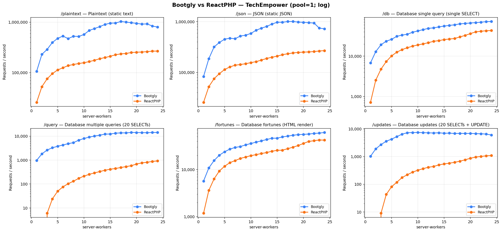
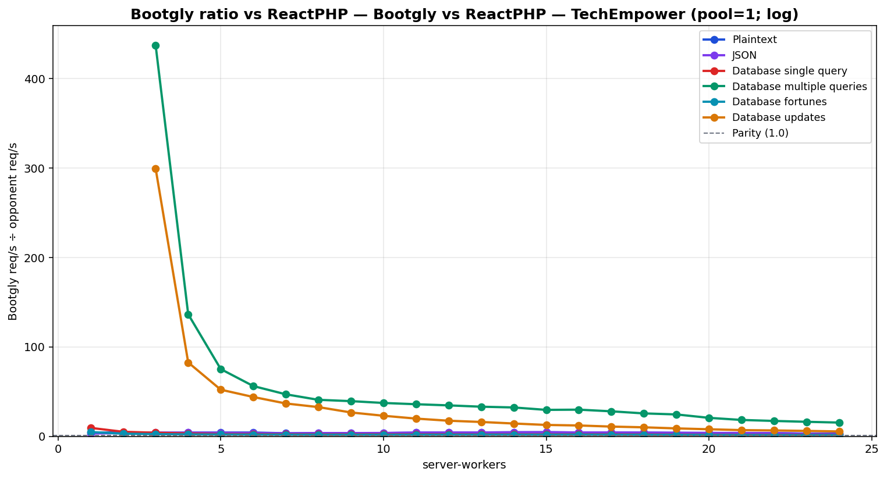

# Bootgly vs ReactPHP — TechEmpower (pool=1; log)

`HTTP_Server_CLI` benchmark — sweep of 24 `.bench.marks` files
varying `server-workers` from `1` to `24`, load set
`techempower`. Generated by `chart.py` on `2026-06-25 16:15:44`.

## Environment

- **OS** — Linux 6.18.33.2-microsoft-standard-WSL2
- **CPU** — 24 logical processors
- **PHP** — 8.4.22
- **Runner** — `tcp_client`
- **Load set** — `techempower`
- **Connections** — `514`
- **Duration** — `10`
- **Client workers** — `12`
- **Pipeline** — `1`

## Command

Reproduction sweep — replace `<IDS>` with the original `--loads=` argument:

```bash
for sw in 1 2 3 4 5 6 7 8 9 10 11 12 13 14 15 16 17 18 19 20 21 22 23 24; do
   php bootgly test benchmark HTTP_Server_CLI \
      --opponents=bootgly,reactphp \
      --runner=tcp_client \
      --connections=514 \
      --duration=10 \
      --client-workers=12 \
      --server-workers="$sw" \
      --loads=techempower:<IDS>  # loads in this sweep: Plaintext, JSON, Database single query, Database multiple queries, Database fortunes, Database updates
done
```

## Throughput



## Bootgly / opponent ratio



Ratio > 1.0 means **Bootgly** is faster than the opponent at that server-workers.

## Comparison tables

### Plaintext

| `server-workers` | Bootgly | ReactPHP | Δ (Bootgly vs ReactPHP) |
|---:|---:|---:|---:|
| 1 | 105.852 | 25.811 | +310.1% |
| 2 | 230.071 | 52.718 | +336.4% |
| 3 | 288.786 | 75.403 | +283.0% |
| 4 | 396.443 | 95.820 | +313.7% |
| 5 | 477.232 | 113.094 | +322.0% |
| 6 | 530.421 | 124.653 | +325.5% |
| 7 | 471.971 | 137.942 | +242.2% |
| 8 | 526.192 | 144.956 | +263.0% |
| 9 | 520.507 | 151.482 | +243.6% |
| 10 | 569.423 | 157.201 | +262.2% |
| 11 | 683.609 | 165.399 | +313.3% |
| 12 | 746.721 | 175.457 | +325.6% |
| 13 | 814.803 | 188.845 | +331.5% |
| 14 | 901.248 | 198.901 | +353.1% |
| 15 | 955.853 | 210.762 | +353.5% |
| 16 | 961.718 | 226.007 | +325.5% |
| 17 | 1.029.522 | 235.279 | +337.6% |
| 18 | 1.004.181 | 239.586 | +319.1% |
| 19 | 975.144 | 250.248 | +289.7% |
| 20 | 946.026 | 253.931 | +272.6% |
| 21 | 916.745 | 256.270 | +257.7% |
| 22 | 922.927 | 260.204 | +254.7% |
| 23 | 838.895 | 266.614 | +214.6% |
| 24 | 798.620 | 267.158 | +198.9% |

### JSON

| `server-workers` | Bootgly | ReactPHP | Δ (Bootgly vs ReactPHP) |
|---:|---:|---:|---:|
| 1 | 83.214 | 25.788 | +222.7% |
| 2 | 186.281 | 52.474 | +255.0% |
| 3 | 318.262 | 75.222 | +323.1% |
| 4 | 389.390 | 94.796 | +310.8% |
| 5 | 452.725 | 114.083 | +296.8% |
| 6 | 473.487 | 128.578 | +268.2% |
| 7 | 461.688 | 138.986 | +232.2% |
| 8 | 522.122 | 143.297 | +264.4% |
| 9 | 543.054 | 148.766 | +265.0% |
| 10 | 587.426 | 156.104 | +276.3% |
| 11 | 679.864 | 163.466 | +315.9% |
| 12 | 745.799 | 175.152 | +325.8% |
| 13 | 808.067 | 188.973 | +327.6% |
| 14 | 899.030 | 199.455 | +350.7% |
| 15 | 976.421 | 209.612 | +365.8% |
| 16 | 974.624 | 224.349 | +334.4% |
| 17 | 1.008.593 | 233.389 | +332.2% |
| 18 | 1.008.774 | 242.493 | +316.0% |
| 19 | 983.990 | 248.263 | +296.3% |
| 20 | 971.503 | 251.795 | +285.8% |
| 21 | 955.847 | 253.801 | +276.6% |
| 22 | 943.322 | 258.144 | +265.4% |
| 23 | 747.432 | 264.914 | +182.1% |
| 24 | 725.605 | 269.292 | +169.4% |

### Database single query

| `server-workers` | Bootgly | ReactPHP | Δ (Bootgly vs ReactPHP) |
|---:|---:|---:|---:|
| 1 | 6.790 | 717 | +847.0% |
| 2 | 12.970 | 2.540 | +410.6% |
| 3 | 19.172 | 4.772 | +301.8% |
| 4 | 23.492 | 7.349 | +219.7% |
| 5 | 26.100 | 10.137 | +157.5% |
| 6 | 31.003 | 12.554 | +147.0% |
| 7 | 33.261 | 14.526 | +129.0% |
| 8 | 34.895 | 16.152 | +116.0% |
| 9 | 39.128 | 17.674 | +121.4% |
| 10 | 42.232 | 18.993 | +122.4% |
| 11 | 45.449 | 20.125 | +125.8% |
| 12 | 48.835 | 21.576 | +126.3% |
| 13 | 50.316 | 23.345 | +115.5% |
| 14 | 53.037 | 24.253 | +118.7% |
| 15 | 55.722 | 25.731 | +116.6% |
| 16 | 57.839 | 26.599 | +117.4% |
| 17 | 59.873 | 27.372 | +118.7% |
| 18 | 63.228 | 30.005 | +110.7% |
| 19 | 64.642 | 32.675 | +97.8% |
| 20 | 66.409 | 36.279 | +83.1% |
| 21 | 67.787 | 39.957 | +69.6% |
| 22 | 69.406 | 41.410 | +67.6% |
| 23 | 71.692 | 42.614 | +68.2% |
| 24 | 72.186 | 43.190 | +67.1% |

### Database multiple queries

| `server-workers` | Bootgly | ReactPHP | Δ (Bootgly vs ReactPHP) |
|---:|---:|---:|---:|
| 1 | 968 | 0 | — |
| 2 | 1.814 | 0 | — |
| 3 | 2.623 | 6 | +43616.7% |
| 4 | 3.276 | 24 | +13550.0% |
| 5 | 3.760 | 50 | +7420.0% |
| 6 | 4.272 | 76 | +5521.1% |
| 7 | 4.840 | 103 | +4599.0% |
| 8 | 5.348 | 131 | +3982.4% |
| 9 | 6.770 | 172 | +3836.0% |
| 10 | 7.986 | 214 | +3631.8% |
| 11 | 9.084 | 253 | +3490.5% |
| 12 | 10.073 | 291 | +3361.5% |
| 13 | 10.969 | 331 | +3213.9% |
| 14 | 12.141 | 376 | +3129.0% |
| 15 | 12.277 | 415 | +2858.3% |
| 16 | 13.277 | 445 | +2883.6% |
| 17 | 13.681 | 489 | +2697.8% |
| 18 | 13.667 | 533 | +2464.2% |
| 19 | 14.251 | 582 | +2348.6% |
| 20 | 14.145 | 684 | +1968.0% |
| 21 | 14.001 | 764 | +1732.6% |
| 22 | 13.912 | 808 | +1621.8% |
| 23 | 14.228 | 875 | +1526.1% |
| 24 | 14.216 | 924 | +1438.5% |

### Database fortunes

| `server-workers` | Bootgly | ReactPHP | Δ (Bootgly vs ReactPHP) |
|---:|---:|---:|---:|
| 1 | 5.704 | 1.182 | +382.6% |
| 2 | 10.818 | 3.613 | +199.4% |
| 3 | 15.558 | 6.347 | +145.1% |
| 4 | 20.201 | 9.331 | +116.5% |
| 5 | 23.905 | 11.784 | +102.9% |
| 6 | 27.201 | 14.019 | +94.0% |
| 7 | 29.517 | 15.536 | +90.0% |
| 8 | 30.845 | 17.255 | +78.8% |
| 9 | 33.503 | 18.514 | +81.0% |
| 10 | 35.786 | 19.746 | +81.2% |
| 11 | 38.284 | 20.804 | +84.0% |
| 12 | 40.738 | 21.916 | +85.9% |
| 13 | 43.510 | 23.019 | +89.0% |
| 14 | 46.358 | 24.529 | +89.0% |
| 15 | 46.497 | 25.617 | +81.5% |
| 16 | 49.385 | 25.860 | +91.0% |
| 17 | 51.386 | 27.806 | +84.8% |
| 18 | 53.568 | 29.929 | +79.0% |
| 19 | 55.268 | 32.412 | +70.5% |
| 20 | 56.018 | 35.961 | +55.8% |
| 21 | 56.913 | 39.652 | +43.5% |
| 22 | 58.557 | 41.017 | +42.8% |
| 23 | 59.528 | 42.550 | +39.9% |
| 24 | 61.469 | 42.243 | +45.5% |

### Database updates

| `server-workers` | Bootgly | ReactPHP | Δ (Bootgly vs ReactPHP) |
|---:|---:|---:|---:|
| 1 | 1.018 | 0 | — |
| 2 | 1.880 | 0 | — |
| 3 | 2.694 | 9 | +29833.3% |
| 4 | 3.552 | 43 | +8160.5% |
| 5 | 4.225 | 81 | +5116.0% |
| 6 | 5.191 | 118 | +4299.2% |
| 7 | 6.393 | 174 | +3574.1% |
| 8 | 7.193 | 220 | +3169.5% |
| 9 | 7.290 | 273 | +2570.3% |
| 10 | 7.363 | 320 | +2200.9% |
| 11 | 7.242 | 365 | +1884.1% |
| 12 | 7.140 | 409 | +1645.7% |
| 13 | 7.038 | 438 | +1506.8% |
| 14 | 7.158 | 499 | +1334.5% |
| 15 | 6.884 | 540 | +1174.8% |
| 16 | 6.969 | 574 | +1114.1% |
| 17 | 6.737 | 618 | +990.1% |
| 18 | 6.834 | 677 | +909.5% |
| 19 | 6.766 | 762 | +787.9% |
| 20 | 6.820 | 863 | +690.3% |
| 21 | 6.669 | 958 | +596.1% |
| 22 | 6.614 | 1.003 | +559.4% |
| 23 | 6.432 | 1.060 | +506.8% |
| 24 | 5.947 | 1.086 | +447.6% |

## Peaks

| Load | Bootgly peak (req/s @ server-workers) | ReactPHP peak (req/s @ server-workers) | Δ at Bootgly peak |
|---|---|---|---|
| Plaintext | 1.029.522 @ 17 | 267.158 @ 24 | +337.6% |
| JSON | 1.008.774 @ 18 | 269.292 @ 24 | +316.0% |
| Database single query | 72.186 @ 24 | 43.190 @ 24 | +67.1% |
| Database multiple queries | 14.251 @ 19 | 924 @ 24 | +2348.6% |
| Database fortunes | 61.469 @ 24 | 42.550 @ 23 | +45.5% |
| Database updates | 7.363 @ 10 | 1.086 @ 24 | +2200.9% |

## Notes

- The sweep crosses the CPU oversubscription threshold — `server-workers + client-workers > 24` logical processors. Above that point the kernel scheduler and external services (e.g. PostgreSQL) become the bottleneck, not the framework.
- Files consumed: `sw1.marks`, `sw2.marks`, `sw3.marks` … (+21 more)
