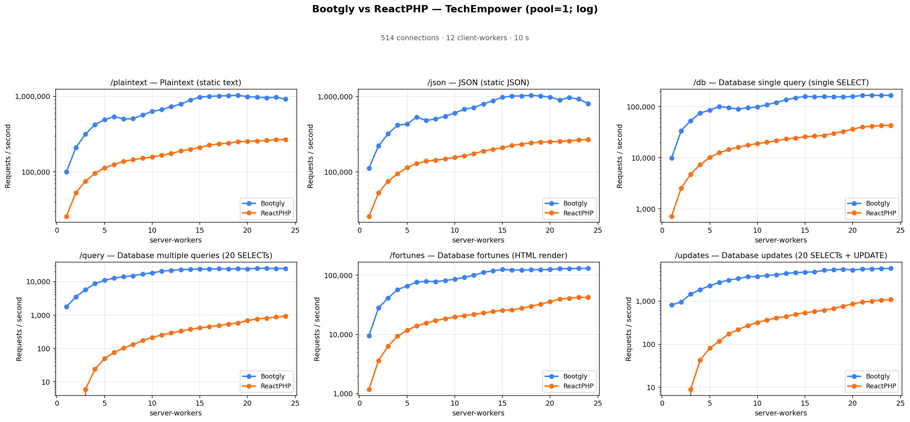
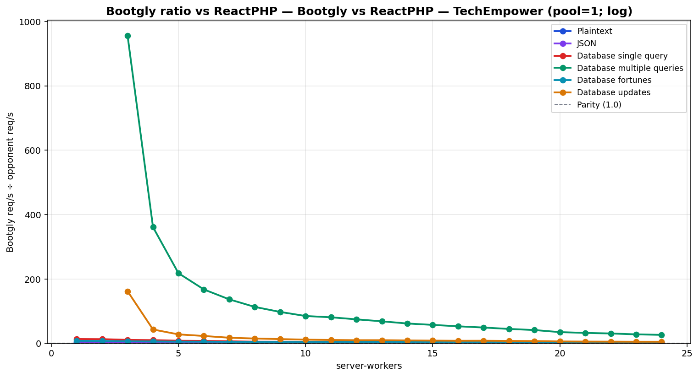

# Bootgly vs ReactPHP — TechEmpower (pool=1; log)

`HTTP_Server_CLI` benchmark — sweep of 24 `.bench.marks` files
varying `server-workers` from `1` to `24`, load set
`techempower`. Generated by `chart.py` on `2026-07-04 00:21:11`.

## Environment

- **OS** — Linux 6.18.35.2-microsoft-standard-WSL2
- **CPU** — 24 logical processors
- **PHP** — 8.4.22
- **Runner** — `tcp_client`
- **Load set** — `techempower`
- **Connections** — `514`
- **Duration** — `10`
- **Client workers** — `12`
- **Pipeline** — `1`
- **DB pool max** — `1`

> **Equal per-worker DB connection — pool = `1` for every framework.** Bootgly, ReactPHP inherit `DB_POOL_MAX=1` from the runner environment, so each worker holds at most 1 PostgreSQL connection(s). Every opponent therefore presents the same database footprint at each point (`server-workers` connections total), so no framework gets a connection-count advantage.

## Command

Reproduction sweep — replace `<IDS>` with the original `--loads=` argument:

```bash
for sw in 1 2 3 4 5 6 7 8 9 10 11 12 13 14 15 16 17 18 19 20 21 22 23 24; do
   php bootgly test benchmark HTTP_Server_CLI \
      --opponents=bootgly,reactphp \
      --runner=tcp_client \
      --connections=514 \
      --duration=10 \
      --client-workers=12 \
      --server-workers="$sw" \
      --loads=techempower:<IDS>  # loads in this sweep: Plaintext, JSON, Database single query, Database multiple queries, Database fortunes, Database updates
done
```

## Throughput



## Bootgly / opponent ratio



Ratio > 1.0 means **Bootgly** is faster than the opponent at that server-workers.

## Comparison tables

### Plaintext

| `server-workers` | Bootgly | ReactPHP | Δ (Bootgly vs ReactPHP) |
|---:|---:|---:|---:|
| 1 | 99.921 | 25.811 | +287.1% |
| 2 | 210.069 | 52.718 | +298.5% |
| 3 | 316.322 | 75.403 | +319.5% |
| 4 | 422.704 | 95.820 | +341.1% |
| 5 | 488.312 | 113.094 | +331.8% |
| 6 | 536.669 | 124.653 | +330.5% |
| 7 | 502.562 | 137.942 | +264.3% |
| 8 | 504.767 | 144.956 | +248.2% |
| 9 | 565.801 | 151.482 | +273.5% |
| 10 | 632.803 | 157.201 | +302.5% |
| 11 | 665.553 | 165.399 | +302.4% |
| 12 | 728.921 | 175.457 | +315.4% |
| 13 | 788.326 | 188.845 | +317.4% |
| 14 | 890.178 | 198.901 | +347.5% |
| 15 | 976.522 | 210.762 | +363.3% |
| 16 | 996.948 | 226.007 | +341.1% |
| 17 | 1.009.569 | 235.279 | +329.1% |
| 18 | 1.019.602 | 239.586 | +325.6% |
| 19 | 1.030.930 | 250.248 | +312.0% |
| 20 | 988.302 | 253.931 | +289.2% |
| 21 | 974.867 | 256.270 | +280.4% |
| 22 | 956.691 | 260.204 | +267.7% |
| 23 | 971.745 | 266.614 | +264.5% |
| 24 | 916.496 | 267.158 | +243.1% |

### JSON

| `server-workers` | Bootgly | ReactPHP | Δ (Bootgly vs ReactPHP) |
|---:|---:|---:|---:|
| 1 | 112.547 | 25.788 | +336.4% |
| 2 | 221.290 | 52.474 | +321.7% |
| 3 | 320.172 | 75.222 | +325.6% |
| 4 | 416.173 | 94.796 | +339.0% |
| 5 | 431.163 | 114.083 | +277.9% |
| 6 | 534.119 | 128.578 | +315.4% |
| 7 | 480.331 | 138.986 | +245.6% |
| 8 | 505.785 | 143.297 | +253.0% |
| 9 | 546.849 | 148.766 | +267.6% |
| 10 | 605.271 | 156.104 | +287.7% |
| 11 | 676.673 | 163.466 | +314.0% |
| 12 | 714.545 | 175.152 | +308.0% |
| 13 | 796.470 | 188.973 | +321.5% |
| 14 | 879.212 | 199.455 | +340.8% |
| 15 | 978.960 | 209.612 | +367.0% |
| 16 | 1.012.949 | 224.349 | +351.5% |
| 17 | 1.018.295 | 233.389 | +336.3% |
| 18 | 1.037.342 | 242.493 | +327.8% |
| 19 | 1.014.478 | 248.263 | +308.6% |
| 20 | 984.301 | 251.795 | +290.9% |
| 21 | 901.336 | 253.801 | +255.1% |
| 22 | 966.706 | 258.144 | +274.5% |
| 23 | 922.392 | 264.914 | +248.2% |
| 24 | 805.515 | 269.292 | +199.1% |

### Database single query

| `server-workers` | Bootgly | ReactPHP | Δ (Bootgly vs ReactPHP) |
|---:|---:|---:|---:|
| 1 | 9.850 | 717 | +1273.8% |
| 2 | 33.793 | 2.540 | +1230.4% |
| 3 | 53.029 | 4.772 | +1011.3% |
| 4 | 75.043 | 7.349 | +921.1% |
| 5 | 85.549 | 10.137 | +743.9% |
| 6 | 100.427 | 12.554 | +700.0% |
| 7 | 95.756 | 14.526 | +559.2% |
| 8 | 89.275 | 16.152 | +452.7% |
| 9 | 95.309 | 17.674 | +439.3% |
| 10 | 98.314 | 18.993 | +417.6% |
| 11 | 109.631 | 20.125 | +444.8% |
| 12 | 120.502 | 21.576 | +458.5% |
| 13 | 136.056 | 23.345 | +482.8% |
| 14 | 148.753 | 24.253 | +513.3% |
| 15 | 158.429 | 25.731 | +515.7% |
| 16 | 156.022 | 26.599 | +486.6% |
| 17 | 157.375 | 27.372 | +474.9% |
| 18 | 155.523 | 30.005 | +418.3% |
| 19 | 155.297 | 32.675 | +375.3% |
| 20 | 157.444 | 36.279 | +334.0% |
| 21 | 165.217 | 39.957 | +313.5% |
| 22 | 166.746 | 41.410 | +302.7% |
| 23 | 166.209 | 42.614 | +290.0% |
| 24 | 166.478 | 43.190 | +285.5% |

### Database multiple queries

| `server-workers` | Bootgly | ReactPHP | Δ (Bootgly vs ReactPHP) |
|---:|---:|---:|---:|
| 1 | 1.754 | 0 | — |
| 2 | 3.525 | 0 | — |
| 3 | 5.735 | 6 | +95483.3% |
| 4 | 8.668 | 24 | +36016.7% |
| 5 | 10.910 | 50 | +21720.0% |
| 6 | 12.744 | 76 | +16668.4% |
| 7 | 14.096 | 103 | +13585.4% |
| 8 | 14.862 | 131 | +11245.0% |
| 9 | 16.823 | 172 | +9680.8% |
| 10 | 18.224 | 214 | +8415.9% |
| 11 | 20.536 | 253 | +8017.0% |
| 12 | 21.767 | 291 | +7380.1% |
| 13 | 22.725 | 331 | +6765.6% |
| 14 | 23.273 | 376 | +6089.6% |
| 15 | 23.892 | 415 | +5657.1% |
| 16 | 23.668 | 445 | +5218.7% |
| 17 | 24.138 | 489 | +4836.2% |
| 18 | 23.975 | 533 | +4398.1% |
| 19 | 24.199 | 582 | +4057.9% |
| 20 | 24.025 | 684 | +3412.4% |
| 21 | 24.954 | 764 | +3166.2% |
| 22 | 24.966 | 808 | +2989.9% |
| 23 | 24.644 | 875 | +2716.5% |
| 24 | 24.577 | 924 | +2559.8% |

### Database fortunes

| `server-workers` | Bootgly | ReactPHP | Δ (Bootgly vs ReactPHP) |
|---:|---:|---:|---:|
| 1 | 9.584 | 1.182 | +710.8% |
| 2 | 28.133 | 3.613 | +678.7% |
| 3 | 41.327 | 6.347 | +551.1% |
| 4 | 57.226 | 9.331 | +513.3% |
| 5 | 66.085 | 11.784 | +460.8% |
| 6 | 76.708 | 14.019 | +447.2% |
| 7 | 79.356 | 15.536 | +410.8% |
| 8 | 77.949 | 17.255 | +351.7% |
| 9 | 81.724 | 18.514 | +341.4% |
| 10 | 85.974 | 19.746 | +335.4% |
| 11 | 92.399 | 20.804 | +344.1% |
| 12 | 100.014 | 21.916 | +356.4% |
| 13 | 112.051 | 23.019 | +386.8% |
| 14 | 118.756 | 24.529 | +384.1% |
| 15 | 125.300 | 25.617 | +389.1% |
| 16 | 123.229 | 25.860 | +376.5% |
| 17 | 122.659 | 27.806 | +341.1% |
| 18 | 124.136 | 29.929 | +314.8% |
| 19 | 124.679 | 32.412 | +284.7% |
| 20 | 125.256 | 35.961 | +248.3% |
| 21 | 129.826 | 39.652 | +227.4% |
| 22 | 129.338 | 41.017 | +215.3% |
| 23 | 130.596 | 42.550 | +206.9% |
| 24 | 131.263 | 42.243 | +210.7% |

### Database updates

| `server-workers` | Bootgly | ReactPHP | Δ (Bootgly vs ReactPHP) |
|---:|---:|---:|---:|
| 1 | 819 | 0 | — |
| 2 | 954 | 0 | — |
| 3 | 1.459 | 9 | +16111.1% |
| 4 | 1.862 | 43 | +4230.2% |
| 5 | 2.276 | 81 | +2709.9% |
| 6 | 2.732 | 118 | +2215.3% |
| 7 | 3.081 | 174 | +1670.7% |
| 8 | 3.347 | 220 | +1421.4% |
| 9 | 3.679 | 273 | +1247.6% |
| 10 | 3.737 | 320 | +1067.8% |
| 11 | 3.957 | 365 | +984.1% |
| 12 | 4.094 | 409 | +901.0% |
| 13 | 4.411 | 438 | +907.1% |
| 14 | 4.575 | 499 | +816.8% |
| 15 | 4.723 | 540 | +774.6% |
| 16 | 4.758 | 574 | +728.9% |
| 17 | 5.213 | 618 | +743.5% |
| 18 | 5.333 | 677 | +687.7% |
| 19 | 5.499 | 762 | +621.7% |
| 20 | 5.309 | 863 | +515.2% |
| 21 | 5.536 | 958 | +477.9% |
| 22 | 5.627 | 1.003 | +461.0% |
| 23 | 5.676 | 1.060 | +435.5% |
| 24 | 5.782 | 1.086 | +432.4% |

## Peaks

| Load | Bootgly peak (req/s @ server-workers) | ReactPHP peak (req/s @ server-workers) | Δ at Bootgly peak |
|---|---|---|---|
| Plaintext | 1.030.930 @ 19 | 267.158 @ 24 | +312.0% |
| JSON | 1.037.342 @ 18 | 269.292 @ 24 | +327.8% |
| Database single query | 166.746 @ 22 | 43.190 @ 24 | +302.7% |
| Database multiple queries | 24.966 @ 22 | 924 @ 24 | +2989.9% |
| Database fortunes | 131.263 @ 24 | 42.550 @ 23 | +210.7% |
| Database updates | 5.782 @ 24 | 1.086 @ 24 | +432.4% |

## Notes

- The sweep crosses the CPU oversubscription threshold — `server-workers + client-workers > 24` logical processors. Above that point the kernel scheduler and external services (e.g. PostgreSQL) become the bottleneck, not the framework.
- Files consumed: `sw01_bench.marks`, `sw02_bench.marks`, `sw03_bench.marks` … (+21 more)
- Provenance: the Bootgly series was re-measured on `v0.19.1-beta` (2026-07-04, persistent Fiber pool + DBAL hot path); the opponent series is the previously published sweep (2026-06) on the same machine/runner/`DB_POOL_MAX=1` setup, merged per `server-workers` point. Opponent latency is omitted where the original `.bench.marks` were no longer available.
