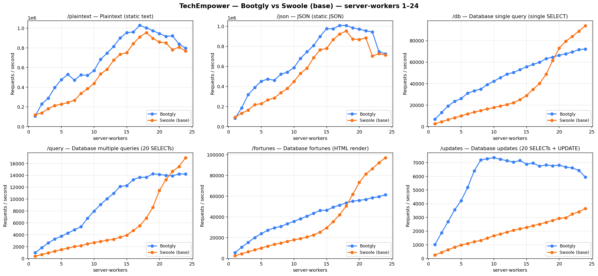
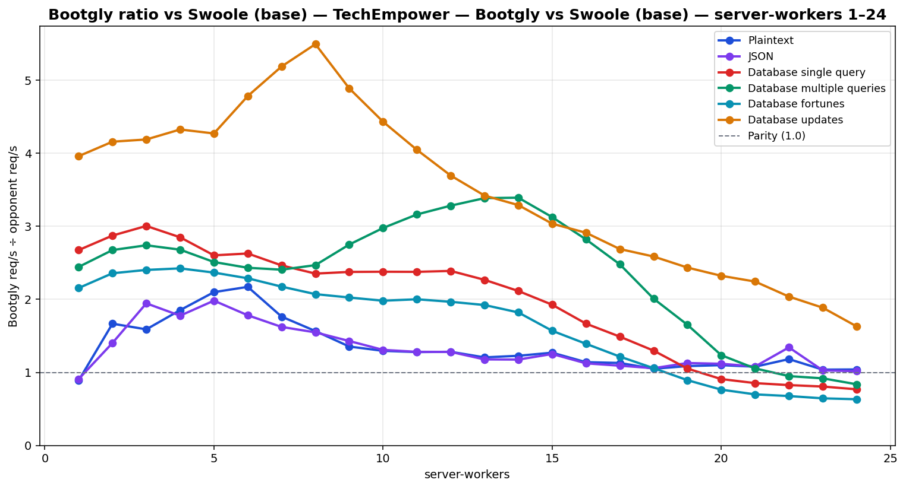

# TechEmpower — Bootgly vs Swoole (base) — server-workers 1–24

`HTTP_Server_CLI` benchmark — sweep of 24 `.bench.marks` files
varying `server-workers` from `1` to `24`, load set
`techempower`. Generated by `chart.py` on `2026-06-22 14:48:31`.

## Environment

- **OS** — Linux 6.18.33.1-microsoft-standard-WSL2
- **CPU** — 24 logical processors
- **PHP** — 8.4.22
- **Swoole** — 6.2.0
- **Runner** — `tcp_client`
- **Load set** — `techempower`
- **Connections** — `514`
- **Duration** — `10`
- **Client workers** — `12`
- **Pipeline** — `1`

## Command

Reproduction sweep — replace `<IDS>` with the original `--loads=` argument:

```bash
for sw in 1 2 3 4 5 6 7 8 9 10 11 12 13 14 15 16 17 18 19 20 21 22 23 24; do
   php bootgly test benchmark HTTP_Server_CLI \
      --opponents=bootgly,swoole-(base) \
      --runner=tcp_client \
      --connections=514 \
      --duration=10 \
      --client-workers=12 \
      --server-workers="$sw" \
      --loads=techempower:<IDS>  # loads in this sweep: Plaintext, JSON, Database single query, Database multiple queries, Database fortunes, Database updates
done
```

## Throughput



## Bootgly / opponent ratio



Ratio > 1.0 means **Bootgly** is faster than the opponent at that server-workers.

## Comparison tables

### Plaintext

| `server-workers` | Bootgly | Swoole (base) | Δ (Bootgly vs Swoole (base)) |
|---:|---:|---:|---:|
| 1 | 105.852 | 118.945 | -11.0% |
| 2 | 230.071 | 137.983 | +66.7% |
| 3 | 288.786 | 181.676 | +59.0% |
| 4 | 396.443 | 213.978 | +85.3% |
| 5 | 477.232 | 227.333 | +109.9% |
| 6 | 530.421 | 244.270 | +117.1% |
| 7 | 471.971 | 267.570 | +76.4% |
| 8 | 526.192 | 335.948 | +56.6% |
| 9 | 520.507 | 384.330 | +35.4% |
| 10 | 569.423 | 439.536 | +29.6% |
| 11 | 683.609 | 534.760 | +27.8% |
| 12 | 746.721 | 582.217 | +28.3% |
| 13 | 814.803 | 675.719 | +20.6% |
| 14 | 901.248 | 734.028 | +22.8% |
| 15 | 955.853 | 752.528 | +27.0% |
| 16 | 961.718 | 843.301 | +14.0% |
| 17 | 1.029.522 | 911.564 | +12.9% |
| 18 | 1.004.181 | 956.162 | +5.0% |
| 19 | 975.144 | 897.220 | +8.7% |
| 20 | 946.026 | 860.553 | +9.9% |
| 21 | 916.745 | 850.133 | +7.8% |
| 22 | 922.927 | 780.642 | +18.2% |
| 23 | 838.895 | 808.210 | +3.8% |
| 24 | 798.620 | 767.487 | +4.1% |

### JSON

| `server-workers` | Bootgly | Swoole (base) | Δ (Bootgly vs Swoole (base)) |
|---:|---:|---:|---:|
| 1 | 83.214 | 91.479 | -9.0% |
| 2 | 186.281 | 132.748 | +40.3% |
| 3 | 318.262 | 163.560 | +94.6% |
| 4 | 389.390 | 219.133 | +77.7% |
| 5 | 452.725 | 228.336 | +98.3% |
| 6 | 473.487 | 265.638 | +78.2% |
| 7 | 461.688 | 284.505 | +62.3% |
| 8 | 522.122 | 337.242 | +54.8% |
| 9 | 543.054 | 379.765 | +43.0% |
| 10 | 587.426 | 448.865 | +30.9% |
| 11 | 679.864 | 530.347 | +28.2% |
| 12 | 745.799 | 582.252 | +28.1% |
| 13 | 808.067 | 685.963 | +17.8% |
| 14 | 899.030 | 764.631 | +17.6% |
| 15 | 976.421 | 779.761 | +25.2% |
| 16 | 974.624 | 866.925 | +12.4% |
| 17 | 1.008.593 | 923.504 | +9.2% |
| 18 | 1.008.774 | 953.483 | +5.8% |
| 19 | 983.990 | 871.835 | +12.9% |
| 20 | 971.503 | 868.764 | +11.8% |
| 21 | 955.847 | 883.940 | +8.1% |
| 22 | 943.322 | 702.581 | +34.3% |
| 23 | 747.432 | 727.241 | +2.8% |
| 24 | 725.605 | 713.147 | +1.7% |

### Database single query

| `server-workers` | Bootgly | Swoole (base) | Δ (Bootgly vs Swoole (base)) |
|---:|---:|---:|---:|
| 1 | 6.790 | 2.538 | +167.5% |
| 2 | 12.970 | 4.513 | +187.4% |
| 3 | 19.172 | 6.379 | +200.5% |
| 4 | 23.492 | 8.242 | +185.0% |
| 5 | 26.100 | 10.027 | +160.3% |
| 6 | 31.003 | 11.795 | +162.8% |
| 7 | 33.261 | 13.491 | +146.5% |
| 8 | 34.895 | 14.829 | +135.3% |
| 9 | 39.128 | 16.467 | +137.6% |
| 10 | 42.232 | 17.754 | +137.9% |
| 11 | 45.449 | 19.120 | +137.7% |
| 12 | 48.835 | 20.435 | +139.0% |
| 13 | 50.316 | 22.187 | +126.8% |
| 14 | 53.037 | 25.079 | +111.5% |
| 15 | 55.722 | 28.916 | +92.7% |
| 16 | 57.839 | 34.677 | +66.8% |
| 17 | 59.873 | 40.188 | +49.0% |
| 18 | 63.228 | 48.710 | +29.8% |
| 19 | 64.642 | 61.447 | +5.2% |
| 20 | 66.409 | 73.071 | -9.1% |
| 21 | 67.787 | 79.413 | -14.6% |
| 22 | 69.406 | 83.996 | -17.4% |
| 23 | 71.692 | 88.865 | -19.3% |
| 24 | 72.186 | 93.917 | -23.1% |

### Database multiple queries

| `server-workers` | Bootgly | Swoole (base) | Δ (Bootgly vs Swoole (base)) |
|---:|---:|---:|---:|
| 1 | 968 | 396 | +144.4% |
| 2 | 1.814 | 678 | +167.6% |
| 3 | 2.623 | 957 | +174.1% |
| 4 | 3.276 | 1.222 | +168.1% |
| 5 | 3.760 | 1.497 | +151.2% |
| 6 | 4.272 | 1.756 | +143.3% |
| 7 | 4.840 | 2.011 | +140.7% |
| 8 | 5.348 | 2.166 | +146.9% |
| 9 | 6.770 | 2.461 | +175.1% |
| 10 | 7.986 | 2.682 | +197.8% |
| 11 | 9.084 | 2.872 | +216.3% |
| 12 | 10.073 | 3.068 | +228.3% |
| 13 | 10.969 | 3.239 | +238.7% |
| 14 | 12.141 | 3.579 | +239.2% |
| 15 | 12.277 | 3.927 | +212.6% |
| 16 | 13.277 | 4.706 | +182.1% |
| 17 | 13.681 | 5.516 | +148.0% |
| 18 | 13.667 | 6.802 | +100.9% |
| 19 | 14.251 | 8.629 | +65.2% |
| 20 | 14.145 | 11.447 | +23.6% |
| 21 | 14.001 | 13.275 | +5.5% |
| 22 | 13.912 | 14.652 | -5.1% |
| 23 | 14.228 | 15.484 | -8.1% |
| 24 | 14.216 | 16.968 | -16.2% |

### Database fortunes

| `server-workers` | Bootgly | Swoole (base) | Δ (Bootgly vs Swoole (base)) |
|---:|---:|---:|---:|
| 1 | 5.704 | 2.646 | +115.6% |
| 2 | 10.818 | 4.588 | +135.8% |
| 3 | 15.558 | 6.473 | +140.4% |
| 4 | 20.201 | 8.331 | +142.5% |
| 5 | 23.905 | 10.100 | +136.7% |
| 6 | 27.201 | 11.884 | +128.9% |
| 7 | 29.517 | 13.573 | +117.5% |
| 8 | 30.845 | 14.888 | +107.2% |
| 9 | 33.503 | 16.538 | +102.6% |
| 10 | 35.786 | 18.058 | +98.2% |
| 11 | 38.284 | 19.126 | +100.2% |
| 12 | 40.738 | 20.711 | +96.7% |
| 13 | 43.510 | 22.627 | +92.3% |
| 14 | 46.358 | 25.454 | +82.1% |
| 15 | 46.497 | 29.617 | +57.0% |
| 16 | 49.385 | 35.479 | +39.2% |
| 17 | 51.386 | 42.232 | +21.7% |
| 18 | 53.568 | 50.639 | +5.8% |
| 19 | 55.268 | 61.846 | -10.6% |
| 20 | 56.018 | 73.330 | -23.6% |
| 21 | 56.913 | 81.383 | -30.1% |
| 22 | 58.557 | 86.561 | -32.4% |
| 23 | 59.528 | 92.295 | -35.5% |
| 24 | 61.469 | 97.115 | -36.7% |

### Database updates

| `server-workers` | Bootgly | Swoole (base) | Δ (Bootgly vs Swoole (base)) |
|---:|---:|---:|---:|
| 1 | 1.018 | 257 | +296.1% |
| 2 | 1.880 | 452 | +315.9% |
| 3 | 2.694 | 643 | +319.0% |
| 4 | 3.552 | 821 | +332.6% |
| 5 | 4.225 | 989 | +327.2% |
| 6 | 5.191 | 1.085 | +378.4% |
| 7 | 6.393 | 1.232 | +418.9% |
| 8 | 7.193 | 1.309 | +449.5% |
| 9 | 7.290 | 1.491 | +388.9% |
| 10 | 7.363 | 1.661 | +343.3% |
| 11 | 7.242 | 1.789 | +304.8% |
| 12 | 7.140 | 1.932 | +269.6% |
| 13 | 7.038 | 2.057 | +242.1% |
| 14 | 7.158 | 2.175 | +229.1% |
| 15 | 6.884 | 2.267 | +203.7% |
| 16 | 6.969 | 2.393 | +191.2% |
| 17 | 6.737 | 2.505 | +168.9% |
| 18 | 6.834 | 2.642 | +158.7% |
| 19 | 6.766 | 2.778 | +143.6% |
| 20 | 6.820 | 2.936 | +132.3% |
| 21 | 6.669 | 2.972 | +124.4% |
| 22 | 6.614 | 3.245 | +103.8% |
| 23 | 6.432 | 3.410 | +88.6% |
| 24 | 5.947 | 3.647 | +63.1% |

## Peaks

| Load | Bootgly peak (req/s @ server-workers) | Swoole (base) peak (req/s @ server-workers) | Δ at Bootgly peak |
|---|---|---|---|
| Plaintext | 1.029.522 @ 17 | 956.162 @ 18 | +12.9% |
| JSON | 1.008.774 @ 18 | 953.483 @ 18 | +5.8% |
| Database single query | 72.186 @ 24 | 93.917 @ 24 | -23.1% |
| Database multiple queries | 14.251 @ 19 | 16.968 @ 24 | +65.2% |
| Database fortunes | 61.469 @ 24 | 97.115 @ 24 | -36.7% |
| Database updates | 7.363 @ 10 | 3.647 @ 24 | +343.3% |

## Notes

- The sweep crosses the CPU oversubscription threshold — `server-workers + client-workers > 24` logical processors. Above that point the kernel scheduler and external services (e.g. PostgreSQL) become the bottleneck, not the framework.
- Files consumed: `2026-06-22_163647_bench.marks`, `2026-06-22_163921_bench.marks`, `2026-06-22_164156_bench.marks` … (+21 more)
