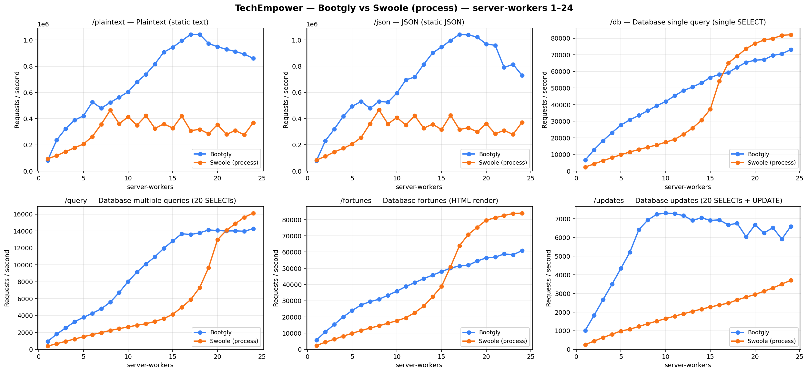
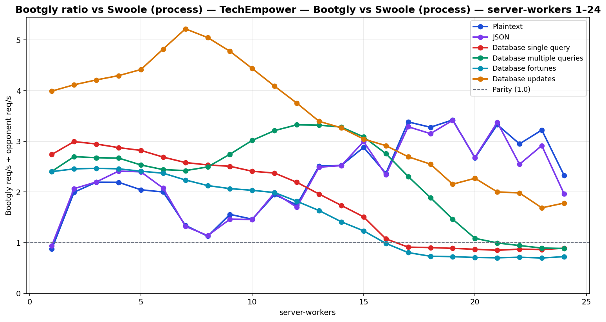

# TechEmpower — Bootgly vs Swoole (process) — server-workers 1–24

`HTTP_Server_CLI` benchmark — sweep of 24 `.bench.marks` files
varying `server-workers` from `1` to `24`, load set
`techempower`. Generated by `chart.py` on `2026-06-22 14:49:48`.

## Environment

- **OS** — Linux 6.18.33.1-microsoft-standard-WSL2
- **CPU** — 24 logical processors
- **PHP** — 8.4.22
- **Swoole** — 6.2.0
- **Runner** — `tcp_client`
- **Load set** — `techempower`
- **Connections** — `514`
- **Duration** — `10`
- **Client workers** — `12`
- **Pipeline** — `1`

## Command

Reproduction sweep — replace `<IDS>` with the original `--loads=` argument:

```bash
for sw in 1 2 3 4 5 6 7 8 9 10 11 12 13 14 15 16 17 18 19 20 21 22 23 24; do
   php bootgly test benchmark HTTP_Server_CLI \
      --opponents=bootgly,swoole-(process) \
      --runner=tcp_client \
      --connections=514 \
      --duration=10 \
      --client-workers=12 \
      --server-workers="$sw" \
      --loads=techempower:<IDS>  # loads in this sweep: Plaintext, JSON, Database single query, Database multiple queries, Database fortunes, Database updates
done
```

## Throughput



## Bootgly / opponent ratio



Ratio > 1.0 means **Bootgly** is faster than the opponent at that server-workers.

## Comparison tables

### Plaintext

| `server-workers` | Bootgly | Swoole (process) | Δ (Bootgly vs Swoole (process)) |
|---:|---:|---:|---:|
| 1 | 81.448 | 93.262 | -12.7% |
| 2 | 235.571 | 117.986 | +99.7% |
| 3 | 322.961 | 147.236 | +119.3% |
| 4 | 388.173 | 177.107 | +119.2% |
| 5 | 421.074 | 206.009 | +104.4% |
| 6 | 526.078 | 262.982 | +100.0% |
| 7 | 479.744 | 357.475 | +34.2% |
| 8 | 522.891 | 463.777 | +12.7% |
| 9 | 563.354 | 361.455 | +55.9% |
| 10 | 603.592 | 412.531 | +46.3% |
| 11 | 680.522 | 349.366 | +94.8% |
| 12 | 738.541 | 422.845 | +74.7% |
| 13 | 816.974 | 325.038 | +151.3% |
| 14 | 907.724 | 359.461 | +152.5% |
| 15 | 943.890 | 327.563 | +188.2% |
| 16 | 994.370 | 419.799 | +136.9% |
| 17 | 1.042.311 | 308.035 | +238.4% |
| 18 | 1.042.728 | 318.029 | +227.9% |
| 19 | 973.650 | 284.422 | +242.3% |
| 20 | 948.576 | 354.795 | +167.4% |
| 21 | 928.998 | 278.994 | +233.0% |
| 22 | 912.594 | 309.371 | +195.0% |
| 23 | 892.070 | 276.673 | +222.4% |
| 24 | 859.557 | 368.926 | +133.0% |

### JSON

| `server-workers` | Bootgly | Swoole (process) | Δ (Bootgly vs Swoole (process)) |
|---:|---:|---:|---:|
| 1 | 78.447 | 83.322 | -5.9% |
| 2 | 231.294 | 111.933 | +106.6% |
| 3 | 319.512 | 145.302 | +119.9% |
| 4 | 417.643 | 173.077 | +141.3% |
| 5 | 493.063 | 205.585 | +139.8% |
| 6 | 530.578 | 255.545 | +107.6% |
| 7 | 477.732 | 361.258 | +32.2% |
| 8 | 530.986 | 465.954 | +14.0% |
| 9 | 524.949 | 358.585 | +46.4% |
| 10 | 594.726 | 408.203 | +45.7% |
| 11 | 694.460 | 350.122 | +98.3% |
| 12 | 717.025 | 421.714 | +70.0% |
| 13 | 813.394 | 326.687 | +149.0% |
| 14 | 900.512 | 357.106 | +152.2% |
| 15 | 946.004 | 315.795 | +199.6% |
| 16 | 995.179 | 425.542 | +133.9% |
| 17 | 1.041.557 | 316.706 | +228.9% |
| 18 | 1.038.559 | 329.410 | +215.3% |
| 19 | 1.020.678 | 298.904 | +241.5% |
| 20 | 968.226 | 360.981 | +168.2% |
| 21 | 958.681 | 283.878 | +237.7% |
| 22 | 789.638 | 309.884 | +154.8% |
| 23 | 813.300 | 278.880 | +191.6% |
| 24 | 729.828 | 371.453 | +96.5% |

### Database single query

| `server-workers` | Bootgly | Swoole (process) | Δ (Bootgly vs Swoole (process)) |
|---:|---:|---:|---:|
| 1 | 6.571 | 2.397 | +174.1% |
| 2 | 12.886 | 4.302 | +199.5% |
| 3 | 18.296 | 6.207 | +194.8% |
| 4 | 23.163 | 8.053 | +187.6% |
| 5 | 27.684 | 9.812 | +182.1% |
| 6 | 30.843 | 11.470 | +168.9% |
| 7 | 33.462 | 12.962 | +158.2% |
| 8 | 36.368 | 14.348 | +153.5% |
| 9 | 39.360 | 15.696 | +150.8% |
| 10 | 41.841 | 17.365 | +141.0% |
| 11 | 45.335 | 19.092 | +137.5% |
| 12 | 48.477 | 22.116 | +119.2% |
| 13 | 50.601 | 25.817 | +96.0% |
| 14 | 53.090 | 30.590 | +73.6% |
| 15 | 56.349 | 37.319 | +51.0% |
| 16 | 58.214 | 54.132 | +7.5% |
| 17 | 59.320 | 65.083 | -8.9% |
| 18 | 62.550 | 69.260 | -9.7% |
| 19 | 65.461 | 73.693 | -11.2% |
| 20 | 66.765 | 76.832 | -13.1% |
| 21 | 67.103 | 78.906 | -15.0% |
| 22 | 69.592 | 79.828 | -12.8% |
| 23 | 70.656 | 81.743 | -13.6% |
| 24 | 73.103 | 82.104 | -11.0% |

### Database multiple queries

| `server-workers` | Bootgly | Swoole (process) | Δ (Bootgly vs Swoole (process)) |
|---:|---:|---:|---:|
| 1 | 941 | 391 | +140.7% |
| 2 | 1.797 | 666 | +169.8% |
| 3 | 2.524 | 943 | +167.7% |
| 4 | 3.263 | 1.222 | +167.0% |
| 5 | 3.783 | 1.493 | +153.4% |
| 6 | 4.269 | 1.748 | +144.2% |
| 7 | 4.804 | 1.983 | +142.3% |
| 8 | 5.579 | 2.236 | +149.5% |
| 9 | 6.726 | 2.449 | +174.6% |
| 10 | 8.020 | 2.656 | +202.0% |
| 11 | 9.162 | 2.852 | +221.2% |
| 12 | 10.085 | 3.032 | +232.6% |
| 13 | 10.953 | 3.299 | +232.0% |
| 14 | 11.954 | 3.642 | +228.2% |
| 15 | 12.828 | 4.154 | +208.8% |
| 16 | 13.672 | 4.958 | +175.8% |
| 17 | 13.581 | 5.887 | +130.7% |
| 18 | 13.777 | 7.290 | +89.0% |
| 19 | 14.114 | 9.648 | +46.3% |
| 20 | 14.062 | 12.957 | +8.5% |
| 21 | 14.000 | 14.072 | -0.5% |
| 22 | 14.015 | 14.862 | -5.7% |
| 23 | 13.967 | 15.620 | -10.6% |
| 24 | 14.269 | 16.112 | -11.4% |

### Database fortunes

| `server-workers` | Bootgly | Swoole (process) | Δ (Bootgly vs Swoole (process)) |
|---:|---:|---:|---:|
| 1 | 5.769 | 2.401 | +140.3% |
| 2 | 10.810 | 4.400 | +145.7% |
| 3 | 15.371 | 6.229 | +146.8% |
| 4 | 20.027 | 8.148 | +145.8% |
| 5 | 23.956 | 9.937 | +141.1% |
| 6 | 27.369 | 11.541 | +137.1% |
| 7 | 29.412 | 13.146 | +123.7% |
| 8 | 30.889 | 14.522 | +112.7% |
| 9 | 33.376 | 16.148 | +106.7% |
| 10 | 35.889 | 17.644 | +103.4% |
| 11 | 38.743 | 19.475 | +98.9% |
| 12 | 41.148 | 22.644 | +81.7% |
| 13 | 43.560 | 26.653 | +63.4% |
| 14 | 45.822 | 32.447 | +41.2% |
| 15 | 47.898 | 38.837 | +23.3% |
| 16 | 50.112 | 50.826 | -1.4% |
| 17 | 51.403 | 63.898 | -19.6% |
| 18 | 51.854 | 70.879 | -26.8% |
| 19 | 54.514 | 75.272 | -27.6% |
| 20 | 56.371 | 79.621 | -29.2% |
| 21 | 56.856 | 81.151 | -29.9% |
| 22 | 58.801 | 82.506 | -28.7% |
| 23 | 58.384 | 83.758 | -30.3% |
| 24 | 60.846 | 84.013 | -27.6% |

### Database updates

| `server-workers` | Bootgly | Swoole (process) | Δ (Bootgly vs Swoole (process)) |
|---:|---:|---:|---:|
| 1 | 1.018 | 255 | +299.2% |
| 2 | 1.832 | 445 | +311.7% |
| 3 | 2.671 | 634 | +321.3% |
| 4 | 3.494 | 813 | +329.8% |
| 5 | 4.347 | 984 | +341.8% |
| 6 | 5.213 | 1.081 | +382.2% |
| 7 | 6.417 | 1.229 | +422.1% |
| 8 | 6.932 | 1.373 | +404.9% |
| 9 | 7.239 | 1.515 | +377.8% |
| 10 | 7.308 | 1.647 | +343.7% |
| 11 | 7.280 | 1.780 | +309.0% |
| 12 | 7.169 | 1.909 | +275.5% |
| 13 | 6.911 | 2.035 | +239.6% |
| 14 | 7.053 | 2.159 | +226.7% |
| 15 | 6.913 | 2.270 | +204.5% |
| 16 | 6.942 | 2.381 | +191.6% |
| 17 | 6.675 | 2.476 | +169.6% |
| 18 | 6.756 | 2.649 | +155.0% |
| 19 | 6.034 | 2.801 | +115.4% |
| 20 | 6.677 | 2.940 | +127.1% |
| 21 | 6.243 | 3.117 | +100.3% |
| 22 | 6.521 | 3.292 | +98.1% |
| 23 | 5.910 | 3.501 | +68.8% |
| 24 | 6.597 | 3.703 | +78.2% |

## Peaks

| Load | Bootgly peak (req/s @ server-workers) | Swoole (process) peak (req/s @ server-workers) | Δ at Bootgly peak |
|---|---|---|---|
| Plaintext | 1.042.728 @ 18 | 463.777 @ 8 | +227.9% |
| JSON | 1.041.557 @ 17 | 465.954 @ 8 | +228.9% |
| Database single query | 73.103 @ 24 | 82.104 @ 24 | -11.0% |
| Database multiple queries | 14.269 @ 24 | 16.112 @ 24 | -11.4% |
| Database fortunes | 60.846 @ 24 | 84.013 @ 24 | -27.6% |
| Database updates | 7.308 @ 10 | 3.703 @ 24 | +343.7% |

## Notes

- The sweep crosses the CPU oversubscription threshold — `server-workers + client-workers > 24` logical processors. Above that point the kernel scheduler and external services (e.g. PostgreSQL) become the bottleneck, not the framework.
- Files consumed: `2026-06-22_proc01_bench.marks`, `2026-06-22_proc02_bench.marks`, `2026-06-22_proc03_bench.marks` … (+21 more)
