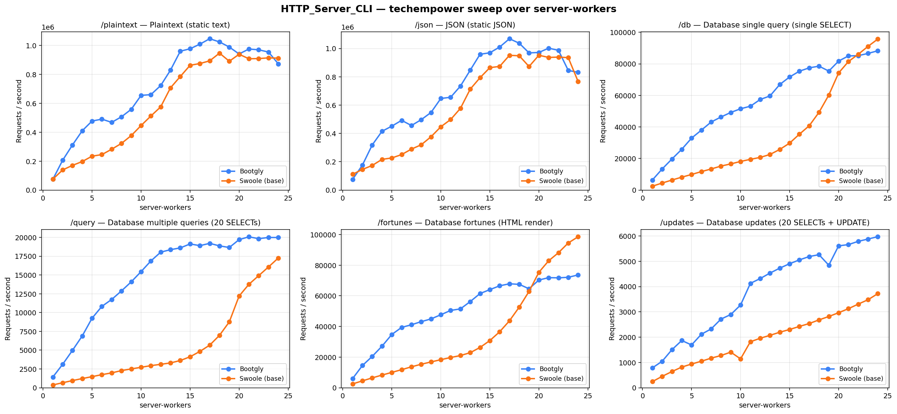
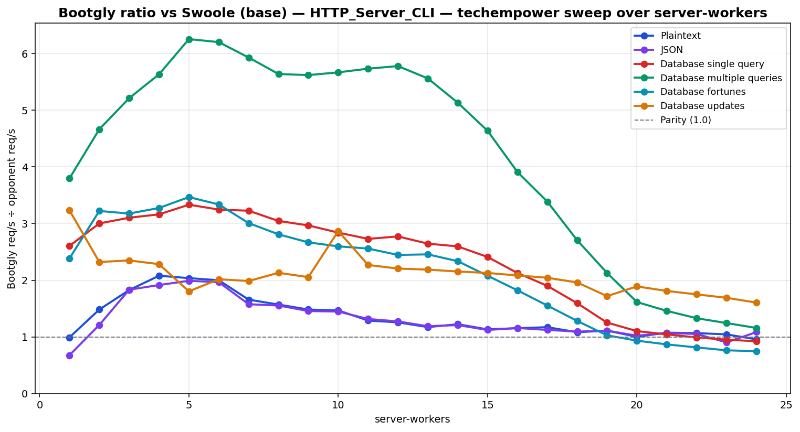

# HTTP_Server_CLI — techempower sweep over server-workers

`HTTP_Server_CLI` benchmark — sweep of 24 `.bench.marks` files
varying `server-workers` from `1` to `24`, load set
`techempower`. Generated by `chart.py` on `2026-06-22 16:46:26`.

## Environment

- **OS** — Linux 6.18.33.1-microsoft-standard-WSL2
- **CPU** — 24 logical processors
- **PHP** — 8.4.22
- **Swoole** — 6.2.0
- **Runner** — `tcp_client`
- **Load set** — `techempower`
- **Connections** — `514`
- **Duration** — `10`
- **Client workers** — `12`
- **Pipeline** — `1`
- **DB pool max** — `1`

> **Equal connection pool — `DB_POOL_MAX=1` for *every* opponent.** Bootgly and Swoole inherit the identical pool ceiling from the runner environment, so neither side can open more PostgreSQL backends per worker than the other. With `DB_POOL_MAX=1` each worker holds at most 1 connection(s), making the database footprint provably symmetric across the sweep.

## Command

Reproduction sweep — replace `<IDS>` with the original `--loads=` argument:

```bash
for sw in 1 2 3 4 5 6 7 8 9 10 11 12 13 14 15 16 17 18 19 20 21 22 23 24; do
   php bootgly test benchmark HTTP_Server_CLI \
      --opponents=bootgly,swoole-(base) \
      --runner=tcp_client \
      --connections=514 \
      --duration=10 \
      --client-workers=12 \
      --server-workers="$sw" \
      --loads=techempower:<IDS>  # loads in this sweep: Plaintext, JSON, Database single query, Database multiple queries, Database fortunes, Database updates
done
```

## Throughput



## Bootgly / opponent ratio



Ratio > 1.0 means **Bootgly** is faster than the opponent at that server-workers.

## Comparison tables

### Plaintext

| `server-workers` | Bootgly | Swoole (base) | Δ (Bootgly vs Swoole (base)) |
|---:|---:|---:|---:|
| 1 | 74.641 | 75.323 | -0.9% |
| 2 | 206.386 | 139.193 | +48.3% |
| 3 | 311.894 | 170.765 | +82.6% |
| 4 | 410.588 | 197.474 | +107.9% |
| 5 | 477.642 | 234.482 | +103.7% |
| 6 | 490.579 | 245.326 | +100.0% |
| 7 | 468.383 | 282.574 | +65.8% |
| 8 | 506.931 | 322.820 | +57.0% |
| 9 | 558.891 | 377.087 | +48.2% |
| 10 | 655.028 | 446.504 | +46.7% |
| 11 | 660.312 | 512.440 | +28.9% |
| 12 | 723.007 | 575.538 | +25.6% |
| 13 | 829.708 | 707.330 | +17.3% |
| 14 | 960.632 | 785.542 | +22.3% |
| 15 | 977.610 | 863.289 | +13.2% |
| 16 | 1.009.526 | 875.396 | +15.3% |
| 17 | 1.047.019 | 894.030 | +17.1% |
| 18 | 1.024.865 | 947.321 | +8.2% |
| 19 | 989.307 | 891.284 | +11.0% |
| 20 | 941.691 | 939.459 | +0.2% |
| 21 | 975.915 | 908.454 | +7.4% |
| 22 | 970.351 | 909.702 | +6.7% |
| 23 | 954.850 | 914.580 | +4.4% |
| 24 | 873.065 | 912.671 | -4.3% |

### JSON

| `server-workers` | Bootgly | Swoole (base) | Δ (Bootgly vs Swoole (base)) |
|---:|---:|---:|---:|
| 1 | 75.585 | 111.723 | -32.3% |
| 2 | 176.250 | 145.587 | +21.1% |
| 3 | 318.366 | 173.736 | +83.2% |
| 4 | 415.175 | 216.745 | +91.5% |
| 5 | 451.320 | 226.808 | +99.0% |
| 6 | 492.405 | 250.534 | +96.5% |
| 7 | 455.781 | 289.187 | +57.6% |
| 8 | 497.033 | 319.835 | +55.4% |
| 9 | 547.974 | 376.437 | +45.6% |
| 10 | 646.882 | 447.059 | +44.7% |
| 11 | 655.306 | 498.003 | +31.6% |
| 12 | 734.330 | 576.984 | +27.3% |
| 13 | 846.746 | 712.793 | +18.8% |
| 14 | 959.046 | 793.587 | +20.8% |
| 15 | 969.540 | 864.553 | +12.1% |
| 16 | 1.010.140 | 873.292 | +15.7% |
| 17 | 1.068.765 | 951.610 | +12.3% |
| 18 | 1.036.983 | 948.489 | +9.3% |
| 19 | 968.787 | 872.448 | +11.0% |
| 20 | 971.745 | 952.043 | +2.1% |
| 21 | 1.002.206 | 936.853 | +7.0% |
| 22 | 986.843 | 938.933 | +5.1% |
| 23 | 844.853 | 935.364 | -9.7% |
| 24 | 831.674 | 767.313 | +8.4% |

### Database single query

| `server-workers` | Bootgly | Swoole (base) | Δ (Bootgly vs Swoole (base)) |
|---:|---:|---:|---:|
| 1 | 6.361 | 2.441 | +160.6% |
| 2 | 13.353 | 4.447 | +200.3% |
| 3 | 19.701 | 6.348 | +210.3% |
| 4 | 25.848 | 8.173 | +216.3% |
| 5 | 32.915 | 9.874 | +233.4% |
| 6 | 37.983 | 11.697 | +224.7% |
| 7 | 43.131 | 13.367 | +222.7% |
| 8 | 46.311 | 15.201 | +204.7% |
| 9 | 49.197 | 16.580 | +196.7% |
| 10 | 51.527 | 18.139 | +184.1% |
| 11 | 53.149 | 19.470 | +173.0% |
| 12 | 57.409 | 20.701 | +177.3% |
| 13 | 59.656 | 22.548 | +164.6% |
| 14 | 66.932 | 25.767 | +159.8% |
| 15 | 71.671 | 29.733 | +141.0% |
| 16 | 75.347 | 35.416 | +112.7% |
| 17 | 77.464 | 40.745 | +90.1% |
| 18 | 78.539 | 49.261 | +59.4% |
| 19 | 75.431 | 60.224 | +25.3% |
| 20 | 81.749 | 74.202 | +10.2% |
| 21 | 85.023 | 81.443 | +4.4% |
| 22 | 85.194 | 86.052 | -1.0% |
| 23 | 86.601 | 91.075 | -4.9% |
| 24 | 88.304 | 95.718 | -7.7% |

### Database multiple queries

| `server-workers` | Bootgly | Swoole (base) | Δ (Bootgly vs Swoole (base)) |
|---:|---:|---:|---:|
| 1 | 1.428 | 376 | +279.8% |
| 2 | 3.121 | 669 | +366.5% |
| 3 | 4.974 | 954 | +421.4% |
| 4 | 6.898 | 1.224 | +463.6% |
| 5 | 9.253 | 1.479 | +525.6% |
| 6 | 10.825 | 1.745 | +520.3% |
| 7 | 11.744 | 1.980 | +493.1% |
| 8 | 12.883 | 2.284 | +464.1% |
| 9 | 14.092 | 2.507 | +462.1% |
| 10 | 15.449 | 2.725 | +466.9% |
| 11 | 16.866 | 2.941 | +473.5% |
| 12 | 18.035 | 3.120 | +478.0% |
| 13 | 18.367 | 3.302 | +456.2% |
| 14 | 18.602 | 3.623 | +413.4% |
| 15 | 19.129 | 4.124 | +363.8% |
| 16 | 18.902 | 4.834 | +291.0% |
| 17 | 19.207 | 5.669 | +238.8% |
| 18 | 18.871 | 6.975 | +170.6% |
| 19 | 18.656 | 8.763 | +112.9% |
| 20 | 19.703 | 12.202 | +61.5% |
| 21 | 20.077 | 13.761 | +45.9% |
| 22 | 19.829 | 14.915 | +32.9% |
| 23 | 19.990 | 16.071 | +24.4% |
| 24 | 19.983 | 17.263 | +15.8% |

### Database fortunes

| `server-workers` | Bootgly | Swoole (base) | Δ (Bootgly vs Swoole (base)) |
|---:|---:|---:|---:|
| 1 | 6.000 | 2.516 | +138.5% |
| 2 | 14.502 | 4.500 | +222.3% |
| 3 | 20.467 | 6.443 | +217.7% |
| 4 | 27.135 | 8.284 | +227.6% |
| 5 | 34.794 | 10.034 | +246.8% |
| 6 | 39.393 | 11.804 | +233.7% |
| 7 | 41.128 | 13.670 | +200.9% |
| 8 | 43.146 | 15.352 | +181.0% |
| 9 | 44.944 | 16.847 | +166.8% |
| 10 | 47.650 | 18.339 | +159.8% |
| 11 | 50.483 | 19.727 | +155.9% |
| 12 | 51.481 | 21.043 | +144.6% |
| 13 | 56.255 | 22.899 | +145.7% |
| 14 | 61.497 | 26.321 | +133.6% |
| 15 | 64.047 | 30.807 | +107.9% |
| 16 | 66.542 | 36.528 | +82.2% |
| 17 | 67.871 | 43.695 | +55.3% |
| 18 | 67.481 | 52.657 | +28.2% |
| 19 | 64.616 | 62.907 | +2.7% |
| 20 | 70.318 | 75.341 | -6.7% |
| 21 | 71.878 | 82.886 | -13.3% |
| 22 | 71.746 | 88.145 | -18.6% |
| 23 | 72.103 | 94.502 | -23.7% |
| 24 | 73.640 | 98.557 | -25.3% |

### Database updates

| `server-workers` | Bootgly | Swoole (base) | Δ (Bootgly vs Swoole (base)) |
|---:|---:|---:|---:|
| 1 | 786 | 243 | +223.5% |
| 2 | 1.047 | 451 | +132.2% |
| 3 | 1.506 | 641 | +134.9% |
| 4 | 1.868 | 818 | +128.4% |
| 5 | 1.692 | 938 | +80.4% |
| 6 | 2.116 | 1.049 | +101.7% |
| 7 | 2.326 | 1.171 | +98.6% |
| 8 | 2.715 | 1.274 | +113.1% |
| 9 | 2.895 | 1.409 | +105.5% |
| 10 | 3.272 | 1.141 | +186.8% |
| 11 | 4.128 | 1.819 | +126.9% |
| 12 | 4.317 | 1.957 | +120.6% |
| 13 | 4.534 | 2.073 | +118.7% |
| 14 | 4.730 | 2.196 | +115.4% |
| 15 | 4.904 | 2.304 | +112.8% |
| 16 | 5.055 | 2.425 | +108.5% |
| 17 | 5.188 | 2.539 | +104.3% |
| 18 | 5.261 | 2.683 | +96.1% |
| 19 | 4.845 | 2.818 | +71.9% |
| 20 | 5.610 | 2.967 | +89.1% |
| 21 | 5.660 | 3.126 | +81.1% |
| 22 | 5.788 | 3.307 | +75.0% |
| 23 | 5.880 | 3.480 | +69.0% |
| 24 | 5.974 | 3.721 | +60.5% |

## Peaks

| Load | Bootgly peak (req/s @ server-workers) | Swoole (base) peak (req/s @ server-workers) | Δ at Bootgly peak |
|---|---|---|---|
| Plaintext | 1.047.019 @ 17 | 947.321 @ 18 | +17.1% |
| JSON | 1.068.765 @ 17 | 952.043 @ 20 | +12.3% |
| Database single query | 88.304 @ 24 | 95.718 @ 24 | -7.7% |
| Database multiple queries | 20.077 @ 21 | 17.263 @ 24 | +45.9% |
| Database fortunes | 73.640 @ 24 | 98.557 @ 24 | -25.3% |
| Database updates | 5.974 @ 24 | 3.721 @ 24 | +60.5% |

## Notes

- The sweep crosses the CPU oversubscription threshold — `server-workers + client-workers > 24` logical processors. Above that point the kernel scheduler and external services (e.g. PostgreSQL) become the bottleneck, not the framework.
- Files consumed: `2026-06-22_182645_bench.marks`, `2026-06-22_182920_bench.marks`, `2026-06-22_194059_bench.marks` … (+21 more)
