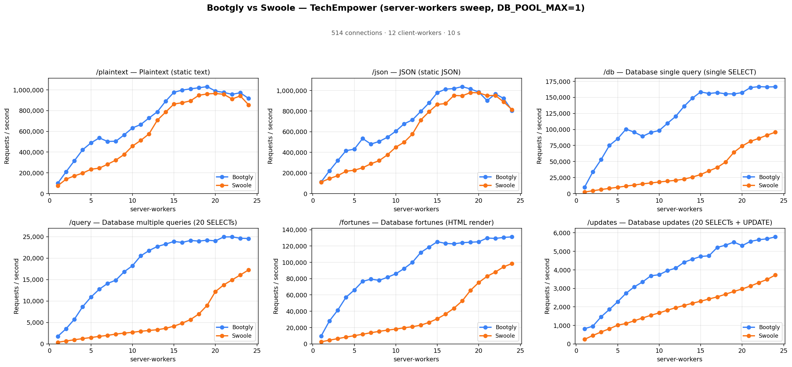
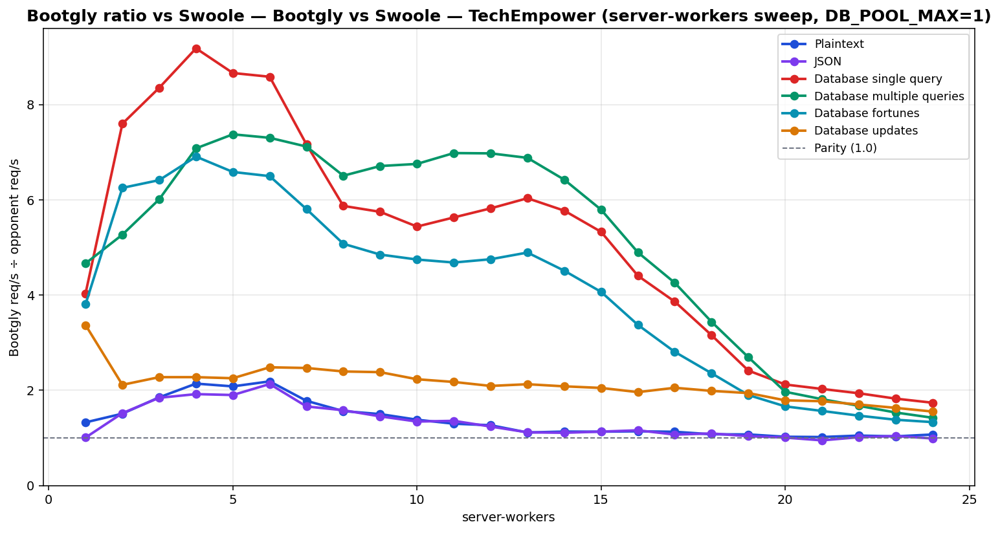

# Bootgly vs Swoole — TechEmpower (server-workers sweep, DB_POOL_MAX=1)

`HTTP_Server_CLI` benchmark — sweep of 24 `.bench.marks` files
varying `server-workers` from `1` to `24`, load set
`techempower`. Generated by `chart.py` on `2026-07-04 00:21:05`.

## Environment

- **OS** — Linux 6.18.35.2-microsoft-standard-WSL2
- **CPU** — 24 logical processors
- **PHP** — 8.4.22
- **Swoole** — 6.2.0
- **Runner** — `tcp_client`
- **Load set** — `techempower`
- **Connections** — `514`
- **Duration** — `10`
- **Client workers** — `12`
- **Pipeline** — `1`
- **DB pool max** — `1`

> **Equal per-worker DB connection — pool = `1` for every framework.** Bootgly, Swoole inherit `DB_POOL_MAX=1` from the runner environment, so each worker holds at most 1 PostgreSQL connection(s). Every opponent therefore presents the same database footprint at each point (`server-workers` connections total), so no framework gets a connection-count advantage.

## Command

Reproduction sweep — replace `<IDS>` with the original `--loads=` argument:

```bash
for sw in 1 2 3 4 5 6 7 8 9 10 11 12 13 14 15 16 17 18 19 20 21 22 23 24; do
   php bootgly test benchmark HTTP_Server_CLI \
      --opponents=bootgly,swoole \
      --runner=tcp_client \
      --connections=514 \
      --duration=10 \
      --client-workers=12 \
      --server-workers="$sw" \
      --loads=techempower:<IDS>  # loads in this sweep: Plaintext, JSON, Database single query, Database multiple queries, Database fortunes, Database updates
done
```

## Throughput



## Bootgly / opponent ratio



Ratio > 1.0 means **Bootgly** is faster than the opponent at that server-workers.

## Comparison tables

### Plaintext

| `server-workers` | Bootgly | Swoole | Δ (Bootgly vs Swoole) |
|---:|---:|---:|---:|
| 1 | 99.921 | 75.323 | +32.7% |
| 2 | 210.069 | 139.193 | +50.9% |
| 3 | 316.322 | 170.765 | +85.2% |
| 4 | 422.704 | 197.474 | +114.1% |
| 5 | 488.312 | 234.482 | +108.3% |
| 6 | 536.669 | 245.326 | +118.8% |
| 7 | 502.562 | 282.574 | +77.9% |
| 8 | 504.767 | 322.820 | +56.4% |
| 9 | 565.801 | 377.087 | +50.0% |
| 10 | 632.803 | 457.770 | +38.2% |
| 11 | 665.553 | 512.440 | +29.9% |
| 12 | 728.921 | 575.538 | +26.7% |
| 13 | 788.326 | 707.330 | +11.5% |
| 14 | 890.178 | 785.542 | +13.3% |
| 15 | 976.522 | 863.289 | +13.1% |
| 16 | 996.948 | 875.396 | +13.9% |
| 17 | 1.009.569 | 894.030 | +12.9% |
| 18 | 1.019.602 | 947.321 | +7.6% |
| 19 | 1.030.930 | 960.536 | +7.3% |
| 20 | 988.302 | 964.908 | +2.4% |
| 21 | 974.867 | 956.866 | +1.9% |
| 22 | 956.691 | 911.846 | +4.9% |
| 23 | 971.745 | 940.921 | +3.3% |
| 24 | 916.496 | 855.105 | +7.2% |

### JSON

| `server-workers` | Bootgly | Swoole | Δ (Bootgly vs Swoole) |
|---:|---:|---:|---:|
| 1 | 112.547 | 111.723 | +0.7% |
| 2 | 221.290 | 145.587 | +52.0% |
| 3 | 320.172 | 173.736 | +84.3% |
| 4 | 416.173 | 216.745 | +92.0% |
| 5 | 431.163 | 226.808 | +90.1% |
| 6 | 534.119 | 250.534 | +113.2% |
| 7 | 480.331 | 289.187 | +66.1% |
| 8 | 505.785 | 319.835 | +58.1% |
| 9 | 546.849 | 376.437 | +45.3% |
| 10 | 605.271 | 450.452 | +34.4% |
| 11 | 676.673 | 498.003 | +35.9% |
| 12 | 714.545 | 576.984 | +23.8% |
| 13 | 796.470 | 712.793 | +11.7% |
| 14 | 879.212 | 793.587 | +10.8% |
| 15 | 978.960 | 864.553 | +13.2% |
| 16 | 1.012.949 | 873.292 | +16.0% |
| 17 | 1.018.295 | 951.610 | +7.0% |
| 18 | 1.037.342 | 948.489 | +9.4% |
| 19 | 1.014.478 | 979.082 | +3.6% |
| 20 | 984.301 | 977.558 | +0.7% |
| 21 | 901.336 | 950.104 | -5.1% |
| 22 | 966.706 | 951.882 | +1.6% |
| 23 | 922.392 | 888.543 | +3.8% |
| 24 | 805.515 | 814.287 | -1.1% |

### Database single query

| `server-workers` | Bootgly | Swoole | Δ (Bootgly vs Swoole) |
|---:|---:|---:|---:|
| 1 | 9.850 | 2.441 | +303.5% |
| 2 | 33.793 | 4.447 | +659.9% |
| 3 | 53.029 | 6.348 | +735.4% |
| 4 | 75.043 | 8.173 | +818.2% |
| 5 | 85.549 | 9.874 | +766.4% |
| 6 | 100.427 | 11.697 | +758.6% |
| 7 | 95.756 | 13.367 | +616.4% |
| 8 | 89.275 | 15.201 | +487.3% |
| 9 | 95.309 | 16.580 | +474.8% |
| 10 | 98.314 | 18.077 | +443.9% |
| 11 | 109.631 | 19.470 | +463.1% |
| 12 | 120.502 | 20.701 | +482.1% |
| 13 | 136.056 | 22.548 | +503.4% |
| 14 | 148.753 | 25.767 | +477.3% |
| 15 | 158.429 | 29.733 | +432.8% |
| 16 | 156.022 | 35.416 | +340.5% |
| 17 | 157.375 | 40.745 | +286.2% |
| 18 | 155.523 | 49.261 | +215.7% |
| 19 | 155.297 | 64.345 | +141.4% |
| 20 | 157.444 | 74.202 | +112.2% |
| 21 | 165.217 | 81.443 | +102.9% |
| 22 | 166.746 | 86.052 | +93.8% |
| 23 | 166.209 | 91.075 | +82.5% |
| 24 | 166.478 | 95.718 | +73.9% |

### Database multiple queries

| `server-workers` | Bootgly | Swoole | Δ (Bootgly vs Swoole) |
|---:|---:|---:|---:|
| 1 | 1.754 | 376 | +366.5% |
| 2 | 3.525 | 669 | +426.9% |
| 3 | 5.735 | 954 | +501.2% |
| 4 | 8.668 | 1.224 | +608.2% |
| 5 | 10.910 | 1.479 | +637.7% |
| 6 | 12.744 | 1.745 | +630.3% |
| 7 | 14.096 | 1.980 | +611.9% |
| 8 | 14.862 | 2.284 | +550.7% |
| 9 | 16.823 | 2.507 | +571.0% |
| 10 | 18.224 | 2.698 | +575.5% |
| 11 | 20.536 | 2.941 | +598.3% |
| 12 | 21.767 | 3.120 | +597.7% |
| 13 | 22.725 | 3.302 | +588.2% |
| 14 | 23.273 | 3.623 | +542.4% |
| 15 | 23.892 | 4.124 | +479.3% |
| 16 | 23.668 | 4.834 | +389.6% |
| 17 | 24.138 | 5.669 | +325.8% |
| 18 | 23.975 | 6.975 | +243.7% |
| 19 | 24.199 | 8.983 | +169.4% |
| 20 | 24.025 | 12.202 | +96.9% |
| 21 | 24.954 | 13.761 | +81.3% |
| 22 | 24.966 | 14.915 | +67.4% |
| 23 | 24.644 | 16.071 | +53.3% |
| 24 | 24.577 | 17.263 | +42.4% |

### Database fortunes

| `server-workers` | Bootgly | Swoole | Δ (Bootgly vs Swoole) |
|---:|---:|---:|---:|
| 1 | 9.584 | 2.516 | +280.9% |
| 2 | 28.133 | 4.500 | +525.2% |
| 3 | 41.327 | 6.443 | +541.4% |
| 4 | 57.226 | 8.284 | +590.8% |
| 5 | 66.085 | 10.034 | +558.6% |
| 6 | 76.708 | 11.804 | +549.8% |
| 7 | 79.356 | 13.670 | +480.5% |
| 8 | 77.949 | 15.352 | +407.7% |
| 9 | 81.724 | 16.847 | +385.1% |
| 10 | 85.974 | 18.112 | +374.7% |
| 11 | 92.399 | 19.727 | +368.4% |
| 12 | 100.014 | 21.043 | +375.3% |
| 13 | 112.051 | 22.899 | +389.3% |
| 14 | 118.756 | 26.321 | +351.2% |
| 15 | 125.300 | 30.807 | +306.7% |
| 16 | 123.229 | 36.528 | +237.4% |
| 17 | 122.659 | 43.695 | +180.7% |
| 18 | 124.136 | 52.657 | +135.7% |
| 19 | 124.679 | 65.621 | +90.0% |
| 20 | 125.256 | 75.341 | +66.3% |
| 21 | 129.826 | 82.886 | +56.6% |
| 22 | 129.338 | 88.145 | +46.7% |
| 23 | 130.596 | 94.502 | +38.2% |
| 24 | 131.263 | 98.557 | +33.2% |

### Database updates

| `server-workers` | Bootgly | Swoole | Δ (Bootgly vs Swoole) |
|---:|---:|---:|---:|
| 1 | 819 | 243 | +237.0% |
| 2 | 954 | 451 | +111.5% |
| 3 | 1.459 | 641 | +127.6% |
| 4 | 1.862 | 818 | +127.6% |
| 5 | 2.276 | 1.010 | +125.3% |
| 6 | 2.732 | 1.100 | +148.4% |
| 7 | 3.081 | 1.248 | +146.9% |
| 8 | 3.347 | 1.397 | +139.6% |
| 9 | 3.679 | 1.545 | +138.1% |
| 10 | 3.737 | 1.674 | +123.2% |
| 11 | 3.957 | 1.819 | +117.5% |
| 12 | 4.094 | 1.957 | +109.2% |
| 13 | 4.411 | 2.073 | +112.8% |
| 14 | 4.575 | 2.196 | +108.3% |
| 15 | 4.723 | 2.304 | +105.0% |
| 16 | 4.758 | 2.425 | +96.2% |
| 17 | 5.213 | 2.539 | +105.3% |
| 18 | 5.333 | 2.683 | +98.8% |
| 19 | 5.499 | 2.832 | +94.2% |
| 20 | 5.309 | 2.967 | +78.9% |
| 21 | 5.536 | 3.126 | +77.1% |
| 22 | 5.627 | 3.307 | +70.2% |
| 23 | 5.676 | 3.480 | +63.1% |
| 24 | 5.782 | 3.721 | +55.4% |

## Peaks

| Load | Bootgly peak (req/s @ server-workers) | Swoole peak (req/s @ server-workers) | Δ at Bootgly peak |
|---|---|---|---|
| Plaintext | 1.030.930 @ 19 | 964.908 @ 20 | +7.3% |
| JSON | 1.037.342 @ 18 | 979.082 @ 19 | +9.4% |
| Database single query | 166.746 @ 22 | 95.718 @ 24 | +93.8% |
| Database multiple queries | 24.966 @ 22 | 17.263 @ 24 | +67.4% |
| Database fortunes | 131.263 @ 24 | 98.557 @ 24 | +33.2% |
| Database updates | 5.782 @ 24 | 3.721 @ 24 | +55.4% |

## Notes

- The sweep crosses the CPU oversubscription threshold — `server-workers + client-workers > 24` logical processors. Above that point the kernel scheduler and external services (e.g. PostgreSQL) become the bottleneck, not the framework.
- Files consumed: `sw01_bench.marks`, `sw02_bench.marks`, `sw03_bench.marks` … (+21 more)
- Provenance: the Bootgly series was re-measured on `v0.19.1-beta` (2026-07-04, persistent Fiber pool + DBAL hot path); the opponent series is the previously published sweep (2026-06) on the same machine/runner/`DB_POOL_MAX=1` setup, merged per `server-workers` point. Opponent latency is omitted where the original `.bench.marks` were no longer available.
