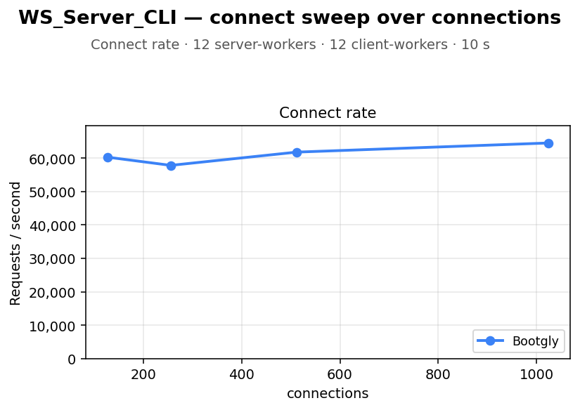

# WS_Server_CLI — connect sweep over connections

`WS_Server_CLI` benchmark — sweep of 4 `.bench.marks` files
varying `connections` from `128` to `1024`, load set
`connect`. Generated by `chart.py` on `2026-06-27 10:10:55`.

## Environment

- **OS** — Linux 6.18.33.2-microsoft-standard-WSL2
- **CPU** — 24 logical processors
- **PHP** — 8.4.22
- **Runner** — `ws_raw`
- **Load set** — `connect`
- **Duration** — `10`
- **Server workers** — `12`
- **Client workers** — `12`

## Command

Reproduction sweep — replace `<IDS>` with the original `--loads=` argument:

```bash
for x in 128 256 512 1024; do
   php bootgly test benchmark WS_Server_CLI \
      --opponents=bootgly \
      --runner=ws_raw \
      --duration=10 \
      --client-workers=12 \
      --connections="$x" \
      --loads=connect:<IDS>  # loads in this sweep: Connect rate
done
```

## Throughput



## Comparison tables

### Connect rate

| `connections` | Bootgly |
|---:|---:|
| 128 | 60.288 |
| 256 | 57.846 |
| 512 | 61.813 |
| 1024 | 64.548 |

## Peaks

| Load | Bootgly peak (req/s @ connections) |
|---|---|
| Connect rate | 64.548 @ 1024 |

## Notes

- Files consumed: `2026-06-27_115916_bench.marks`, `2026-06-27_115941_bench.marks`, `2026-06-27_120006_bench.marks` … (+1 more)
