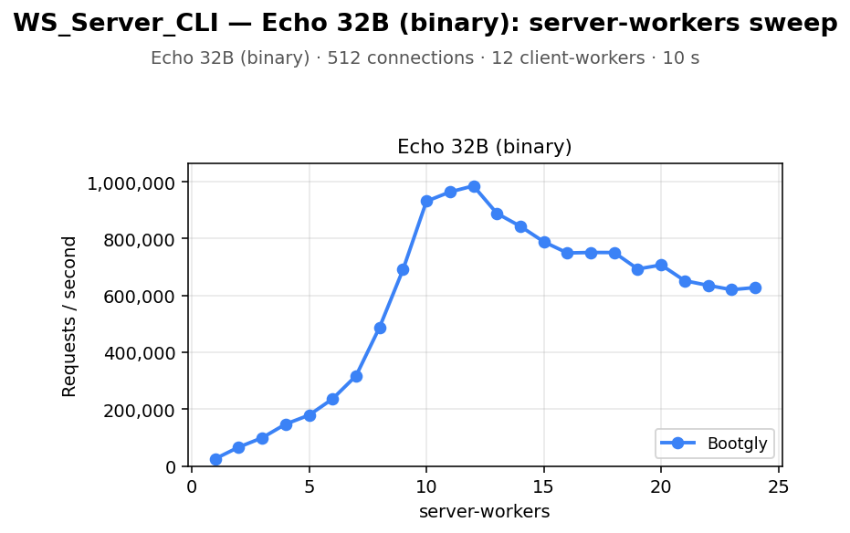

# WS_Server_CLI — Echo 32B (binary): server-workers sweep

`WS_Server_CLI` benchmark — sweep of 24 `.bench.marks` files
varying `server-workers` from `1` to `24`, load set
`echo-binary`. Generated by `chart.py` on `2026-06-27 10:10:53`.

## Environment

- **OS** — Linux 6.18.33.2-microsoft-standard-WSL2
- **CPU** — 24 logical processors
- **PHP** — 8.4.22
- **Runner** — `ws_raw`
- **Load set** — `echo`
- **Connections** — `512`
- **Duration** — `10`
- **Client workers** — `12`

## Command

Reproduction sweep — replace `<IDS>` with the original `--loads=` argument:

```bash
for sw in 1 2 3 4 5 6 7 8 9 10 11 12 13 14 15 16 17 18 19 20 21 22 23 24; do
   php bootgly test benchmark WS_Server_CLI \
      --opponents=bootgly \
      --runner=ws_raw \
      --connections=512 \
      --duration=10 \
      --client-workers=12 \
      --server-workers="$sw" \
      --loads=echo-binary:<IDS>  # loads in this sweep: Echo 32B (binary)
done
```

## Throughput



## Comparison tables

### Echo 32B (binary)

| `server-workers` | Bootgly |
|---:|---:|
| 1 | 25.532 |
| 2 | 66.382 |
| 3 | 99.267 |
| 4 | 147.491 |
| 5 | 179.090 |
| 6 | 236.201 |
| 7 | 317.361 |
| 8 | 487.713 |
| 9 | 690.718 |
| 10 | 931.384 |
| 11 | 964.031 |
| 12 | 985.424 |
| 13 | 888.660 |
| 14 | 843.249 |
| 15 | 788.774 |
| 16 | 749.419 |
| 17 | 751.214 |
| 18 | 750.988 |
| 19 | 693.143 |
| 20 | 707.224 |
| 21 | 651.918 |
| 22 | 635.370 |
| 23 | 620.273 |
| 24 | 627.721 |

## Peaks

| Load | Bootgly peak (req/s @ server-workers) |
|---|---|
| Echo 32B (binary) | 985.424 @ 12 |

## Notes

- The sweep crosses the CPU oversubscription threshold — `server-workers + client-workers > 24` logical processors. Above that point the kernel scheduler and external services (e.g. PostgreSQL) become the bottleneck, not the framework.
- Files consumed: `2026-06-27_124623_bench.marks`, `2026-06-27_124647_bench.marks`, `2026-06-27_124712_bench.marks` … (+21 more)
