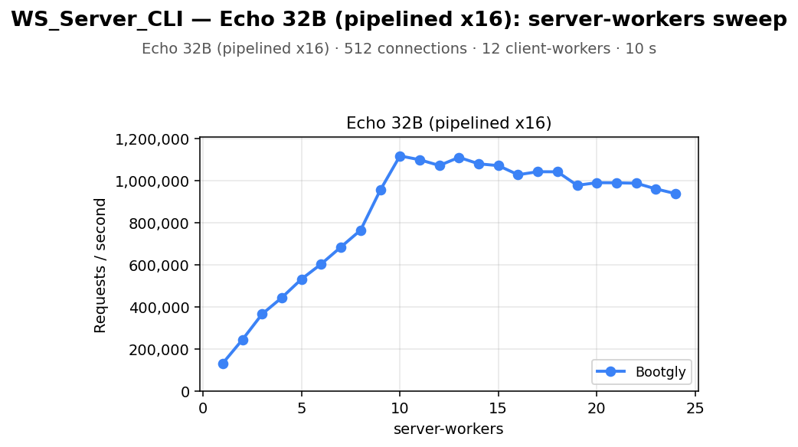

# WS_Server_CLI — Echo 32B (pipelined x16): server-workers sweep

`WS_Server_CLI` benchmark — sweep of 24 `.bench.marks` files
varying `server-workers` from `1` to `24`, load set
`echo-pipelined`. Generated by `chart.py` on `2026-06-27 10:10:53`.

## Environment

- **OS** — Linux 6.18.33.2-microsoft-standard-WSL2
- **CPU** — 24 logical processors
- **PHP** — 8.4.22
- **Runner** — `ws_raw`
- **Load set** — `echo`
- **Connections** — `512`
- **Duration** — `10`
- **Client workers** — `12`

## Command

Reproduction sweep — replace `<IDS>` with the original `--loads=` argument:

```bash
for sw in 1 2 3 4 5 6 7 8 9 10 11 12 13 14 15 16 17 18 19 20 21 22 23 24; do
   php bootgly test benchmark WS_Server_CLI \
      --opponents=bootgly \
      --runner=ws_raw \
      --connections=512 \
      --duration=10 \
      --client-workers=12 \
      --server-workers="$sw" \
      --loads=echo-pipelined:<IDS>  # loads in this sweep: Echo 32B (pipelined x16)
done
```

## Throughput



## Comparison tables

### Echo 32B (pipelined x16)

| `server-workers` | Bootgly |
|---:|---:|
| 1 | 130.786 |
| 2 | 243.309 |
| 3 | 364.985 |
| 4 | 443.035 |
| 5 | 531.116 |
| 6 | 602.828 |
| 7 | 683.556 |
| 8 | 763.642 |
| 9 | 953.823 |
| 10 | 1.116.803 |
| 11 | 1.098.494 |
| 12 | 1.071.304 |
| 13 | 1.109.747 |
| 14 | 1.079.104 |
| 15 | 1.070.468 |
| 16 | 1.027.229 |
| 17 | 1.041.616 |
| 18 | 1.041.153 |
| 19 | 976.898 |
| 20 | 989.457 |
| 21 | 988.826 |
| 22 | 986.934 |
| 23 | 959.816 |
| 24 | 937.383 |

## Peaks

| Load | Bootgly peak (req/s @ server-workers) |
|---|---|
| Echo 32B (pipelined x16) | 1.116.803 @ 10 |

## Notes

- The sweep crosses the CPU oversubscription threshold — `server-workers + client-workers > 24` logical processors. Above that point the kernel scheduler and external services (e.g. PostgreSQL) become the bottleneck, not the framework.
- Files consumed: `2026-06-27_125617_bench.marks`, `2026-06-27_125642_bench.marks`, `2026-06-27_125706_bench.marks` … (+21 more)
